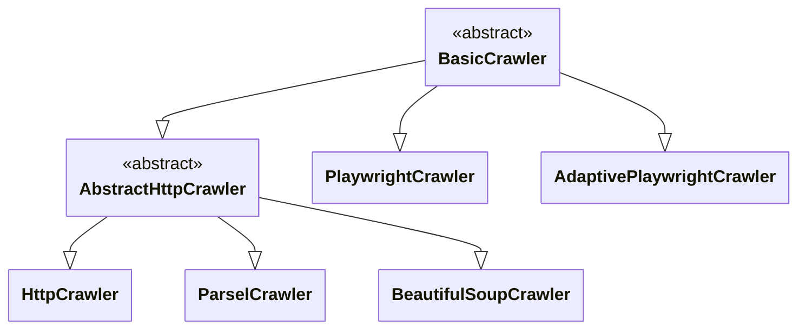
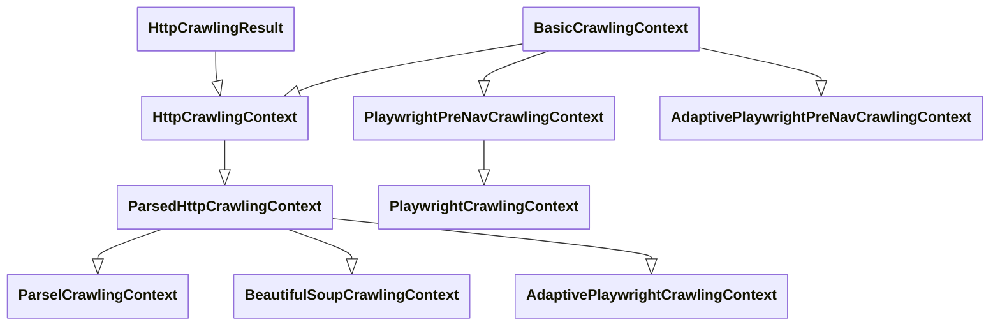
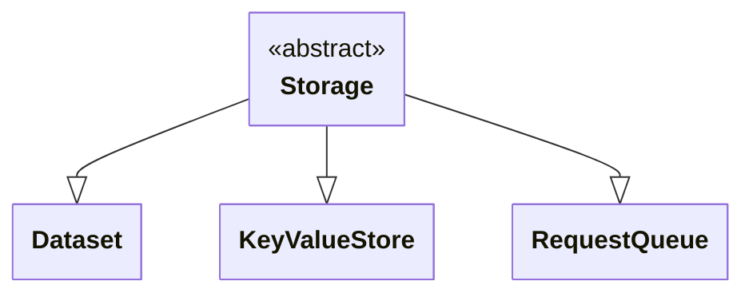
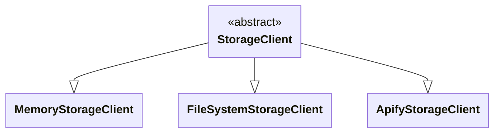
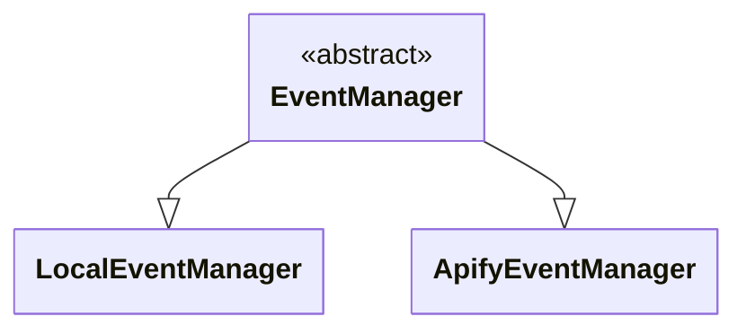
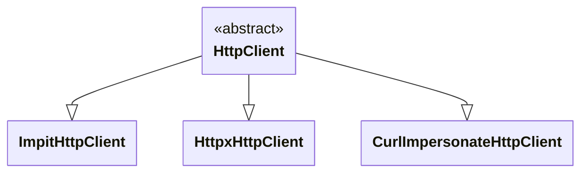
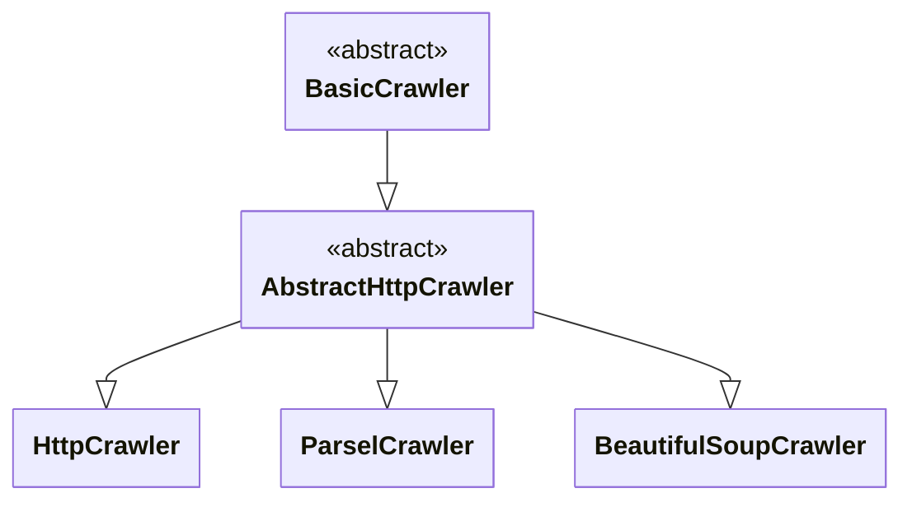
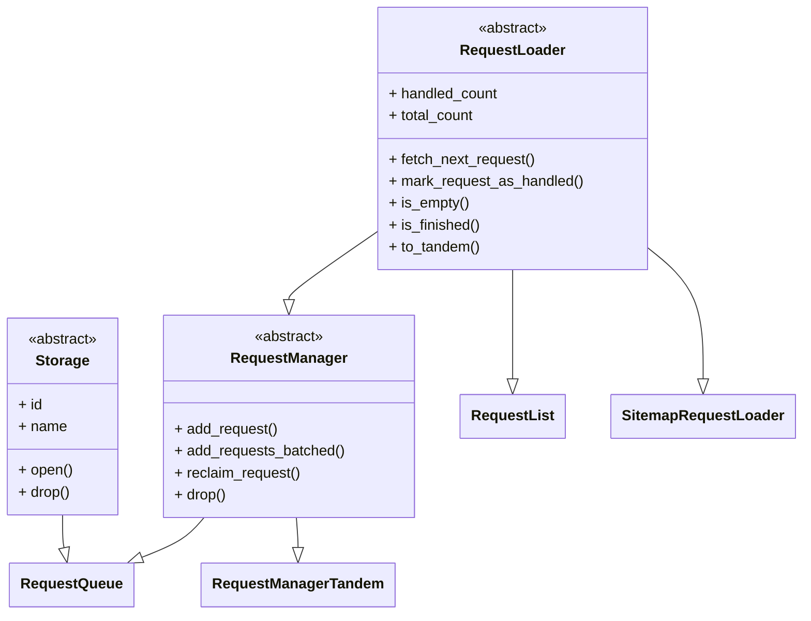
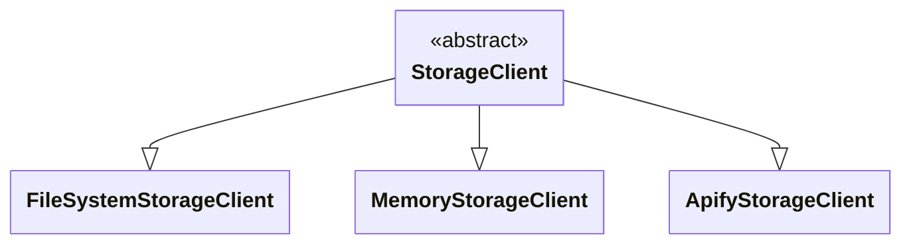

This file is a merged representation of a subset of the codebase, containing specifically included files, combined into a single document by Repomix.

# File Summary

## Purpose
This file contains a packed representation of the entire repository's contents.
It is designed to be easily consumable by AI systems for analysis, code review,
or other automated processes.

## File Format
The content is organized as follows:
1. This summary section
2. Repository information
3. Directory structure
4. Repository files (if enabled)
5. Multiple file entries, each consisting of:
  a. A header with the file path (## File: path/to/file)
  b. The full contents of the file in a code block

## Usage Guidelines
- This file should be treated as read-only. Any changes should be made to the
  original repository files, not this packed version.
- When processing this file, use the file path to distinguish
  between different files in the repository.
- Be aware that this file may contain sensitive information. Handle it with
  the same level of security as you would the original repository.

## Notes
- Some files may have been excluded based on .gitignore rules and Repomix's configuration
- Binary files are not included in this packed representation. Please refer to the Repository Structure section for a complete list of file paths, including binary files
- Only files matching these patterns are included: docs/**/*.{md,markdown,rmd,mdx,rst,rest,txt,adoc,asciidoc}
- Files matching patterns in .gitignore are excluded
- Files matching default ignore patterns are excluded
- Files are sorted by Git change count (files with more changes are at the bottom)

# Directory Structure
```
docs/
  deployment/
    apify_platform.mdx
    google_cloud_run.mdx
    google_cloud.mdx
  examples/
    add_data_to_dataset.mdx
    beautifulsoup_crawler.mdx
    capture_screenshot_using_playwright.mdx
    capturing_page_snapshots_with_error_snapshotter.mdx
    crawl_all_links_on_website.mdx
    crawl_multiple_urls.mdx
    crawl_specific_links_on_website.mdx
    crawl_website_with_relative_links.mdx
    crawler_keep_alive.mdx
    crawler_stop.mdx
    export_entire_dataset_to_file.mdx
    fill_and_submit_web_form.mdx
    json_logging.mdx
    parsel_crawler.mdx
    playwright_crawler_adaptive.mdx
    playwright_crawler_with_block_requests.mdx
    playwright_crawler_with_camoufox.mdx
    playwright_crawler_with_fingerprint_generator.mdx
    playwright_crawler.mdx
    respect_robots_txt_file.mdx
    resuming_paused_crawl.mdx
  guides/
    architecture_overview.mdx
    avoid_blocking.mdx
    crawler_login.mdx
    creating_web_archive.mdx
    error_handling.mdx
    http_clients.mdx
    http_crawlers.mdx
    playwright_crawler_adaptive.mdx
    playwright_crawler_stagehand.mdx
    playwright_crawler.mdx
    proxy_management.mdx
    request_loaders.mdx
    request_router.mdx
    running_in_web_server.mdx
    scaling_crawlers.mdx
    service_locator.mdx
    session_management.mdx
    storage_clients.mdx
    storages.mdx
    trace_and_monitor_crawlers.mdx
  introduction/
    01_setting_up.mdx
    02_first_crawler.mdx
    03_adding_more_urls.mdx
    04_real_world_project.mdx
    05_crawling.mdx
    06_scraping.mdx
    07_saving_data.mdx
    08_refactoring.mdx
    09_running_in_cloud.mdx
    index.mdx
  quick-start/
    index.mdx
  upgrading/
    upgrading_to_v0x.md
    upgrading_to_v1.md
```

# Files

## File: docs/deployment/apify_platform.mdx
````
---
id: apify-platform
title: Apify platform
description: Apify platform - large-scale and high-performance web scraping
---

import ApiLink from '@site/src/components/ApiLink';

import CodeBlock from '@theme/CodeBlock';

import LogWithConfigExample from '!!raw-loader!./code_examples/apify/log_with_config_example.py';
import CrawlerAsActorExample from '!!raw-loader!./code_examples/apify/crawler_as_actor_example.py';
import ProxyExample from '!!raw-loader!./code_examples/apify/proxy_example.py';
import ProxyAdvancedExample from '!!raw-loader!./code_examples/apify/proxy_advanced_example.py';

Apify is a [platform](https://apify.com) built to serve large-scale and high-performance web scraping and automation needs. It provides easy access to [compute instances (Actors)](#what-is-an-actor), convenient request and result storages, [proxies](../guides/proxy-management), scheduling, webhooks and [more](https://docs.apify.com/), accessible through a [web interface](https://console.apify.com) or an [API](https://docs.apify.com/api).

While we think that the Apify platform is super cool, and it's definitely worth signing up for a [free account](https://console.apify.com/sign-up), **Crawlee is and will always be open source**, runnable locally or on any cloud infrastructure.

:::note

We do not test Crawlee in other cloud environments such as Lambda or on specific architectures such as Raspberry PI. We strive to make it work, but there are no guarantees.

:::

## Requirements

To run your Crawlee code on Apify platform, you need an Apify account. If you don't have one yet, you can sign up [here](https://console.apify.com/sign-up).

Additionally, you must have the [Apify CLI](https://docs.apify.com/cli/) installed on your computer. For installation instructions, refer to the [Installation guide](https://docs.apify.com/cli/docs/installation).

Finally, ensure that the [Apify SDK] (https://docs.apify.com/sdk/python/) is installed in your project. You can install it using `pip`:

```bash
pip install apify
```

## Logging into Apify platform from Crawlee

To access your [Apify account](https://console.apify.com/sign-up) from Crawlee, you must provide credentials - your [API token](https://console.apify.com/account?tab=integrations). You can do that either by utilizing [Apify CLI](https://docs.apify.com/cli/) or with environment variables.

Once you provide credentials to your Apify CLI installation, you will be able to use all the Apify platform features, such as calling Actors, saving to cloud storages, using Apify proxies, setting up webhooks and so on.

### Log in with CLI

Apify CLI allows you to log in to your Apify account on your computer. If you then run your crawler using the CLI, your credentials will automatically be added.

```bash
npm install -g apify-cli
apify login -t YOUR_API_TOKEN
```

### Log in with environment variables

Alternatively, you can always provide credentials to your Actor by setting the [`APIFY_TOKEN`](#apify_token) environment variable to your API token.

> There's also the [`APIFY_PROXY_PASSWORD`](#apify_proxy_password)
> environment variable. Actor automatically infers that from your token, but it can be useful
> when you need to access proxies from a different account than your token represents.

### Log in with Configuration

Another option is to use the [`Configuration`](https://docs.apify.com/sdk/python/reference/class/Configuration) instance and set your api token there.

<CodeBlock className="language-python">
    {LogWithConfigExample}
</CodeBlock>

## What is an Actor

When you deploy your script to the Apify platform, it becomes an [Actor](https://apify.com/actors). An Actor is a serverless microservice that accepts an input and produces an output. It can run for a few seconds, hours or even infinitely. An Actor can perform anything from a simple action such as filling out a web form or sending an email, to complex operations such as crawling an entire website and removing duplicates from a large dataset.

Actors can be shared in the [Apify Store](https://apify.com/store) so that other people can use them. But don't worry, if you share your Actor in the store and somebody uses it, it runs under their account, not yours.

**Related links**

- [Store of existing Actors](https://apify.com/store)
- [Documentation](https://docs.apify.com/actors)
- [View Actors in Apify Console](https://console.apify.com/actors)
- [API reference](https://apify.com/docs/api/v2#/reference/actors)

## Running an Actor locally

First let's create a boilerplate of the new Actor. You could use Apify CLI and just run:

```bash
apify create my-hello-world
```

The CLI will prompt you to select a project boilerplate template - let's pick "Crawlee + BeautifulSoup". The tool will create a directory called `my-hello-world` with Python project files. You can run the Actor as follows:

```bash
cd my-hello-world
apify run
```

## Running Crawlee code as an Actor

For running Crawlee code as an Actor on [Apify platform](https://apify.com/actors) you need to wrap the body of the main function of your crawler with `async with Actor`.

:::info NOTE
Adding `async with Actor` is the only important thing needed to run it on Apify platform as an Actor. It is needed to initialize your Actor (e.g. to set the correct storage implementation) and to correctly handle exitting the process.
:::

Let's look at the `BeautifulSoupCrawler` example from the [Quick start](../quick-start) guide:

<CodeBlock className="language-python">
    {CrawlerAsActorExample}
</CodeBlock>

Note that you could also run your Actor (that is using Crawlee) locally with Apify CLI. You could start it via the following command in your project folder:

```bash
apify run
```

## Deploying an Actor to Apify platform

Now (assuming you are already logged in to your Apify account) you can easily deploy your code to the Apify platform by running:

```bash
apify push
```

Your script will be uploaded to and built on the Apify platform so that it can be run there. For more information, view the
[Apify Actor](https://docs.apify.com/cli) documentation.

## Usage on Apify platform

You can also develop your Actor in an online code editor directly on the platform (you'll need an Apify Account). Let's go to the [Actors](https://console.apify.com/actors) page in the app, click *Create new* and then go to the *Source* tab and start writing the code or paste one of the examples from the [Examples](../examples) section.

## Storages

There are several things worth mentioning here.

### Helper functions for default Key-Value Store and Dataset

To simplify access to the _default_ storages, instead of using the helper functions of respective storage classes, you could use:
- [`Actor.set_value()`](https://docs.apify.com/sdk/python/reference/class/Actor#set_value), [`Actor.get_value()`](https://docs.apify.com/sdk/python/reference/class/Actor#get_value), [`Actor.get_input()`](https://docs.apify.com/sdk/python/reference/class/Actor#get_input) for [`Key-Value Store`](https://docs.apify.com/sdk/python/reference/class/KeyValueStore)
- [`Actor.push_data()`](https://docs.apify.com/sdk/python/reference/class/Actor#push_data) for [`Dataset`](https://docs.apify.com/sdk/python/reference/class/Dataset)

### Using platform storage in a local Actor

When you plan to use the platform storage while developing and running your Actor locally, you should use [`Actor.open_key_value_store()`](https://docs.apify.com/sdk/python/reference/class/Actor#open_key_value_store), [`Actor.open_dataset()`](https://docs.apify.com/sdk/python/reference/class/Actor#open_dataset) and [`Actor.open_request_queue()`](https://docs.apify.com/sdk/python/reference/class/Actor#open_request_queue) to open the respective storage.

Using each of these methods allows to pass the `force_cloud` keyword argument. If set to `True`, cloud storage will be used instead of the folder on the local disk.

:::note
If you don't plan to force usage of the platform storages when running the Actor locally, there is no need to use the [`Actor`](https://docs.apify.com/sdk/python/reference/class/Actor) class for it. The Crawlee variants <ApiLink to="class/KeyValueStore#open">`KeyValueStore.open()`</ApiLink>, <ApiLink to="class/Dataset#open">`Dataset.open()`</ApiLink> and <ApiLink to="class/RequestQueue#open">`RequestQueue.open()`</ApiLink> will work the same.
:::

{/*
### Getting public url of an item in the platform storage

If you need to share a link to some file stored in a [Key-Value](https://docs.apify.com/sdk/python/reference/class/KeyValueStore) Store on Apify platform, you can use [`get_public_url()`](https://docs.apify.com/sdk/python/reference/class/KeyValueStore#get_public_url) method. It accepts only one parameter: `key` - the key of the item you want to share.

<CodeBlock language="python">
    {GetPublicUrlSource}
</CodeBlock>

*/}

### Exporting dataset data

When the <ApiLink to="class/Dataset">`Dataset`</ApiLink> is stored on the [Apify platform](https://apify.com/actors), you can export its data to the following formats: HTML, JSON, CSV, Excel, XML and RSS. The datasets are displayed on the Actor run details page and in the [Storage](https://console.apify.com/storage) section in the Apify Console. The actual data is exported using the [Get dataset items](https://apify.com/docs/api/v2#/reference/datasets/item-collection/get-items) Apify API endpoint. This way you can easily share the crawling results.

**Related links**

- [Apify platform storage documentation](https://docs.apify.com/storage)
- [View storage in Apify Console](https://console.apify.com/storage)
- [Key-value stores API reference](https://apify.com/docs/api/v2#/reference/key-value-stores)
- [Datasets API reference](https://docs.apify.com/api/v2#/reference/datasets)
- [Request queues API reference](https://docs.apify.com/api/v2#/reference/request-queues)

## Environment variables

The following describes select environment variables set by the Apify platform. For a complete list, see the [Environment variables](https://docs.apify.com/platform/actors/development/programming-interface/environment-variables) section in the Apify platform documentation.

:::note

It's important to notice that `CRAWLEE_` environment variables don't need to be replaced with equivalent `APIFY_` ones. Likewise, Crawlee understands `APIFY_` environment variables.

:::

### `APIFY_TOKEN`

The API token for your Apify account. It is used to access the Apify API, e.g. to access cloud storage
or to run an Actor on the Apify platform. You can find your API token on the
[Account Settings / Integrations](https://console.apify.com/account?tab=integrations) page.

### Combinations of `APIFY_TOKEN` and `CRAWLEE_STORAGE_DIR`

By combining the env vars in various ways, you can greatly influence the Actor's behavior.

| Env Vars                                | API | Storages         |
| --------------------------------------- | --- | ---------------- |
|  none OR `CRAWLEE_STORAGE_DIR`          | no  | local            |
| `APIFY_TOKEN`                           | yes | Apify platform   |
| `APIFY_TOKEN` AND `CRAWLEE_STORAGE_DIR` | yes | local + platform |

When using both `APIFY_TOKEN` and `CRAWLEE_STORAGE_DIR`, you can use all the Apify platform
features and your data will be stored locally by default. If you want to access platform storages,
you can use the `force_cloud=true` option in their respective functions.

### `APIFY_PROXY_PASSWORD`

Optional password to [Apify Proxy](https://docs.apify.com/proxy) for IP address rotation.
Assuming Apify Account was already created, you can find the password on the [Proxy page](https://console.apify.com/proxy)
in the Apify Console. The password is automatically inferred using the `APIFY_TOKEN` env var,
so in most cases, you don't need to touch it. You should use it when, for some reason,
you need access to Apify Proxy, but not access to Apify API, or when you need access to
proxy from a different account than your token represents.

## Proxy management

In addition to your own proxy servers and proxy servers acquired from
third-party providers used together with Crawlee, you can also rely on [Apify Proxy](https://apify.com/proxy)
for your scraping needs.

### Apify proxy

If you are already subscribed to Apify Proxy, you can start using them immediately in only a few lines of code (for local usage you first should be [logged in](#logging-into-apify-platform-from-crawlee) to your Apify account.

<CodeBlock className="language-python">
    {ProxyExample}
</CodeBlock>

Note that unlike using your own proxies in Crawlee, you shouldn't use the constructor to create <ApiLink to="class/ProxyConfiguration">`ProxyConfiguration`</ApiLink> instances. For using the Apify Proxy you should create an instance using the [`Actor.create_proxy_configuration()`](https://docs.apify.com/sdk/python/reference/class/Actor#create_proxy_configuration) function instead.

### Advanced Apify proxy configuration

With Apify Proxy, you can select specific proxy groups to use, or countries to connect from.
This allows you to get better proxy performance after some initial research.

<CodeBlock className="language-python">
    {ProxyAdvancedExample}
</CodeBlock>

Now your crawlers will use only Residential proxies from the US. Note that you must first get access
to a proxy group before you are able to use it. You can check proxy groups available to you
in the [proxy dashboard](https://console.apify.com/proxy).

### Apify proxy vs. own proxies

The [`ProxyConfiguration`](https://docs.apify.com/sdk/python/reference/class/ProxyConfiguration) class covers both Apify Proxy and custom proxy URLs so that you can easily switch between proxy providers. However, some features of the class are available only to Apify Proxy users, mainly because Apify Proxy is what one would call a super-proxy. It's not a single proxy server, but an API endpoint that allows connection through millions of different IP addresses. So the class essentially has two modes: Apify Proxy or Own (third party) proxy.

The difference is easy to remember.
- If you're using your own proxies - you should create a <ApiLink to="class/ProxyConfiguration">`ProxyConfiguration`</ApiLink> instance directly.
- If you are planning to use Apify Proxy - you should create an instance using the [`Actor.create_proxy_configuration()`](https://docs.apify.com/sdk/python/reference/class/Actor#create_proxy_configuration) function. The `new_url_function` parameter enables the use of your custom proxy URLs, whereas all the other options are there to configure Apify Proxy.

**Related links**

- [Apify Proxy docs](https://docs.apify.com/proxy)
````

## File: docs/deployment/google_cloud_run.mdx
````
---
id: gcp-cloud-run
title: Cloud Run
description: Prepare your crawler to run in Cloud Run on Google Cloud Platform.
---

import ApiLink from '@site/src/components/ApiLink';

import CodeBlock from '@theme/CodeBlock';

import GoogleCloudRun from '!!raw-loader!./code_examples/google/cloud_run_example.py';


[Google Cloud Run](https://cloud.google.com/run)  is a container-based serverless platform that allows you to run web crawlers with headless browsers. This service is recommended when your Crawlee applications need browser rendering capabilities, require more granular control, or have complex dependencies that aren't supported by [Cloud Functions](./gcp-cloud-run-functions).

GCP Cloud Run allows you to deploy using Docker containers, giving you full control over your environment and the flexibility to use any web server framework of your choice, unlike Cloud Functions which are limited to [Flask](https://flask.palletsprojects.com/en/stable/).

## Preparing the project

We'll prepare our project using [Litestar](https://litestar.dev/) and the [Uvicorn](https://www.uvicorn.org/) web server. The HTTP server handler will wrap the crawler to communicate with clients. Because the Cloud Run platform sees only an opaque Docker container, we have to take care of this bit ourselves.

:::info

GCP passes you an environment variable called `PORT` - your HTTP server is expected to be listening on this port (GCP exposes this one to the outer world).

:::

<CodeBlock className="language-python">
    {GoogleCloudRun.replace(/^.*?\n/, '')}
</CodeBlock>


:::tip

Always make sure to keep all the logic in the request handler - as with other FaaS services, your request handlers have to be **stateless.**

:::

## Deploying to Google Cloud Platform

Now, we’re ready to deploy! If you have initialized your project using `uvx crawlee create`, the initialization script has prepared a Dockerfile for you.

All you have to do now is run `gcloud run deploy` in your project folder (the one with your Dockerfile in it). The gcloud CLI application will ask you a few questions, such as what region you want to deploy your application in, or whether you want to make your application public or private.

After answering those questions, you should be able to see your application in the GCP dashboard and run it using the link you find there.

:::tip

In case your first execution of your newly created Cloud Run fails, try editing the Run configuration - mainly setting the available memory to 1GiB or more and updating the request timeout according to the size of the website you are scraping.

:::
````

## File: docs/deployment/google_cloud.mdx
````
---
id: gcp-cloud-run-functions
title: Cloud Run functions
description: Prepare your crawler to run in Cloud Run functions on Google Cloud Platform.
---

import ApiLink from '@site/src/components/ApiLink';

import CodeBlock from '@theme/CodeBlock';

import GoogleFunctions from '!!raw-loader!./code_examples/google/google_example.py';

[Google Cloud Run Functions](https://cloud.google.com/functions) is a serverless execution environment for running simple HTTP-based web scrapers. This service is best suited for lightweight crawlers that don't require browser rendering capabilities and can be executed via HTTP requests.

## Updating the project

For the project foundation, use <ApiLink to="class/BeautifulSoupCrawler">BeautifulSoupCrawler</ApiLink> as described in this [example](../examples/beautifulsoup-crawler).

Add [`functions-framework`](https://pypi.org/project/functions-framework/) to your dependencies file `requirements.txt`. If you're using a project manager like `poetry` or `uv`, export your dependencies to `requirements.txt`.

Update the project code to make it compatible with Cloud Functions and return data in JSON format. Also add an entry point that Cloud Functions will use to run the project.

<CodeBlock className="language-python">
    {GoogleFunctions.replace(/^.*?\n/, '')}
</CodeBlock>

You can test your project locally. Start the server by running:

```bash
functions-framework --target=crawlee_run
```

Then make a GET request to `http://127.0.0.1:8080/`, for example in your browser.

## Deploying to Google Cloud Platform

In the Google Cloud dashboard, create a new function, allocate memory and CPUs to it, set region and function timeout.

When deploying, select **"Use an inline editor to create a function"**. This allows you to configure the project using only the Google Cloud Console dashboard.

Using the `inline editor`, update the function files according to your project. **Make sure** to update the `requirements.txt` file to match your project's dependencies.

Also, make sure to set the **Function entry point** to the name of the function decorated with `@functions_framework.http`, which in our case is `crawlee_run`.

After the Function deploys, you can test it by clicking the "Test" button. This button opens a popup with a `curl` script that calls your new Cloud Function. To avoid having to install the `gcloud` CLI application locally, you can also run this script in the Cloud Shell by clicking the link above the code block.
````

## File: docs/examples/add_data_to_dataset.mdx
````
---
id: add-data-to-dataset
title: Add data to dataset
---

import ApiLink from '@site/src/components/ApiLink';
import Tabs from '@theme/Tabs';
import TabItem from '@theme/TabItem';
import RunnableCodeBlock from '@site/src/components/RunnableCodeBlock';

import BeautifulSoupExample from '!!raw-loader!roa-loader!./code_examples/add_data_to_dataset_bs.py';
import PlaywrightExample from '!!raw-loader!roa-loader!./code_examples/add_data_to_dataset_pw.py';
import DatasetExample from '!!raw-loader!roa-loader!./code_examples/add_data_to_dataset_dataset.py';

This example demonstrates how to store extracted data into datasets using the <ApiLink to="class/PushDataFunction#open">`context.push_data`</ApiLink> helper function. If the specified dataset does not already exist, it will be created automatically. Additionally, you can save data to custom datasets by providing `dataset_id` or `dataset_name` parameters to the <ApiLink to="class/PushDataFunction#open">`push_data`</ApiLink> function.

<Tabs groupId="main">
    <TabItem value="BeautifulSoupCrawler" label="BeautifulSoupCrawler">
        <RunnableCodeBlock className="language-python" language="python">
            {BeautifulSoupExample}
        </RunnableCodeBlock>
    </TabItem>
    <TabItem value="PlaywrightCrawler" label="PlaywrightCrawler">
        <RunnableCodeBlock className="language-python" language="python">
            {PlaywrightExample}
        </RunnableCodeBlock>
    </TabItem>
</Tabs>

Each item in the dataset will be stored in its own file within the following directory:

```text
{PROJECT_FOLDER}/storage/datasets/default/
```

For more control, you can also open a dataset manually using the asynchronous constructor <ApiLink to="class/Dataset#open">`Dataset.open`</ApiLink>

<RunnableCodeBlock className="language-python" language="python">
    {DatasetExample}
</RunnableCodeBlock>
````

## File: docs/examples/beautifulsoup_crawler.mdx
````
---
id: beautifulsoup-crawler
title: BeautifulSoup crawler
---

import ApiLink from '@site/src/components/ApiLink';
import RunnableCodeBlock from '@site/src/components/RunnableCodeBlock';

import BeautifulSoupExample from '!!raw-loader!roa-loader!./code_examples/beautifulsoup_crawler.py';

This example demonstrates how to use <ApiLink to="class/BeautifulSoupCrawler">`BeautifulSoupCrawler`</ApiLink> to crawl a list of URLs, load each URL using a plain HTTP request, parse the HTML using the [BeautifulSoup](https://pypi.org/project/beautifulsoup4/) library and extract some data from it - the page title and all `<h1>`, `<h2>` and `<h3>` tags. This setup is perfect for scraping specific elements from web pages. Thanks to the well-known BeautifulSoup, you can easily navigate the HTML structure and retrieve the data you need with minimal code. It also shows how you can add optional pre-navigation hook to the crawler. Pre-navigation hooks are user defined functions that execute before sending the request.

<RunnableCodeBlock className="language-python" language="python">
    {BeautifulSoupExample}
</RunnableCodeBlock>
````

## File: docs/examples/capture_screenshot_using_playwright.mdx
````
---
id: capture-screenshots-using-playwright
title: Capture screenshots using Playwright
---

import ApiLink from '@site/src/components/ApiLink';
import RunnableCodeBlock from '@site/src/components/RunnableCodeBlock';

import CaptureScreenshotExample from '!!raw-loader!roa-loader!./code_examples/capture_screenshot_using_playwright.py';

This example demonstrates how to capture screenshots of web pages using <ApiLink to="class/PlaywrightCrawler">`PlaywrightCrawler`</ApiLink> and store them in the key-value store.

The <ApiLink to="class/PlaywrightCrawler">`PlaywrightCrawler`</ApiLink> is configured to automate the browsing and interaction with web pages. It uses headless Chromium as the browser type to perform these tasks. Each web page specified in the initial list of URLs is visited sequentially, and a screenshot of the page is captured using Playwright's `page.screenshot()` method.

The captured screenshots are stored in the key-value store, which is suitable for managing and storing files in various formats. In this case, screenshots are stored as PNG images with a unique key generated from the URL of the page.

<RunnableCodeBlock className="language-python" language="python">
    {CaptureScreenshotExample}
</RunnableCodeBlock>
````

## File: docs/examples/capturing_page_snapshots_with_error_snapshotter.mdx
````
---
id: capturing-page-snapshots-with-error-snapshotter
title: Capturing page snapshots with ErrorSnapshotter
description: How to capture page snapshots on errors.
---
import Tabs from '@theme/Tabs';
import TabItem from '@theme/TabItem';
import RunnableCodeBlock from '@site/src/components/RunnableCodeBlock';
import ApiLink from '@site/src/components/ApiLink';
import ParselCrawlerWithErrorSnapshotter from '!!raw-loader!roa-loader!./code_examples/parsel_crawler_with_error_snapshotter.py';
import PlaywrightCrawlerWithErrorSnapshotter from '!!raw-loader!roa-loader!./code_examples/playwright_crawler_with_error_snapshotter.py';


This example demonstrates how to capture page snapshots on first occurrence of each unique error. The capturing happens automatically if you set `save_error_snapshots=True` in the crawler's <ApiLink to="class/Statistics">`Statistics`</ApiLink>. The error snapshot can contain `html` file and `jpeg` file that are created from the page where the unhandled exception was raised. Captured error snapshot files are saved to the default key-value store. Both <ApiLink to="class/PlaywrightCrawler">`PlaywrightCrawler`</ApiLink> and [HTTP crawlers](../guides/http-crawlers) are capable of capturing the html file, but only <ApiLink to="class/PlaywrightCrawler">`PlaywrightCrawler`</ApiLink> is able to capture page screenshot as well.

<Tabs>
    <TabItem value="ParselCrawler" label="ParselCrawler">
        <RunnableCodeBlock className="language-python" language="python">
            { ParselCrawlerWithErrorSnapshotter }
        </RunnableCodeBlock>
    </TabItem>
    <TabItem value="PlaywrightCrawler" label="PlaywrightCrawler">
        <RunnableCodeBlock className="language-python" language="python">
            { PlaywrightCrawlerWithErrorSnapshotter }
        </RunnableCodeBlock>
    </TabItem>
</Tabs>
````

## File: docs/examples/crawl_all_links_on_website.mdx
````
---
id: crawl-all-links-on-website
title: Crawl all links on website
---

import ApiLink from '@site/src/components/ApiLink';
import Tabs from '@theme/Tabs';
import TabItem from '@theme/TabItem';
import RunnableCodeBlock from '@site/src/components/RunnableCodeBlock';

import BeautifulSoupExample from '!!raw-loader!roa-loader!./code_examples/crawl_all_links_on_website_bs.py';
import PlaywrightExample from '!!raw-loader!roa-loader!./code_examples/crawl_all_links_on_website_pw.py';

This example uses the <ApiLink to="class/EnqueueLinksFunction">`enqueue_links`</ApiLink> helper to add new links to the <ApiLink to="class/RequestQueue">`RequestQueue`</ApiLink> as the crawler navigates from page to page. By automatically discovering and enqueuing all links on a given page, the crawler can systematically scrape an entire website. This approach is ideal for web scraping tasks where you need to collect data from multiple interconnected pages.

:::tip

If no options are given, by default the method will only add links that are under the same subdomain. This behavior can be controlled with the `strategy` option, which is an instance of the `EnqueueStrategy` type alias. You can find more info about this option in the [Crawl website with relative links](./crawl-website-with-relative-links) example.

:::

<Tabs groupId="main">
    <TabItem value="BeautifulSoupCrawler" label="BeautifulSoupCrawler">
        <RunnableCodeBlock className="language-python" language="python">
            {BeautifulSoupExample}
        </RunnableCodeBlock>
    </TabItem>
    <TabItem value="PlaywrightCrawler" label="PlaywrightCrawler">
        <RunnableCodeBlock className="language-python" language="python">
            {PlaywrightExample}
        </RunnableCodeBlock>
    </TabItem>
</Tabs>
````

## File: docs/examples/crawl_multiple_urls.mdx
````
---
id: crawl-multiple-urls
title: Crawl multiple URLs
---

import ApiLink from '@site/src/components/ApiLink';
import Tabs from '@theme/Tabs';
import TabItem from '@theme/TabItem';
import RunnableCodeBlock from '@site/src/components/RunnableCodeBlock';

import BeautifulSoupExample from '!!raw-loader!roa-loader!./code_examples/crawl_multiple_urls_bs.py';
import PlaywrightExample from '!!raw-loader!roa-loader!./code_examples/crawl_multiple_urls_pw.py';

This example demonstrates how to crawl a specified list of URLs using different crawlers. You'll learn how to set up the crawler, define a request handler, and run the crawler with multiple URLs. This setup is useful for scraping data from multiple pages or websites concurrently.

<Tabs groupId="main">
    <TabItem value="BeautifulSoupCrawler" label="BeautifulSoupCrawler">
        <RunnableCodeBlock className="language-python" language="python">
            {BeautifulSoupExample}
        </RunnableCodeBlock>
    </TabItem>
    <TabItem value="PlaywrightCrawler" label="PlaywrightCrawler">
        <RunnableCodeBlock className="language-python" language="python">
            {PlaywrightExample}
        </RunnableCodeBlock>
    </TabItem>
</Tabs>
````

## File: docs/examples/crawl_specific_links_on_website.mdx
````
---
id: crawl-specific-links-on-website
title: Crawl specific links on website
---

import ApiLink from '@site/src/components/ApiLink';
import Tabs from '@theme/Tabs';
import TabItem from '@theme/TabItem';
import RunnableCodeBlock from '@site/src/components/RunnableCodeBlock';

import BeautifulSoupExample from '!!raw-loader!roa-loader!./code_examples/crawl_specific_links_on_website_bs.py';
import PlaywrightExample from '!!raw-loader!roa-loader!./code_examples/crawl_specific_links_on_website_pw.py';

import BeautifulSoupExampleExtractAndAdd from '!!raw-loader!roa-loader!./code_examples/extract_and_add_specific_links_on_website_bs.py';
import PlaywrightExampleExtractAndAdd from '!!raw-loader!roa-loader!./code_examples/extract_and_add_specific_links_on_website_pw.py';

This example demonstrates how to crawl a website while targeting specific patterns of links. By utilizing the <ApiLink to="class/EnqueueLinksFunction">`enqueue_links`</ApiLink> helper, you can pass `include` or `exclude` parameters to improve your crawling strategy. This approach ensures that only the links matching the specified patterns are added to the <ApiLink to="class/RequestQueue">`RequestQueue`</ApiLink>. Both `include` and `exclude` support lists of globs or regular expressions. This functionality is great for focusing on relevant sections of a website and avoiding scraping unnecessary or irrelevant content.

<Tabs groupId="first-example">
    <TabItem value="BeautifulSoupCrawler" label="BeautifulSoupCrawler">
        <RunnableCodeBlock className="language-python" language="python">
            {BeautifulSoupExample}
        </RunnableCodeBlock>
    </TabItem>
    <TabItem value="PlaywrightCrawler" label="PlaywrightCrawler">
        <RunnableCodeBlock className="language-python" language="python">
            {PlaywrightExample}
        </RunnableCodeBlock>
    </TabItem>
</Tabs>

## Even more control over the enqueued links

<ApiLink to="class/EnqueueLinksFunction">`enqueue_links`</ApiLink> is a convenience helper and internally it calls <ApiLink to="class/ExtractLinksFunction">`extract_links`</ApiLink> to find the links and <ApiLink to="class/AddRequestsFunction">`add_requests`</ApiLink> to add them to the queue. If you need some additional custom filtering of the extracted links before enqueuing them, then consider using <ApiLink to="class/ExtractLinksFunction">`extract_links`</ApiLink> and <ApiLink to="class/AddRequestsFunction">`add_requests`</ApiLink> instead of the <ApiLink to="class/EnqueueLinksFunction">`enqueue_links`</ApiLink>

<Tabs groupId="second-example">
    <TabItem value="BeautifulSoupCrawler" label="BeautifulSoupCrawler">
        <RunnableCodeBlock className="language-python" language="python">
            {BeautifulSoupExampleExtractAndAdd}
        </RunnableCodeBlock>
    </TabItem>
    <TabItem value="PlaywrightCrawler" label="PlaywrightCrawler">
        <RunnableCodeBlock className="language-python" language="python">
            {PlaywrightExampleExtractAndAdd}
        </RunnableCodeBlock>
    </TabItem>
</Tabs>
````

## File: docs/examples/crawl_website_with_relative_links.mdx
````
---
id: crawl-website-with-relative-links
title: Crawl website with relative links
---

import ApiLink from '@site/src/components/ApiLink';
import Tabs from '@theme/Tabs';
import TabItem from '@theme/TabItem';
import RunnableCodeBlock from '@site/src/components/RunnableCodeBlock';

import AllLinksExample from '!!raw-loader!roa-loader!./code_examples/crawl_website_with_relative_links_all_links.py';
import SameDomainExample from '!!raw-loader!roa-loader!./code_examples/crawl_website_with_relative_links_same_domain.py';
import SameHostnameExample from '!!raw-loader!roa-loader!./code_examples/crawl_website_with_relative_links_same_hostname.py';
import SameOriginExample from '!!raw-loader!roa-loader!./code_examples/crawl_website_with_relative_links_same_origin.py';

When crawling a website, you may encounter various types of links that you wish to include in your crawl. To facilitate this, we provide the <ApiLink to="class/EnqueueLinksFunction">`enqueue_links`</ApiLink> method on the crawler context, which will automatically find and add these links to the crawler's <ApiLink to="class/RequestQueue">`RequestQueue`</ApiLink>. This method simplifies the process of handling different types of links, including relative links, by automatically resolving them based on the page's context.

:::note

For these examples, we are using the <ApiLink to="class/BeautifulSoupCrawler">`BeautifulSoupCrawler`</ApiLink>. However, the same method is available for other crawlers as well. You can use it in exactly the same way.

:::

`EnqueueStrategy` type alias provides four distinct strategies for crawling relative links:

- `all` - Enqueues all links found, regardless of the domain they point to. This strategy is useful when you want to follow every link, including those that navigate to external websites.
- `same-domain` - Enqueues all links found that share the same domain name, including any possible subdomains. This strategy ensures that all links within the same top-level and base domain are included.
- `same-hostname` - Enqueues all links found for the exact same hostname. This is the **default** strategy, and it restricts the crawl to links that have the same hostname as the current page, excluding subdomains.
- `same-origin` - Enqueues all links found that share the same origin. The same origin refers to URLs that share the same protocol, domain, and port, ensuring a strict scope for the crawl.

<Tabs groupId="main">
    <TabItem value="all_links" label="All links">
        <RunnableCodeBlock className="language-python" language="python">
            {AllLinksExample}
        </RunnableCodeBlock>
    </TabItem>
    <TabItem value="same-domain" label="Same domain">
        <RunnableCodeBlock className="language-python" language="python">
            {SameDomainExample}
        </RunnableCodeBlock>
    </TabItem>
    <TabItem value="same-hostname" label="Same hostname">
        <RunnableCodeBlock className="language-python" language="python">
            {SameHostnameExample}
        </RunnableCodeBlock>
    </TabItem>
    <TabItem value="same-origin" label="Same origin">
        <RunnableCodeBlock className="language-python" language="python">
            {SameOriginExample}
        </RunnableCodeBlock>
    </TabItem>
</Tabs>
````

## File: docs/examples/crawler_keep_alive.mdx
````
---
id: crawler-keep-alive
title: Keep a Crawler alive waiting for more requests
---

import ApiLink from '@site/src/components/ApiLink';
import RunnableCodeBlock from '@site/src/components/RunnableCodeBlock';

import BeautifulSoupExample from '!!raw-loader!roa-loader!./code_examples/beautifulsoup_crawler_keep_alive.py';

This example demonstrates how to keep crawler alive even when there are no requests at the moment by using `keep_alive=True` argument of <ApiLink to="class/BasicCrawler#__init__">`BasicCrawler.__init__`</ApiLink>. This is available to all crawlers that inherit from <ApiLink to="class/BasicCrawler">`BasicCrawler`</ApiLink> and in the example below it is shown on <ApiLink to="class/BeautifulSoupCrawler">`BeautifulSoupCrawler`</ApiLink>. To stop the crawler that was started with `keep_alive=True` you can call `crawler.stop()`.

<RunnableCodeBlock className="language-python" language="python">
    {BeautifulSoupExample}
</RunnableCodeBlock>
````

## File: docs/examples/crawler_stop.mdx
````
---
id: crawler-stop
title: Stopping a Crawler with stop method
---

import ApiLink from '@site/src/components/ApiLink';
import RunnableCodeBlock from '@site/src/components/RunnableCodeBlock';

import BeautifulSoupExample from '!!raw-loader!roa-loader!./code_examples/beautifulsoup_crawler_stop.py';

This example demonstrates how to use `stop` method of <ApiLink to="class/BasicCrawler">`BasicCrawler`</ApiLink> to stop crawler once the crawler finds what it is looking for. This method is available to all crawlers that inherit from <ApiLink to="class/BasicCrawler">`BasicCrawler`</ApiLink> and in the example below it is shown on <ApiLink to="class/BeautifulSoupCrawler">`BeautifulSoupCrawler`</ApiLink>. Simply call `crawler.stop()` to stop the crawler. It will not continue to crawl through new requests. Requests that are already being concurrently processed are going to get finished. It is possible to call `stop` method with optional argument `reason` that is a string that will be used in logs and it can improve logs readability especially if you have multiple different conditions for triggering `stop`.

<RunnableCodeBlock className="language-python" language="python">
    {BeautifulSoupExample}
</RunnableCodeBlock>
````

## File: docs/examples/export_entire_dataset_to_file.mdx
````
---
id: export-entire-dataset-to-file
title: Export entire dataset to file
---

import ApiLink from '@site/src/components/ApiLink';
import Tabs from '@theme/Tabs';
import TabItem from '@theme/TabItem';
import RunnableCodeBlock from '@site/src/components/RunnableCodeBlock';

import JsonExample from '!!raw-loader!roa-loader!./code_examples/export_entire_dataset_to_file_json.py';
import CsvExample from '!!raw-loader!roa-loader!./code_examples/export_entire_dataset_to_file_csv.py';

This example demonstrates how to use the <ApiLink to="class/BasicCrawler#export_data">`BasicCrawler.export_data`</ApiLink> method of the crawler to export the entire default dataset to a single file. This method supports exporting data in either CSV or JSON format.

:::note

For these examples, we are using the <ApiLink to="class/BeautifulSoupCrawler">`BeautifulSoupCrawler`</ApiLink>. However, the same method is available for other crawlers as well. You can use it in exactly the same way.

:::

<Tabs groupId="main">
    <TabItem value="json" label="JSON">
        <RunnableCodeBlock className="language-python" language="python">
            {JsonExample}
        </RunnableCodeBlock>
    </TabItem>
    <TabItem value="csv" label="CSV">
        <RunnableCodeBlock className="language-python" language="python">
            {CsvExample}
        </RunnableCodeBlock>
    </TabItem>
</Tabs>
````

## File: docs/examples/fill_and_submit_web_form.mdx
````
---
id: fill-and-submit-web-form
title: Fill and submit web form
---

import ApiLink from '@site/src/components/ApiLink';
import Tabs from '@theme/Tabs';
import TabItem from '@theme/TabItem';
import RunnableCodeBlock from '@site/src/components/RunnableCodeBlock';

import RequestExample from '!!raw-loader!roa-loader!./code_examples/fill_and_submit_web_form_request.py';
import CrawlerExample from '!!raw-loader!roa-loader!./code_examples/fill_and_submit_web_form_crawler.py';

This example demonstrates how to fill and submit a web form using the <ApiLink to="class/HttpCrawler">`HttpCrawler`</ApiLink> crawler. The same approach applies to any crawler that inherits from it, such as the <ApiLink to="class/BeautifulSoupCrawler">`BeautifulSoupCrawler`</ApiLink> or <ApiLink to="class/ParselCrawler">`ParselCrawler`</ApiLink>.

We are going to use the [httpbin.org](https://httpbin.org) website to demonstrate how it works.

## Investigate the form fields

First, we need to examine the form fields and the form's action URL. You can do this by opening the [httpbin.org/forms/post](https://httpbin.org/forms/post) page in a browser and inspecting the form fields.

In Chrome, right-click on the page and select "Inspect" or press `Ctrl+Shift+I`.
Use the element selector (`Ctrl+Shift+C`) to click on the form element you want to inspect.


Identify the field names. For example, the customer name field is `custname`, the email field is `custemail`, and the phone field is `custtel`.

Now navigate to the "Network" tab in developer tools and submit the form by clicking the "Submit order" button.


Find the form submission request and examine its details. The "Headers" tab will show the submission URL, in this case, it is `https://httpbin.org/post`.


The "Payload" tab will display the form fields and their submitted values. This method could be an alternative to inspecting the HTML source code directly.


## Preparing a POST request

Now, let's create a POST request with the form fields and their values using the <ApiLink to="class/Request">`Request`</ApiLink> class, specifically its <ApiLink to="class/Request#from_url">`Request.from_url`</ApiLink> constructor:

<RunnableCodeBlock className="language-python" language="python">
    {RequestExample}
</RunnableCodeBlock>

Alternatively, you can send form data as URL parameters using the `url` argument. It depends on the form and how it is implemented. However, sending the data as a POST request body using the `payload` is generally a better approach.

## Implementing the crawler

Finally, let's implement the crawler and run it with the prepared request. Although we are using the <ApiLink to="class/HttpCrawler">`HttpCrawler`</ApiLink>, the process is the same for any crawler that inherits from it.

<RunnableCodeBlock className="language-python" language="python">
    {CrawlerExample}
</RunnableCodeBlock>

## Running the crawler

Finally, run your crawler. Your logs should show something like this:

```plaintext
...
[crawlee.http_crawler._http_crawler] INFO  Processing https://httpbin.org/post ...
[crawlee.http_crawler._http_crawler] INFO  Response: {
  "args": {},
  "data": "",
  "files": {},
  "form": {
    "comments": "Please ring the doorbell upon arrival.",
    "custemail": "johndoe@example.com",
    "custname": "John Doe",
    "custtel": "1234567890",
    "delivery": "13:00",
    "size": "large",
    "topping": [
      "bacon",
      "cheese",
      "mushroom"
    ]
  },
  "headers": {
    "Accept": "*/*",
    "Accept-Encoding": "gzip, deflate, br",
    "Content-Length": "190",
    "Content-Type": "application/x-www-form-urlencoded",
    "Host": "httpbin.org",
    "User-Agent": "python-httpx/0.27.0",
    "X-Amzn-Trace-Id": "Root=1-66c849d6-1ae432fb7b4156e6149ff37f"
  },
  "json": null,
  "origin": "78.80.81.196",
  "url": "https://httpbin.org/post"
}

[crawlee._autoscaling.autoscaled_pool] INFO  Waiting for remaining tasks to finish
[crawlee.http_crawler._http_crawler] INFO  Final request statistics:
┌───────────────────────────────┬──────────┐
│ requests_finished             │ 1        │
│ requests_failed               │ 0        │
│ retry_histogram               │ [1]      │
│ request_avg_failed_duration   │ None     │
│ request_avg_finished_duration │ 0.678442 │
│ requests_finished_per_minute  │ 85       │
│ requests_failed_per_minute    │ 0        │
│ request_total_duration        │ 0.678442 │
│ requests_total                │ 1        │
│ crawler_runtime               │ 0.707666 │
└───────────────────────────────┴──────────┘
```

This log output confirms that the crawler successfully submitted the form and processed the response. Congratulations! You have successfully filled and submitted a web form using the <ApiLink to="class/HttpCrawler">`HttpCrawler`</ApiLink>.
````

## File: docs/examples/json_logging.mdx
````
---
id: configure-json-logging
title: Сonfigure JSON logging
---

import ApiLink from '@site/src/components/ApiLink';
import RunnableCodeBlock from '@site/src/components/RunnableCodeBlock';

import JsonLoggingExample from '!!raw-loader!roa-loader!./code_examples/configure_json_logging.py';

This example demonstrates how to configure JSON line (JSONL) logging with Crawlee. By using the `use_table_logs=False` parameter, you can disable table-formatted statistics logs, which makes it easier to parse logs with external tools or to serialize them as JSON.

The example shows how to integrate with the popular [`loguru`](https://github.com/delgan/loguru) library to capture Crawlee logs and format them as JSONL (one JSON object per line). This approach works well when you need to collect logs for analysis, monitoring, or when integrating with logging platforms like ELK Stack, Grafana Loki, or similar systems.

<RunnableCodeBlock className="language-python" language="python">
    {JsonLoggingExample}
</RunnableCodeBlock>

Here's an example of what a crawler statistics log entry in JSONL format.

```json
{
    "text": "[HttpCrawler] |   INFO   | - Final request statistics: {'requests_finished': 1, 'requests_failed': 0, 'retry_histogram': [1], 'request_avg_failed_duration': None, 'request_avg_finished_duration': 3.57098, 'requests_finished_per_minute': 17, 'requests_failed_per_minute': 0, 'request_total_duration': 3.57098, 'requests_total': 1, 'crawler_runtime': 3.59165}\n",
    "record": {
        "elapsed": { "repr": "0:00:05.604568", "seconds": 5.604568 },
        "exception": null,
        "extra": {
            "requests_finished": 1,
            "requests_failed": 0,
            "retry_histogram": [1],
            "request_avg_failed_duration": null,
            "request_avg_finished_duration": 3.57098,
            "requests_finished_per_minute": 17,
            "requests_failed_per_minute": 0,
            "request_total_duration": 3.57098,
            "requests_total": 1,
            "crawler_runtime": 3.59165
        },
        "file": {
            "name": "_basic_crawler.py",
            "path": "/crawlers/_basic/_basic_crawler.py"
        },
        "function": "run",
        "level": { "icon": "ℹ️", "name": "INFO", "no": 20 },
        "line": 583,
        "message": "Final request statistics:",
        "module": "_basic_crawler",
        "name": "HttpCrawler",
        "process": { "id": 198383, "name": "MainProcess" },
        "thread": { "id": 135312814966592, "name": "MainThread" },
        "time": {
            "repr": "2025-03-17 17:14:45.339150+00:00",
            "timestamp": 1742231685.33915
        }
    }
}
```
````

## File: docs/examples/parsel_crawler.mdx
````
---
id: parsel-crawler
title: Parsel crawler
---

import ApiLink from '@site/src/components/ApiLink';
import RunnableCodeBlock from '@site/src/components/RunnableCodeBlock';

import ParselCrawlerExample from '!!raw-loader!roa-loader!./code_examples/parsel_crawler.py';

This example shows how to use <ApiLink to="class/ParselCrawler">`ParselCrawler`</ApiLink> to crawl a website or a list of URLs. Each URL is loaded using a plain HTTP request and the response is parsed using [Parsel](https://pypi.org/project/parsel/) library which supports CSS and XPath selectors for HTML responses and JMESPath for JSON responses. We can extract data from all kinds of complex HTML structures using XPath. In this example, we will use Parsel to crawl github.com and extract page title, URL and emails found in the webpage. The default handler will scrape data from the current webpage and enqueue all the links found in the webpage for continuous scraping.  It also shows how you can add optional pre-navigation hook to the crawler. Pre-navigation hooks are user defined functions that execute before sending the request.

<RunnableCodeBlock className="language-python" language="python">
    {ParselCrawlerExample}
</RunnableCodeBlock>
````

## File: docs/examples/playwright_crawler_adaptive.mdx
````
---
id: adaptive-playwright-crawler
title: Adaptive Playwright crawler
---

import ApiLink from '@site/src/components/ApiLink';
import RunnableCodeBlock from '@site/src/components/RunnableCodeBlock';

import AdaptivePlaywrightCrawlerExample from '!!raw-loader!roa-loader!./code_examples/adaptive_playwright_crawler.py';

This example demonstrates how to use <ApiLink to="class/AdaptivePlaywrightCrawler">`AdaptivePlaywrightCrawler`</ApiLink>. An <ApiLink to="class/AdaptivePlaywrightCrawler">`AdaptivePlaywrightCrawler`</ApiLink> is a combination of <ApiLink to="class/PlaywrightCrawler">`PlaywrightCrawler`</ApiLink> and some implementation of HTTP-based crawler such as <ApiLink to="class/ParselCrawler">`ParselCrawler`</ApiLink> or <ApiLink to="class/BeautifulSoupCrawler">`BeautifulSoupCrawler`</ApiLink>.
It uses a more limited crawling context interface so that it is able to switch to HTTP-only crawling when it detects that it may bring a performance benefit.

A [pre-navigation hook](/python/docs/guides/adaptive-playwright-crawler#page-configuration-with-pre-navigation-hooks) can be used to perform actions before navigating to the URL. This hook provides further flexibility in controlling environment and preparing for navigation. Hooks will be executed both for the pages crawled by HTTP-bases sub crawler and playwright based sub crawler. Use `playwright_only=True` to mark hooks that should be executed only for playwright sub crawler.

For more detailed description please see [Adaptive Playwright crawler guide](/python/docs/guides/adaptive-playwright-crawler)

<RunnableCodeBlock className="language-python" language="python">
    {AdaptivePlaywrightCrawlerExample}
</RunnableCodeBlock>
````

## File: docs/examples/playwright_crawler_with_block_requests.mdx
````
---
id: playwright-crawler-with-block-requests
title: Playwright crawler with block requests
---

import ApiLink from '@site/src/components/ApiLink';
import RunnableCodeBlock from '@site/src/components/RunnableCodeBlock';

import PlaywrightBlockRequests from '!!raw-loader!roa-loader!./code_examples/playwright_block_requests.py';

This example demonstrates how to optimize your <ApiLink to="class/PlaywrightCrawler">`PlaywrightCrawler`</ApiLink> performance by blocking unnecessary network requests.

The primary use case is when you need to scrape or interact with web pages without loading non-essential resources like images, styles, or analytics scripts. This can significantly reduce bandwidth usage and improve crawling speed.

The <ApiLink to="class/BlockRequestsFunction">`block_requests`</ApiLink> helper provides the most efficient way to block requests as it operates directly in the browser.

By default, <ApiLink to="class/BlockRequestsFunction">`block_requests`</ApiLink> will block all URLs including the following patterns:

```python
['.css', '.webp', '.jpg', '.jpeg', '.png', '.svg', '.gif', '.woff', '.pdf', '.zip']
```

You can also replace the default patterns list with your own by providing `url_patterns`, or extend it by passing additional patterns in `extra_url_patterns`.

<RunnableCodeBlock className="language-python" language="python">
    {PlaywrightBlockRequests}
</RunnableCodeBlock>
````

## File: docs/examples/playwright_crawler_with_camoufox.mdx
````
---
id: playwright-crawler-with-camoufox
title: Playwright crawler with Camoufox
---

import ApiLink from '@site/src/components/ApiLink';
import RunnableCodeBlock from '@site/src/components/RunnableCodeBlock';

import PlaywrightCrawlerExampleWithCamoufox from '!!raw-loader!roa-loader!./code_examples/playwright_crawler_with_camoufox.py';

This example demonstrates how to integrate Camoufox into <ApiLink to="class/PlaywrightCrawler">`PlaywrightCrawler`</ApiLink> using <ApiLink to="class/BrowserPool">`BrowserPool`</ApiLink> with custom <ApiLink to="class/PlaywrightBrowserPlugin">`PlaywrightBrowserPlugin`</ApiLink>.

Camoufox is a stealthy minimalistic build of Firefox. For details please visit its homepage https://camoufox.com/ .
To be able to run this example you will need to install camoufox, as it is external tool, and it is not part of the crawlee. For installation please see https://pypi.org/project/camoufox/.

**Warning!** Camoufox is using custom build of firefox. This build can be hundreds of MB large.
You can either pre-download this file using following command `python3 -m camoufox fetch` or camoufox will download it automatically once you try to run it, and it does not find existing binary.
For more details please refer to: https://github.com/daijro/camoufox/tree/main/pythonlib#camoufox-python-interface

**Project template -** It is possible to generate project with Python code which includes Camoufox integration into crawlee through crawlee cli. Call `crawlee create` and pick `Playwright-camoufox` when asked for Crawler type.

The example code after PlayWrightCrawler instantiation is similar to example describing the use of Playwright Crawler. The main difference is that in this example Camoufox will be used as the browser through BrowserPool.

<RunnableCodeBlock className="language-python" language="python">
    {PlaywrightCrawlerExampleWithCamoufox}
</RunnableCodeBlock>
````

## File: docs/examples/playwright_crawler_with_fingerprint_generator.mdx
````
---
id: playwright-crawler-with-fingeprint-generator
title: Playwright crawler with fingerprint generator
---

import ApiLink from '@site/src/components/ApiLink';
import RunnableCodeBlock from '@site/src/components/RunnableCodeBlock';

import PlaywrightCrawlerExample from '!!raw-loader!roa-loader!./code_examples/playwright_crawler_with_fingerprint_generator.py';

This example demonstrates how to use <ApiLink to="class/PlaywrightCrawler">`PlaywrightCrawler`</ApiLink> together with <ApiLink to="class/FingerprintGenerator">`FingerprintGenerator`</ApiLink> that will populate several browser attributes to mimic real browser fingerprint. To read more about fingerprints please see: https://docs.apify.com/academy/anti-scraping/techniques/fingerprinting.

You can implement your own fingerprint generator or use <ApiLink to="class/BrowserforgeFingerprintGenerator">`DefaultFingerprintGenerator`</ApiLink>. To use the generator initialize it with the desired fingerprint options. The generator will try to create fingerprint based on those options. Unspecified options will be automatically selected by the generator from the set of reasonable values. If some option is important for you, do not rely on the default and explicitly define it.

<RunnableCodeBlock className="language-python" language="python">
    {PlaywrightCrawlerExample}
</RunnableCodeBlock>
````

## File: docs/examples/playwright_crawler.mdx
````
---
id: playwright-crawler
title: Playwright crawler
---

import ApiLink from '@site/src/components/ApiLink';
import RunnableCodeBlock from '@site/src/components/RunnableCodeBlock';

import PlaywrightCrawlerExample from '!!raw-loader!roa-loader!./code_examples/playwright_crawler.py';

This example demonstrates how to use <ApiLink to="class/PlaywrightCrawler">`PlaywrightCrawler`</ApiLink> to recursively scrape the Hacker news website using headless Chromium and Playwright.

The <ApiLink to="class/PlaywrightCrawler">`PlaywrightCrawler`</ApiLink> manages the browser and page instances, simplifying the process of interacting with web pages. In the request handler, Playwright's API is used to extract data from each post on the page. Specifically, it retrieves the title, rank, and URL of each post. Additionally, the handler enqueues links to the next pages to ensure continuous scraping. This setup is ideal for scraping dynamic web pages where JavaScript execution is required to render the content.

A **pre-navigation hook** can be used to perform actions before navigating to the URL. This hook provides further flexibility in controlling environment and preparing for navigation.

<RunnableCodeBlock className="language-python" language="python">
    {PlaywrightCrawlerExample}
</RunnableCodeBlock>
````

## File: docs/examples/respect_robots_txt_file.mdx
````
---
id: respect-robots-txt-file
title: Respect robots.txt file
---

import ApiLink from '@site/src/components/ApiLink';
import RunnableCodeBlock from '@site/src/components/RunnableCodeBlock';

import RespectRobotsTxt from '!!raw-loader!roa-loader!./code_examples/respect_robots_txt_file.py';
import OnSkippedRequest from '!!raw-loader!roa-loader!./code_examples/respect_robots_on_skipped_request.py';

This example demonstrates how to configure your crawler to respect the rules established by websites for crawlers as described in the [robots.txt](https://www.robotstxt.org/robotstxt.html) file.

To configure `Crawlee` to follow the `robots.txt` file, set the parameter `respect_robots_txt_file=True` in <ApiLink to="class/BasicCrawlerOptions">`BasicCrawlerOptions`</ApiLink>. In this case, `Crawlee` will skip any URLs forbidden in the website's robots.txt file.

As an example, let's look at the website `https://news.ycombinator.com/` and its corresponding [robots.txt](https://news.ycombinator.com/robots.txt) file. Since the file has a rule `Disallow: /login`, the URL `https://news.ycombinator.com/login` will be automatically skipped.

The code below demonstrates this behavior using the <ApiLink to="class/BeautifulSoupCrawler">`BeautifulSoupCrawler`</ApiLink>:

<RunnableCodeBlock className="language-python" language="python">
    {RespectRobotsTxt}
</RunnableCodeBlock>

## Handle with `on_skipped_request`

If you want to process URLs skipped according to the `robots.txt` rules, for example for further analysis, you should use the `on_skipped_request` handler from <ApiLink to="class/BasicCrawler#on_skipped_request">`BasicCrawler`</ApiLink>.

Let's update the code by adding the `on_skipped_request` handler:

<RunnableCodeBlock className="language-python" language="python">
    {OnSkippedRequest}
</RunnableCodeBlock>
````

## File: docs/examples/resuming_paused_crawl.mdx
````
---
id: resuming-paused-crawl
title: Resuming a paused crawl
---

import ApiLink from '@site/src/components/ApiLink';
import RunnableCodeBlock from '@site/src/components/RunnableCodeBlock';

import ResumeCrawl from '!!raw-loader!roa-loader!./code_examples/resuming_paused_crawl.py';

This example demonstrates how to resume crawling from its last state when running locally, if for some reason it was unexpectedly terminated.

If each run should continue crawling from the previous state, you can configure this using `purge_on_start` in <ApiLink to="class/Configuration">`Configuration`</ApiLink>.

Use the code below and perform 2 sequential runs. During the 1st run, stop the crawler by pressing `CTRL+C`, and the 2nd run will resume crawling from where it stopped.

<RunnableCodeBlock className="language-python" language="python">
    {ResumeCrawl}
</RunnableCodeBlock>

Perform the 1st run, interrupting the crawler with `CTRL+C` after 2 links have been processed.


Now resume crawling after the pause to process the remaining 3 links.


Alternatively, use the environment variable `CRAWLEE_PURGE_ON_START=0` instead of using `configuration.purge_on_start = False`.

For example, when running code:

```bash
CRAWLEE_PURGE_ON_START=0 python -m best_crawler
```
````

## File: docs/guides/architecture_overview.mdx
````
---
id: architecture-overview
title: Architecture overview
description: An overview of the core components of the Crawlee library and its architecture.
---

import ApiLink from '@site/src/components/ApiLink';

Crawlee is a modern and modular web scraping framework. It is designed for both HTTP-only and browser-based scraping. In this guide, we will provide a high-level overview of its architecture and the main components that make up the system.

## Crawler

The main user-facing component of Crawlee is the crawler, which orchestrates the crawling process and takes care of all other components. It manages storages, executes user-defined request handlers, handles retries, manages concurrency, and coordinates all other components. All crawlers inherit from the <ApiLink to="class/BasicCrawler">`BasicCrawler`</ApiLink> class, which provides the basic functionality. There are two main groups of specialized crawlers: HTTP crawlers and browser crawlers.

:::info

You will learn more about the request handlers in the request router section.

:::



### HTTP crawlers

HTTP crawlers use HTTP clients to fetch pages and parse them with HTML parsing libraries. They are fast and efficient for sites that do not require JavaScript rendering. HTTP clients are Crawlee components that wrap around HTTP libraries like [httpx](https://www.python-httpx.org/), [curl-impersonate](https://github.com/lwthiker/curl-impersonate) or [impit](https://apify.github.io/impit) and handle HTTP communication for requests and responses. You can learn more about them in the [HTTP clients guide](./http-clients).

HTTP crawlers inherit from <ApiLink to="class/AbstractHttpCrawler">`AbstractHttpCrawler`</ApiLink> and there are three crawlers that belong to this category:

- <ApiLink to="class/BeautifulSoupCrawler">`BeautifulSoupCrawler`</ApiLink> utilizes the [BeautifulSoup](https://www.crummy.com/software/BeautifulSoup/) HTML parser.
- <ApiLink to="class/ParselCrawler">`ParselCrawler`</ApiLink> utilizes [Parsel](https://github.com/scrapy/parsel) for parsing HTML.
- <ApiLink to="class/HttpCrawler">`HttpCrawler`</ApiLink> does not parse HTTP responses at all and is used when no content parsing is required.

You can learn more about HTTP crawlers in the [HTTP crawlers guide](./http-crawlers).

### Browser crawlers

Browser crawlers use a real browser to render pages, enabling scraping of sites that require JavaScript. They manage browser instances, pages, and context lifecycles. Currently, the only browser crawler is <ApiLink to="class/PlaywrightCrawler">`PlaywrightCrawler`</ApiLink>, which utilizes the [Playwright](https://playwright.dev/) library. Playwright provides a high-level API for controlling and navigating browsers. You can learn more about <ApiLink to="class/PlaywrightCrawler">`PlaywrightCrawler`</ApiLink>, its features, and how it internally manages browser instances in the [Playwright crawler guide](./playwright-crawler).

### Adaptive crawler

The <ApiLink to="class/AdaptivePlaywrightCrawler">`AdaptivePlaywrightCrawler`</ApiLink> sits between HTTP and browser crawlers. It can automatically decide whether to use HTTP or browser crawling for each request based on heuristics or user configuration. This allows for optimal performance and compatibility. It also provides a uniform interface for both crawling types (modes). You can learn more about adaptive crawling in the [Adaptive Playwright crawler guide](./adaptive-playwright-crawler).

## Crawling contexts

Crawling contexts are objects that encapsulate the state and data for each request being processed by the crawler. They provide access to the request, response, session, and helper methods for handling the request. Crawling contexts are used to pass data between different parts of the crawler and to manage the lifecycle of each request. These contexts are provided to user-defined request handlers, which can then use them to access request data, response data, or use helper methods to interact with storages, and extract and enqueue new requests.



They have a similar inheritance structure as the crawlers, with the base class being <ApiLink to="class/BasicCrawlingContext">`BasicCrawlingContext`</ApiLink>. The specific crawling contexts are:
- <ApiLink to="class/HttpCrawlingContext">`HttpCrawlingContext`</ApiLink> for HTTP crawlers.
- <ApiLink to="class/ParsedHttpCrawlingContext">`ParsedHttpCrawlingContext`</ApiLink> for HTTP crawlers with parsed responses.
- <ApiLink to="class/ParselCrawlingContext">`ParselCrawlingContext`</ApiLink> for HTTP crawlers that use [Parsel](https://github.com/scrapy/parsel) for parsing.
- <ApiLink to="class/BeautifulSoupCrawlingContext">`BeautifulSoupCrawlingContext`</ApiLink> for HTTP crawlers that use [BeautifulSoup](https://www.crummy.com/software/BeautifulSoup/) for parsing.
- <ApiLink to="class/PlaywrightPreNavCrawlingContext">`PlaywrightPreNavCrawlingContext`</ApiLink> for Playwright crawlers before the page is navigated.
- <ApiLink to="class/PlaywrightCrawlingContext">`PlaywrightCrawlingContext`</ApiLink> for Playwright crawlers.
- <ApiLink to="class/AdaptivePlaywrightPreNavCrawlingContext">`AdaptivePlaywrightPreNavCrawlingContext`</ApiLink> for Adaptive Playwright crawlers before the page is navigated.
- <ApiLink to="class/AdaptivePlaywrightCrawlingContext">`AdaptivePlaywrightCrawlingContext`</ApiLink> for Adaptive Playwright crawlers.

## Storages

Storages are the components that manage data in Crawlee. They provide a way to store and retrieve data during the crawling process. Crawlee's storage system consists of two main layers:

- **Storages**: High-level interfaces for interacting with different storage types
- **Storage clients**: Backend implementations that handle the actual data persistence and management (you will learn more about them in the next section)

Crawlee provides three built-in storage types for managing data:

- <ApiLink to="class/Dataset">`Dataset`</ApiLink> - Append-only, tabular storage for structured data. It is ideal for storing scraping results.
- <ApiLink to="class/KeyValueStore">`KeyValueStore`</ApiLink> - Storage for arbitrary data like JSON documents, images or configs. It supports get and set operations with key-value pairs; updates are only possible by replacement.
- <ApiLink to="class/RequestQueue">`RequestQueue`</ApiLink> - A managed queue for pending and completed requests, with automatic deduplication and dynamic addition of new items. It is used to track URLs for crawling.

See the [Storages guide](./storages) for more details.



## Storage clients

Storage clients are the backend implementations for storages that handle interactions with different storage systems. They provide a unified interface for <ApiLink to="class/Dataset">`Dataset`</ApiLink>, <ApiLink to="class/KeyValueStore">`KeyValueStore`</ApiLink>, and <ApiLink to="class/RequestQueue">`RequestQueue`</ApiLink>, regardless of the underlying storage implementation.

Crawlee provides several built-in storage client implementations:

- <ApiLink to="class/MemoryStorageClient">`MemoryStorageClient`</ApiLink> - Stores data in memory with no persistence (ideal for testing and fast operations).
- <ApiLink to="class/FileSystemStorageClient">`FileSystemStorageClient`</ApiLink> - Provides persistent file system storage with caching (default client).
- [`ApifyStorageClient`](https://docs.apify.com/sdk/python/reference/class/ApifyStorageClient) - Manages storage on the [Apify platform](https://apify.com/) (cloud-based). It is implemented in the [Apify SDK](https://github.com/apify/apify-sdk-python). You can find more information about it in the [Apify SDK documentation](https://docs.apify.com/sdk/python/docs/overview/introduction).



Storage clients can be registered globally with the <ApiLink to="class/ServiceLocator">`ServiceLocator`</ApiLink> (you will learn more about the <ApiLink to="class/ServiceLocator">`ServiceLocator`</ApiLink> in the next section), passed directly to crawlers, or specified when opening individual storage instances. You can also create custom storage clients by implementing the <ApiLink to="class/StorageClient">`StorageClient`</ApiLink> interface.

See the [Storage clients guide](./storage-clients) for more details.

## Request router

The request <ApiLink to="class/Router">`Router`</ApiLink> is a central component that manages the flow of requests and responses in Crawlee. It is responsible for routing requests to the appropriate request handlers, managing the crawling context, and coordinating the execution of user-defined logic.

### Request handlers

Request handlers are user-defined functions that process requests and responses in Crawlee. They are the core of the crawling logic and are responsible for handling data extraction, processing, and storage. Each request handler receives a crawling context as an argument, which provides access to request data, response data, and other information related to the request. Request handlers can be registered with the <ApiLink to="class/Router">`Router`</ApiLink>.

The request routing in Crawlee supports:
- Default handlers - Fallback handlers for requests without specific labels.
- Label-based routing - Handlers for specific request types based on labels.
- Error handlers - Handle errors during request processing.
- Failed request handlers - Handle requests that exceed retry limits.
- Pre-navigation hooks - Execute logic before navigating to URLs.

See the [Request router guide](./request-router) for detailed information and examples.

## Service locator

The <ApiLink to="class/ServiceLocator">`ServiceLocator`</ApiLink> is a central registry for global services in Crawlee. It manages and provides access to core services throughout the framework, ensuring consistent configuration across all components. The service locator coordinates these three services:

- <ApiLink to="class/Configuration">`Configuration`</ApiLink> - Application-wide settings and parameters that control various aspects of Crawlee behavior.
- <ApiLink to="class/StorageClient">`StorageClient`</ApiLink> - Backend implementation for data storage across datasets, key-value stores, and request queues.
- <ApiLink to="class/EventManager">`EventManager`</ApiLink> - Event coordination system for internal framework events and custom user hooks.

Services can be registered globally through the `service_locator` singleton instance, passed to crawler constructors, or provided when opening individual storage instances. The service locator includes conflict prevention mechanisms to ensure configuration consistency and prevent accidental service conflicts during runtime.

See the [Service locator guide](./service-locator) for detailed information about service registration and configuration options.

## Request loaders

Request loaders provide a subset of <ApiLink to="class/RequestQueue">`RequestQueue`</ApiLink> functionality, focusing specifically on reading and accessing streams of requests from various sources. They define how requests are fetched and processed, enabling use cases such as reading URLs from files, external APIs, sitemaps, or combining multiple sources together. Unlike request queues, they do not handle storage or persistence—they only provide request reading capabilities.

- <ApiLink to="class/RequestLoader">`RequestLoader`</ApiLink> - Base interface for read-only access to a stream of requests, with capabilities like fetching the next request, marking as handled, and status checking.
- <ApiLink to="class/RequestList">`RequestList`</ApiLink> - Lightweight in-memory implementation of `RequestLoader` for managing static lists of URLs.
- <ApiLink to="class/SitemapRequestLoader">`SitemapRequestLoader`</ApiLink> - Specialized loader for reading URLs from XML sitemaps with filtering capabilities.

### Request managers

<ApiLink to="class/RequestManager">`RequestManager`</ApiLink> extends <ApiLink to="class/RequestLoader">`RequestLoader`</ApiLink> with write capabilities for adding and reclaiming requests, providing full request management functionality. <ApiLink to="class/RequestQueue">`RequestQueue`</ApiLink> is the primary concrete implementation of <ApiLink to="class/RequestManager">`RequestManager`</ApiLink>.

<ApiLink to="class/RequestManagerTandem">`RequestManagerTandem`</ApiLink> combines a read-only `RequestLoader` with a writable <ApiLink to="class/RequestManager">`RequestManager`</ApiLink>, transferring requests from the loader to the manager for hybrid scenarios. This is useful when you want to start with a predefined set of URLs (from a file or sitemap) but also need to add new requests dynamically during crawling. The tandem first processes all requests from the loader, then handles any additional requests added to the manager.

Request loaders are useful when you need to start with a predefined set of URLs. The tandem approach allows processing requests from static sources (like files or sitemaps) while maintaining the ability to add new requests dynamically.

See the [Request loaders guide](./request-loaders) for detailed information.

## Event manager

The <ApiLink to="class/EventManager">`EventManager`</ApiLink> is responsible for coordinating internal events throughout Crawlee and enabling custom hooks. It provides a system for registering event listeners, emitting events, and managing their execution lifecycle.

Crawlee provides several implementations of the event manager:

- <ApiLink to="class/EventManager">`EventManager`</ApiLink> is the base class for event management in Crawlee.
- <ApiLink to="class/LocalEventManager">`LocalEventManager`</ApiLink> extends the base event manager for local environments by automatically emitting `SYSTEM_INFO` events at regular intervals. This provides real-time system metrics including CPU usage and memory consumption, which are essential for internal components like the <ApiLink to="class/Snapshotter">`Snapshotter`</ApiLink> and <ApiLink to="class/AutoscaledPool">`AutoscaledPool`</ApiLink>.
- [`ApifyEventManager`](https://docs.apify.com/sdk/python/reference/class/PlatformEventManager) - Manages events on the [Apify platform](https://apify.com/) (cloud-based). It is implemented in the [Apify SDK](https://docs.apify.com/sdk/python/).

:::info

You can learn more about <ApiLink to="class/Snapshotter">`Snapshotter`</ApiLink> and <ApiLink to="class/AutoscaledPool">`AutoscaledPool`</ApiLink> and their configuration in the [Scaling crawlers guide](./scaling-crawlers).

:::

Crawlee defines several built-in event types:

- `PERSIST_STATE` - Emitted periodically to trigger state persistence.
- `SYSTEM_INFO` - Contains CPU and memory usage information.
- `MIGRATING` - Signals that the crawler is migrating to a different environment.
- `ABORTING` - Indicates the crawler is aborting execution.
- `EXIT` - Emitted when the crawler is exiting.
- `CRAWLER_STATUS` - Provides status updates from crawlers.

Additional specialized events for browser and session management are also available.

The event manager operates as an async context manager, automatically starting periodic tasks when entered and ensuring all listeners complete before exiting. Event listeners can be either synchronous or asynchronous functions and are executed safely without blocking the main event loop.



## Session management

The core component of session management in Crawlee is <ApiLink to="class/SessionPool">`SessionPool`</ApiLink>. It manages a collection of sessions that simulate individual users with unique attributes like cookies, IP addresses (via proxies), and browser fingerprints. Sessions help avoid blocking by rotating user identities and maintaining realistic browsing patterns.

:::info

You can learn more about fingerprints and how to avoid getting blocked in the [Avoid blocking guide](./avoid-blocking).

:::

### Session

A session is represented as a <ApiLink to="class/Session">`Session`</ApiLink> object, which contains components like cookies, error tracking, usage limits, and expiration handling. Sessions can be marked as good (<ApiLink to="class/Session#mark_good">`Session.mark_good`</ApiLink>), bad (<ApiLink to="class/Session#mark_bad">`Session.mark_bad`</ApiLink>), or retired (<ApiLink to="class/Session#retire">`Session.retire`</ApiLink>) based on their performance, and they automatically become unusable when they exceed error thresholds or usage limits.

### Session pool

The session pool provides automated session lifecycle management:

- Automatic rotation - Retrieves random sessions from the pool and creates new ones as needed.
- Pool maintenance - Removes retired sessions and maintains the pool at maximum capacity.
- State persistence - Persists session state to enable recovery across restarts.
- Configurable limits - Supports custom pool sizes, session settings, and creation functions.

The pool operates as an async context manager, automatically initializing with sessions and cleaning up on exit. It ensures proper session management by rotating sessions based on usage count, expiration time, and custom rules while maintaining optimal pool size.

See the [Session management guide](./session-management) for more information.

## Statistics

The <ApiLink to="class/Statistics">`Statistics`</ApiLink> class provides runtime monitoring for crawler operations, tracking performance metrics like request counts, processing times, retry attempts, and error patterns. It operates as an async context manager, automatically persisting data across crawler restarts and migrations using <ApiLink to="class/KeyValueStore">`KeyValueStore`</ApiLink>.

The system includes error tracking through the <ApiLink to="class/ErrorTracker">`ErrorTracker`</ApiLink> class, which groups similar errors by type and message patterns using wildcard matching. It can capture HTML snapshots and screenshots for debugging and separately track retry-specific errors.

Statistics are logged at configurable intervals in both table and inline formats, with final summary data returned from the `crawler.run` method available through <ApiLink to="class/FinalStatistics">`FinalStatistics`</ApiLink>.

## Conclusion

In this guide, we provided a high-level overview of the core components of the Crawlee library and its architecture. We covered the main components like crawlers, crawling contexts, storages, request routers, service locator, request loaders, event manager, session management, and statistics. Check out other guides, the [API reference](https://crawlee.dev/python/api), and [Examples](../examples) for more details on how to use these components in your own projects.

If you have questions or need assistance, feel free to reach out on our [GitHub](https://github.com/apify/crawlee-python) or join our [Discord community](https://discord.com/invite/jyEM2PRvMU). Happy scraping!
````

## File: docs/guides/avoid_blocking.mdx
````
---
id: avoid-blocking
title: Avoid getting blocked
description: How to avoid getting blocked when scraping
---

import ApiLink from '@site/src/components/ApiLink';
import CodeBlock from '@theme/CodeBlock';
import RunnableCodeBlock from '@site/src/components/RunnableCodeBlock';

import PlaywrightDefaultFingerprintGenerator from '!!raw-loader!roa-loader!./code_examples/avoid_blocking/playwright_with_fingerprint_generator.py';
import PlaywrightWithCamoufox from '!!raw-loader!roa-loader!../examples/code_examples/playwright_crawler_with_camoufox.py';

import PlaywrightDefaultFingerprintGeneratorWithArgs from '!!raw-loader!./code_examples/avoid_blocking/default_fingerprint_generator_with_args.py';

A scraper might get blocked for numerous reasons. Let's narrow it down to the two main ones. The first is a bad or blocked IP address. You can learn about this topic in the [proxy management guide](./proxy-management). The second reason is [browser fingerprints](https://pixelprivacy.com/resources/browser-fingerprinting/) (or signatures), which we will explore more in this guide. Check the [Apify Academy anti-scraping course](https://docs.apify.com/academy/anti-scraping) to gain a deeper theoretical understanding of blocking and learn a few tips and tricks.

Browser fingerprint is a collection of browser attributes and significant features that can show if our browser is a bot or a real user. Moreover, most browsers have these unique features that allow the website to track the browser even within different IP addresses. This is the main reason why scrapers should change browser fingerprints while doing browser-based scraping. In return, it should significantly reduce the blocking.

## Using browser fingerprints

Changing browser fingerprints can be a tedious job. Luckily, Crawlee provides this feature with minimal configuration necessary - the usage of fingerprints in <ApiLink to="class/PlaywrightCrawler">`PlaywrightCrawler`</ApiLink> is enabled by default. You can customize the fingerprints by using the `fingerprint_generator` argument of the <ApiLink to="class/PlaywrightCrawler#__init__">`PlaywrightCrawler.__init__`</ApiLink>, either pass your own implementation of <ApiLink to="class/FingerprintGenerator">`FingerprintGenerator`</ApiLink> or use <ApiLink to="class/BrowserforgeFingerprintGenerator">`DefaultFingerprintGenerator`</ApiLink>.

<RunnableCodeBlock className="language-python" language="python">
    {PlaywrightDefaultFingerprintGenerator}
</RunnableCodeBlock>

In certain cases we want to narrow down the fingerprints used - e.g. specify a certain operating system, locale or browser. This is also possible with Crawlee - the crawler can have the generation algorithm customized to reflect the particular browser version and many more. For description of fingerprint generation options please see <ApiLink to="class/HeaderGeneratorOptions">`HeaderGeneratorOptions`</ApiLink>, <ApiLink to="class/ScreenOptions">`ScreenOptions`</ApiLink> and <ApiLink to="class/BrowserforgeFingerprintGenerator#__init__">`DefaultFingerprintGenerator.__init__`</ApiLink>  See the example bellow:

<CodeBlock className="language-python">
    {PlaywrightDefaultFingerprintGeneratorWithArgs}
</CodeBlock>

If you do not want to use fingerprints, then pass `fingerprint_generator=None` argument to the <ApiLink to="class/PlaywrightCrawler#__init__">`PlaywrightCrawler.__init__`</ApiLink>.

## Using Camoufox

In some cases even <ApiLink to="class/PlaywrightCrawler">`PlaywrightCrawler`</ApiLink> with fingerprints is not enough. You can try using <ApiLink to="class/PlaywrightCrawler">`PlaywrightCrawler`</ApiLink> together with [Camoufox](https://camoufox.com/). See the example integration below:

<RunnableCodeBlock className="language-python" language="python">
    {PlaywrightWithCamoufox}
</RunnableCodeBlock>

**Related links**

- [Fingerprint Suite Docs](https://github.com/apify/fingerprint-suite)
- [Apify Academy anti-scraping course](https://docs.apify.com/academy/anti-scraping)
````

## File: docs/guides/crawler_login.mdx
````
---
id: logging-in-with-a-crawler
title: Logging in with a crawler
description: How to log in to websites with Crawlee.
---

import ApiLink from '@site/src/components/ApiLink';
import RunnableCodeBlock from '@site/src/components/RunnableCodeBlock';

import PlaywrightLogin from '!!raw-loader!roa-loader!./code_examples/login_crawler/playwright_login.py';
import HttpLogin from '!!raw-loader!roa-loader!./code_examples/login_crawler/http_login.py';

Many websites require authentication to access their content. This guide demonstrates how to implement login functionality using both <ApiLink to="class/PlaywrightCrawler">`PlaywrightCrawler`</ApiLink> and <ApiLink to="class/HttpCrawler">`HttpCrawler`</ApiLink>.

## Session management for authentication

When implementing authentication, you'll typically want to maintain the same <ApiLink to="class/Session">`Session`</ApiLink> throughout your crawl to preserve login state. This requires proper configuration of the <ApiLink to="class/SessionPool">`SessionPool`</ApiLink>. For more details, see our [session management guide](./session-management).

If your use case requires multiple authenticated sessions with different credentials, you can:
- Use the `new_session_function` parameter in <ApiLink to="class/SessionPool#__init__">`SessionPool`</ApiLink> to customize session creation.
- Specify the `session_id` parameter in <ApiLink to="class/Request#from_url">`Request`</ApiLink> to bind specific requests to particular sessions.

For this guide, we'll use [demoqa.com](https://demoqa.com/login), a testing site designed for automation practice that provides a login form and protected content.

## Login with Playwright crawler

The following example demonstrates how to authenticate on a website using <ApiLink to="class/PlaywrightCrawler">`PlaywrightCrawler`</ApiLink>, which provides browser automation capabilities for filling out logging forms.

<RunnableCodeBlock className="language-python" language="python">
    {PlaywrightLogin}
</RunnableCodeBlock>

## Login with HTTP crawler

You can also use <ApiLink to="class/HttpCrawler">`HttpCrawler`</ApiLink> (or its more specific variants like <ApiLink to="class/ParselCrawler">`ParselCrawler`</ApiLink> or <ApiLink to="class/BeautifulSoupCrawler">`BeautifulSoupCrawler`</ApiLink>) to authenticate by sending a POST <ApiLink to="class/Request">`Request`</ApiLink> with your credentials directly to the authentication endpoint.

HTTP-based authentication often varies significantly between websites. Using browser [DevTools](https://developer.chrome.com/docs/devtools/overview) to analyze the `Network` tab during manual login can help you understand the specific authentication flow, required headers, and body parameters for your target website.

<RunnableCodeBlock className="language-python" language="python">
    {HttpLogin}
</RunnableCodeBlock>
````

## File: docs/guides/creating_web_archive.mdx
````
---
id: creating-web-archive
title: Creating web archive
description: How to create a Web ARChive (WARC) with Crawlee
---

import ApiLink from '@site/src/components/ApiLink';
import CodeBlock from '@theme/CodeBlock';

import PlaywrightCrawlerRecordThroughProxy from '!!raw-loader!./code_examples/creating_web_archive/simple_pw_through_proxy_pywb_server.py';
import ParselCrawlerRecordManual from '!!raw-loader!./code_examples/creating_web_archive/manual_archiving_parsel_crawler.py';
import PlaywrightCrawlerRecordManual from '!!raw-loader!./code_examples/creating_web_archive/manual_archiving_playwright_crawler.py';

Archiving webpages is one of the tasks that a web crawler can be used for. There are various use cases, such as archiving for future reference, speeding up web crawler development, creating top-level regression tests for web crawlers and so on.

There are various existing libraries of web archives with massive amount of data stored during their years of existence, for example [Wayback Machine](https://web.archive.org/) or [Common Crawl](https://commoncrawl.org/). There are also dedicated tools for archiving web pages, to name some: simple browser extensions such as [Archive Webpage](https://archiveweb.page/), open source tools such as [pywb](https://pypi.org/project/pywb/) or [warcio](https://pypi.org/project/warcio/), or even web crawlers specialized in archiving such as [Browsertrix](https://webrecorder.net/browsertrix/).

The common file format used for archiving is [WARC](https://www.iso.org/standard/68004.html). Crawlee does not offer any out-of-the-box functionality to create WARC files, but in this guide, we will show examples of approaches that can be easily used in your use case to create WARC files with Crawlee.

## Crawling through proxy recording server

This approach can be especially attractive as it does not require almost any code change to the crawler itself and the correct WARC creation is done by code from well maintained [pywb](https://pypi.org/project/pywb/) package. The trick is to run a properly configured [wayback proxy server](https://pywb.readthedocs.io/en/latest/manual/usage.html#using-pywb-recorder), use it as a proxy for the crawler and record any traffic. Another advantage of this approach is that it is language agnostic. This way, you can record both your Python-based crawler and your JavaScript-based crawler. This is very straightforward and a good place to start.

This approach expects that you have already created your crawler, and that you just want to archive all the pages it is visiting during its crawl.

Install [pywb](https://pypi.org/project/pywb/) which will allow you to use `wb-manager` and `wayback` commands.
Create a new collection that will be used for this archiving session and start the wayback server:
```bash
wb-manager init example-collection
wayback --record --live -a --auto-interval 10 --proxy example-collection --proxy-record
```
Instead of passing many configuration  arguments to `wayback` command, you can configure the server by adding configuration options to `config.yaml`. See the details in the [documentation](https://pywb.readthedocs.io/en/latest/manual/configuring.html#configuring-the-web-archive).

### Configure the crawler

Now you should use this locally hosted server as a proxy in your crawler. There are two more steps before starting the crawler:
 - Make the crawler use the proxy server.
 - Deal with the [pywb Certificate Authority](https://pywb.readthedocs.io/en/latest/manual/configuring.html#https-proxy-and-pywb-certificate-authority).

For example, in <ApiLink to="class/PlaywrightCrawler">`PlaywrightCrawler`</ApiLink>, this is the simplest setup, which takes the shortcut and ignores the CA-related errors:

<CodeBlock className="language-python">
    {PlaywrightCrawlerRecordThroughProxy}
</CodeBlock>

After you run the crawler you will be able to see the archived data in the wayback collection directory for example `.../collections/example-collection/archive`. You can then access the recorded pages directly in the proxy recording server or use it with any other WARC-compatible tool.

## Manual WARC creation

A different approach is to create WARC files manually in the crawler, which gives you full control over the WARC files. This is way more complex and low-level approach as you have to ensure that all the relevant data is collected, and correctly stored and that the archiving functions are called at the right time. This is by no means a trivial task and the example archiving functions below are just the most simple examples that will be insufficient for many real-world use cases. You will need to extend and improve them to properly fit your specific needs.

### Simple crawlers

With non-browser crawlers such as <ApiLink to="class/ParselCrawler">`ParselCrawler`</ApiLink> you will not be able to create high fidelity archive of the page as you will be missing all the JavaScript dynamic content. However, you can still create a WARC file with the HTML content of the page, which can be sufficient for some use cases. Let's take a look at the example below:
<CodeBlock className="language-python">
    {ParselCrawlerRecordManual}
</CodeBlock>

The example above is calling an archiving function on each request using the `request_handler`.

### Browser-based crawlers

With browser crawlers such as <ApiLink to="class/PlaywrightCrawler">`PlaywrightCrawler`</ApiLink> you should be able to create high fidelity archive of a web page. Let's take a look at the example below:

<CodeBlock className="language-python">
    {PlaywrightCrawlerRecordManual}
</CodeBlock>

The example above is adding an archiving callback on each response in the pre_navigation `archiving_hook`. This ensures that additional resources requested by the browser are also archived.

## Using the archived data

In the following section, we will describe an example use case how you can use the recorded WARC files to speed up the development of your web crawler. The idea is to use the archived data as a source of responses for your crawler so that you can test it against the real data without having to crawl the web again.

It is assumed that you already have the WARC files. If not, please read the previous sections on how to create them first.

Let's use pywb again. This time we will not use it as a recording server, but as a proxy server that will serve the previously archived pages to your crawler in development.

```bash
wb-manager init example-collection
wb-manager add example-collection /your_path_to_warc_file/example.warc.gz
wayback --proxy example-collection
```

Previous commands start the wayback server that allows crawler requests to be served from the archived pages in the `example-collection` instead of sending requests to the real website. This is again [proxy mode of the wayback server](https://pywb.readthedocs.io/en/latest/manual/usage.html#http-s-proxy-mode-access), but without recording capability. Now you need to [configure your crawler](#configure-the-crawler) to use this proxy server, which was already described above. Once everything is finished, you can just run your crawler, and it will crawl the offline archived version of the website from your WARC file.

You can also manually browse the archived pages in the wayback server by going to the locally hosted server and entering the collection and URL of the archived page, for example: `http://localhost:8080/example-collection/https:/crawlee.dev/`. The wayback server will serve the page from the WARC file if it exists, or it will return a 404 error if it does not. For more detail about the server please refer to the [pywb documentation](https://pywb.readthedocs.io/en/latest/manual/usage.html#getting-started).

If you have questions or need assistance, feel free to reach out on our [GitHub](https://github.com/apify/crawlee-python) or join our [Discord](https://discord.com/invite/jyEM2PRvMU) community.
````

## File: docs/guides/error_handling.mdx
````
---
id: error-handling
title: Error handling
description: How to handle errors that occur during web crawling.
---

import ApiLink from '@site/src/components/ApiLink';
import RunnableCodeBlock from '@site/src/components/RunnableCodeBlock';

import HandleProxyError from '!!raw-loader!roa-loader!./code_examples/error_handling/handle_proxy_error.py';
import ChangeHandleErrorStatus from '!!raw-loader!roa-loader!./code_examples/error_handling/change_handle_error_status.py';
import DisableRetry from '!!raw-loader!roa-loader!./code_examples/error_handling/disable_retry.py';

This guide demonstrates techniques for handling common errors encountered during web crawling operations.

## Handling proxy errors

Low-quality proxies can cause problems even with high settings for `max_request_retries` and `max_session_rotations` in <ApiLink to="class/BasicCrawlerOptions">`BasicCrawlerOptions`</ApiLink>. If you can't get data because of proxy errors, you might want to try again. You can do this using <ApiLink to="class/BasicCrawler#failed_request_handler">`failed_request_handler`</ApiLink>:

<RunnableCodeBlock className="language-python" language="python">
    {HandleProxyError}
</RunnableCodeBlock>

You can use this same approach when testing different proxy providers. To better manage this process, you can count proxy errors and [stop the crawler](../examples/crawler-stop) if you get too many.

## Changing how error status codes are handled

By default, when <ApiLink to="class/Session">`Sessions`</ApiLink> get status codes like [401](https://developer.mozilla.org/en-US/docs/Web/HTTP/Reference/Status/401), [403](https://developer.mozilla.org/en-US/docs/Web/HTTP/Reference/Status/403), or [429](https://developer.mozilla.org/en-US/docs/Web/HTTP/Reference/Status/429), Crawlee marks the <ApiLink to="class/Session">`Session`</ApiLink> as `retire` and switches to a new one. This might not be what you want, especially when working with [authentication](./logging-in-with-a-crawler). You can learn more in the [Session management guide](./session-management).

Here's an example of how to change this behavior:

<RunnableCodeBlock className="language-python" language="python">
    {ChangeHandleErrorStatus}
</RunnableCodeBlock>

## Turning off retries for non-network errors

Sometimes you might get unexpected errors when parsing data, like when a website has an unusual structure. Crawlee normally tries again based on your `max_request_retries` setting, but sometimes you don't want that.

Here's how to turn off retries for non-network errors using <ApiLink to="class/BasicCrawler#error_handler">`error_handler`</ApiLink>, which runs before Crawlee tries again:

<RunnableCodeBlock className="language-python" language="python">
    {DisableRetry}
</RunnableCodeBlock>
````

## File: docs/guides/http_clients.mdx
````
---
id: http-clients
title: HTTP clients
description: Learn about Crawlee's HTTP client architecture, how to switch between different implementations, and create custom HTTP clients for specialized web scraping needs.
---

import ApiLink from '@site/src/components/ApiLink';
import Tabs from '@theme/Tabs';
import TabItem from '@theme/TabItem';
import RunnableCodeBlock from '@site/src/components/RunnableCodeBlock';

import ParselHttpxExample from '!!raw-loader!roa-loader!./code_examples/http_clients/parsel_httpx_example.py';
import ParselCurlImpersonateExample from '!!raw-loader!roa-loader!./code_examples/http_clients/parsel_curl_impersonate_example.py';
import ParselImpitExample from '!!raw-loader!roa-loader!./code_examples/http_clients/parsel_impit_example.py';

HTTP clients are utilized by HTTP-based crawlers (e.g., <ApiLink to="class/ParselCrawler">`ParselCrawler`</ApiLink> and <ApiLink to="class/BeautifulSoupCrawler">`BeautifulSoupCrawler`</ApiLink>) to communicate with web servers. They use external HTTP libraries for communication rather than a browser. Examples of such libraries include [httpx](https://pypi.org/project/httpx/), [aiohttp](https://pypi.org/project/aiohttp/), [curl-cffi](https://pypi.org/project/curl-cffi/), and [impit](https://apify.github.io/impit/). After retrieving page content, an HTML parsing library is typically used to facilitate data extraction. Examples of such libraries include [beautifulsoup](https://pypi.org/project/beautifulsoup4/), [parsel](https://pypi.org/project/parsel/), [selectolax](https://pypi.org/project/selectolax/), and [pyquery](https://pypi.org/project/pyquery/). These crawlers are faster than browser-based crawlers but cannot execute client-side JavaScript.



## Switching between HTTP clients

Crawlee currently provides three main HTTP clients: <ApiLink to="class/ImpitHttpClient">`ImpitHttpClient`</ApiLink>, which uses the `impit` library, <ApiLink to="class/HttpxHttpClient">`HttpxHttpClient`</ApiLink>, which uses the `httpx` library with `browserforge` for custom HTTP headers and fingerprints, and <ApiLink to="class/CurlImpersonateHttpClient">`CurlImpersonateHttpClient`</ApiLink>, which uses the `curl-cffi` library. You can switch between them by setting the `http_client` parameter when initializing a crawler class. The default HTTP client is <ApiLink to="class/ImpitHttpClient">`ImpitHttpClient`</ApiLink>. For more details on anti-blocking features, see our [avoid getting blocked guide](./avoid-blocking).

Below are examples of how to configure the HTTP client for the <ApiLink to="class/ParselCrawler">`ParselCrawler`</ApiLink>:

<Tabs>
    <TabItem value="ParselHttpxExample" label="ParselCrawler with HTTPX">
        <RunnableCodeBlock className="language-python" language="python">
            {ParselHttpxExample}
        </RunnableCodeBlock>
    </TabItem>
    <TabItem value="ParselCurlImpersonateExample" label="ParselCrawler with curl-cffi">
        <RunnableCodeBlock className="language-python" language="python">
            {ParselCurlImpersonateExample}
        </RunnableCodeBlock>
    </TabItem>
    <TabItem value="ParselImpitExample" label="ParselCrawler with impit">
        <RunnableCodeBlock className="language-python" language="python">
            {ParselImpitExample}
        </RunnableCodeBlock>
    </TabItem>
</Tabs>

## Installation requirements

Since <ApiLink to="class/ImpitHttpClient">`ImpitHttpClient`</ApiLink> is the default HTTP client, it's included with the base Crawlee installation and requires no additional packages.

For <ApiLink to="class/CurlImpersonateHttpClient">`CurlImpersonateHttpClient`</ApiLink>, you need to install Crawlee with the `curl-impersonate` extra:

```sh
python -m pip install 'crawlee[curl-impersonate]'
```

For <ApiLink to="class/HttpxHttpClient">`HttpxHttpClient`</ApiLink>, you need to install Crawlee with the `httpx` extra:

```sh
python -m pip install 'crawlee[httpx]'
```

Alternatively, you can install all available extras to get access to all HTTP clients and features:

```sh
python -m pip install 'crawlee[all]'
```

## Creating custom HTTP clients

Crawlee provides an abstract base class, <ApiLink to="class/HttpClient">`HttpClient`</ApiLink>, which defines the interface that all HTTP clients must implement. This allows you to create custom HTTP clients tailored to your specific requirements.

HTTP clients are responsible for several key operations:

- sending HTTP requests and receiving responses,
- managing cookies and sessions,
- handling headers and authentication,
- managing proxy configurations,
- connection pooling with timeout management.

To create a custom HTTP client, you need to inherit from the <ApiLink to="class/HttpClient">`HttpClient`</ApiLink> base class and implement all required abstract methods. Your implementation must be async-compatible and include proper cleanup and resource management to work seamlessly with Crawlee's concurrent processing model.

## Conclusion

This guide introduced you to the HTTP clients available in Crawlee and demonstrated how to switch between them, including their installation requirements and usage examples. You also learned about the responsibilities of HTTP clients and how to implement your own custom HTTP client by inheriting from the <ApiLink to="class/HttpClient">`HttpClient`</ApiLink> base class.

If you have questions or need assistance, feel free to reach out on our [GitHub](https://github.com/apify/crawlee-python) or join our [Discord community](https://discord.com/invite/jyEM2PRvMU). Happy scraping!
````

## File: docs/guides/http_crawlers.mdx
````
---
id: http-crawlers
title: HTTP crawlers
description: Learn about Crawlee's HTTP crawlers including BeautifulSoup, Parsel, and raw HTTP crawlers for efficient server-rendered content extraction without JavaScript execution.
---

import ApiLink from '@site/src/components/ApiLink';
import Tabs from '@theme/Tabs';
import TabItem from '@theme/TabItem';
import RunnableCodeBlock from '@site/src/components/RunnableCodeBlock';

import BeautifulSoupExample from '!!raw-loader!roa-loader!./code_examples/http_crawlers/beautifulsoup_example.py';
import ParselExample from '!!raw-loader!roa-loader!./code_examples/http_crawlers/parsel_example.py';
import HttpExample from '!!raw-loader!roa-loader!./code_examples/http_crawlers/http_example.py';

HTTP crawlers are ideal for extracting data from server-rendered websites that don't require JavaScript execution. These crawlers make requests via HTTP clients to fetch HTML content and then parse it using various parsing libraries. For client-side rendered content, where you need to execute JavaScript consider using [Playwright crawler](https://crawlee.dev/python/docs/guides/playwright-crawler) instead.

## Overview

All HTTP crawlers share a common architecture built around the <ApiLink to="class/AbstractHttpCrawler">`AbstractHttpCrawler`</ApiLink> base class. The main differences lie in the parsing strategy and the context provided to request handlers. There are <ApiLink to="class/BeautifulSoupCrawler">`BeautifulSoupCrawler`</ApiLink>, <ApiLink to="class/ParselCrawler">`ParselCrawler`</ApiLink>, and <ApiLink to="class/HttpCrawler">`HttpCrawler`</ApiLink>. It can also be extended to create custom crawlers with specialized parsing requirements. They use HTTP clients to fetch page content and parsing libraries to extract data from the HTML, check out the [HTTP clients guide](./http-clients) to learn about the HTTP clients used by these crawlers, how to switch between them, and how to create custom HTTP clients tailored to your specific requirements.



## BeautifulSoupCrawler

The <ApiLink to="class/BeautifulSoupCrawler">`BeautifulSoupCrawler`</ApiLink> uses the [BeautifulSoup](https://www.crummy.com/software/BeautifulSoup/) library for HTML parsing. It provides fault-tolerant parsing that handles malformed HTML, automatic character encoding detection, and supports CSS selectors, tag navigation, and custom search functions. Use this crawler when working with imperfect HTML structures, when you prefer BeautifulSoup's intuitive API, or when prototyping web scraping solutions.

<RunnableCodeBlock className="language-python" language="python">
    {BeautifulSoupExample}
</RunnableCodeBlock>

## ParselCrawler

The <ApiLink to="class/ParselCrawler">`ParselCrawler`</ApiLink> uses the [Parsel](https://parsel.readthedocs.io/) library, which provides XPath 1.0 and CSS selector support built on `lxml` for high performance. It includes built-in regex support for pattern matching, proper XML namespace handling, and offers better performance than BeautifulSoup while maintaining a clean API. Use this crawler when you need XPath functionality, require high-performance parsing, or need to extract data using regular expressions.

<RunnableCodeBlock className="language-python" language="python">
    {ParselExample}
</RunnableCodeBlock>

## HttpCrawler

The <ApiLink to="class/HttpCrawler">`HttpCrawler`</ApiLink> provides direct access to HTTP response body and headers without automatic parsing, offering maximum performance with no parsing overhead. It supports any content type (JSON, XML, binary) and allows complete control over response processing, including memory-efficient handling of large responses. Use this crawler when working with non-HTML content, requiring maximum performance, implementing custom parsing logic, or needing access to raw response data.

<RunnableCodeBlock className="language-python" language="python">
    {HttpExample}
</RunnableCodeBlock>

## Creating custom HTTP crawler

While the built-in crawlers cover most use cases, you might need a custom HTTP crawler for specialized parsing requirements. To create a custom HTTP crawler, inherit directly from <ApiLink to="class/AbstractHttpCrawler">`AbstractHttpCrawler`</ApiLink>. This approach requires implementing:

1. **Custom parser class**: Inherit from <ApiLink to="class/AbstractHttpParser">`AbstractHttpParser`</ApiLink>.
2. **Custom context class**: Define what data and helpers are available to handlers.
3. **Custom crawler class**: Tie everything together.

This approach is recommended when you need tight integration between parsing and the crawling context, or when you're building a reusable crawler for a specific technology or format.

## Conclusion

This guide provided a comprehensive overview of HTTP crawlers in Crawlee. You learned about the three main crawler types - <ApiLink to="class/BeautifulSoupCrawler">`BeautifulSoupCrawler`</ApiLink> for fault-tolerant HTML parsing, <ApiLink to="class/ParselCrawler">`ParselCrawler`</ApiLink> for high-performance extraction with XPath and CSS selectors, and <ApiLink to="class/HttpCrawler">`HttpCrawler`</ApiLink> for raw response processing. You also discovered how to create custom crawlers for specific use cases.

If you have questions or need assistance, feel free to reach out on our [GitHub](https://github.com/apify/crawlee-python) or join our [Discord community](https://discord.com/invite/jyEM2PRvMU). Happy scraping!
````

## File: docs/guides/playwright_crawler_adaptive.mdx
````
---
id: adaptive-playwright-crawler
title: Adaptive Playwright crawler
description: Learn how to use the Adaptive Playwright crawler to automatically switch between browser-based and HTTP-only crawling.
---

import ApiLink from '@site/src/components/ApiLink';
import CodeBlock from '@theme/CodeBlock';
import Tabs from '@theme/Tabs';
import TabItem from '@theme/TabItem';
import RunnableCodeBlock from '@site/src/components/RunnableCodeBlock';

import AdaptivePlaywrightCrawlerHandler from '!!raw-loader!roa-loader!./code_examples/playwright_crawler_adaptive/handler.py';
import AdaptivePlaywrightCrawlerPreNavHooks from '!!raw-loader!roa-loader!./code_examples/playwright_crawler_adaptive/pre_nav_hooks.py';

import AdaptivePlaywrightCrawlerInitBeautifulSoup from '!!raw-loader!./code_examples/playwright_crawler_adaptive/init_beautifulsoup.py';
import AdaptivePlaywrightCrawlerInitParsel from '!!raw-loader!./code_examples/playwright_crawler_adaptive/init_parsel.py';
import AdaptivePlaywrightCrawlerInitPrediction from '!!raw-loader!./code_examples/playwright_crawler_adaptive/init_prediction.py';

An <ApiLink to="class/AdaptivePlaywrightCrawler">`AdaptivePlaywrightCrawler`</ApiLink> is a combination of <ApiLink to="class/PlaywrightCrawler">`PlaywrightCrawler`</ApiLink> and some implementation of HTTP-based crawler such as <ApiLink to="class/ParselCrawler">`ParselCrawler`</ApiLink> or <ApiLink to="class/BeautifulSoupCrawler">`BeautifulSoupCrawler`</ApiLink>.
It uses a more limited crawling context interface so that it is able to switch to HTTP-only crawling when it detects that it may bring a performance benefit.

Detection is done based on the <ApiLink to="class/RenderingTypePredictor">`RenderingTypePredictor`</ApiLink> with default implementation <ApiLink to="class/DefaultRenderingTypePredictor">`DefaultRenderingTypePredictor`</ApiLink>. It predicts which crawling method should be used and learns from already crawled pages.

## When to use AdaptivePlaywrightCrawler

Use <ApiLink to="class/AdaptivePlaywrightCrawler">`AdaptivePlaywrightCrawler`</ApiLink> in scenarios where some target pages have to be crawled with <ApiLink to="class/PlaywrightCrawler">`PlaywrightCrawler`</ApiLink>, but for others faster HTTP-based crawler is sufficient. This way, you can achieve lower costs when crawling multiple different websites.

Another use case is performing selector-based data extraction without prior knowledge of whether the selector exists in the static page or is dynamically added by a code executed in a browsing client.

## Request handler and adaptive context helpers

Request handler for <ApiLink to="class/AdaptivePlaywrightCrawler">`AdaptivePlaywrightCrawler`</ApiLink> works on special context type - <ApiLink to="class/AdaptivePlaywrightCrawlingContext">`AdaptivePlaywrightCrawlingContext`</ApiLink>. This context is sometimes created by HTTP-based sub crawler and sometimes by playwright based sub crawler. Due to its dynamic nature, you can't always access [page](https://playwright.dev/python/docs/api/class-page) object. To overcome this limitation, there are three helper methods on this context that can be called regardless of how the context was created.

<ApiLink to="class/AdaptivePlaywrightCrawlingContext#wait_for_selector">`wait_for_selector`</ApiLink> accepts `css` selector as first argument and timeout as second argument. The function will try to locate this selector a return once it is found(within timeout). In practice this means that if HTTP-based sub crawler was used, the function will find the selector only if it is part of the static content. If not, the adaptive crawler will fall back to the playwright sub crawler and will wait try to locate the selector within the timeout using playwright.

<ApiLink to="class/AdaptivePlaywrightCrawlingContext#query_selector_one">`query_selector_one`</ApiLink> accepts `css` selector as first argument and timeout as second argument. This function acts similar to `wait_for_selector`, but it also returns one selector if any selector is found. Return value type is determined by used HTTP-based sub crawler. For example, it will be `Selector` for <ApiLink to="class/ParselCrawler">`ParselCrawler`</ApiLink> and `Tag` for <ApiLink to="class/BeautifulSoupCrawler">`BeautifulSoupCrawler`</ApiLink>.

<ApiLink to="class/AdaptivePlaywrightCrawlingContext#query_selector_one">`query_selector_all`</ApiLink> same as <ApiLink to="class/AdaptivePlaywrightCrawlingContext#query_selector_one">`query_selector_one`</ApiLink>, but returns all found selectors.

<ApiLink to="class/AdaptivePlaywrightCrawlingContext#parse_with_static_parser">`parse_with_static_parser`</ApiLink> will re-parse the whole page. Return value type is determined by used HTTP-based sub crawler. It has optional arguments: `selector` and `timeout`. If those optional arguments are used then the function first calls <ApiLink to="class/AdaptivePlaywrightCrawlingContext#wait_for_selector">`wait_for_selector`</ApiLink> and then do the parsing. This can be used in scenario where some specific element can signal, that page is already complete.

See the following example about how to create request handler and use context helpers:

<RunnableCodeBlock className="language-python" language="python">
    {AdaptivePlaywrightCrawlerHandler}
</RunnableCodeBlock>

## Crawler configuration

To use <ApiLink to="class/AdaptivePlaywrightCrawler">`AdaptivePlaywrightCrawler`</ApiLink> it is recommended to use one of the prepared factory methods that will create the crawler with specific HTTP-based sub crawler variant: <ApiLink to="class/AdaptivePlaywrightCrawler#with_beautifulsoup_static_parser">`AdaptivePlaywrightCrawler.with_beautifulsoup_static_parser`</ApiLink> or <ApiLink to="class/AdaptivePlaywrightCrawler#with_parsel_static_parser">`AdaptivePlaywrightCrawler.with_parsel_static_parser`</ApiLink>.

<ApiLink to="class/AdaptivePlaywrightCrawler">`AdaptivePlaywrightCrawler`</ApiLink> is internally composed of two sub crawlers and you can do a detailed configuration of both of them. For detailed configuration options of the sub crawlers, please refer to their pages: <ApiLink to="class/PlaywrightCrawler">`PlaywrightCrawler`</ApiLink>, <ApiLink to="class/ParselCrawler">`ParselCrawler`</ApiLink>, <ApiLink to="class/BeautifulSoupCrawler">`BeautifulSoupCrawler`</ApiLink>.

In the following example you can see how to create and configure <ApiLink to="class/AdaptivePlaywrightCrawler">`AdaptivePlaywrightCrawler`</ApiLink> with two different HTTP-based sub crawlers:

<Tabs>
    <TabItem value="BeautifulSoupCrawler" label="BeautifulSoupCrawler" default>
        <CodeBlock className="language-python">
            {AdaptivePlaywrightCrawlerInitBeautifulSoup}
        </CodeBlock>
    </TabItem>
    <TabItem value="ParselCrawler" label="ParselCrawler">
        <CodeBlock className="language-python">
            {AdaptivePlaywrightCrawlerInitParsel}
        </CodeBlock>
    </TabItem>
</Tabs>

### Prediction related arguments

To control which pages are crawled by which method you can use following arguments:

<ApiLink to="class/RenderingTypePredictor">`RenderingTypePredictor`</ApiLink> - Class that can give recommendations about which sub crawler should be used for specific url. Predictor will also recommend to use both sub crawlers for some page from time to time, to check that the given recommendation was correct. Predictor should be able to learn from previous results and gradually give more reliable recommendations.

`result_checker` - Is a function that checks result created from crawling a page. By default, it always returns `True`.

`result_comparator` - Is a function that compares two results (HTTP-based sub crawler result and playwright based sub crawler result) and returns `True` if they are considered the same. By default, this function compares calls of context helper `push_data` by each sub crawler. This function is used by `rendering_type_predictor` to evaluate whether HTTP-based crawler has the same results as playwright based sub crawler.

See the following example about how to pass prediction related arguments:

<CodeBlock className="language-python">
    {AdaptivePlaywrightCrawlerInitPrediction}
</CodeBlock>

## Page configuration with pre-navigation hooks

In some use cases, you may need to configure the [page](https://playwright.dev/python/docs/api/class-page) before it navigates to the target URL. For instance, you might set navigation timeouts or manipulate other page-level settings. For such cases you can use the <ApiLink to="class/AdaptivePlaywrightCrawler#pre_navigation_hook">`pre_navigation_hook`</ApiLink> method of the <ApiLink to="class/AdaptivePlaywrightCrawler">`AdaptivePlaywrightCrawler`</ApiLink>. This method is called before the page navigates to the target URL and allows you to configure the page instance. Due to the dynamic nature of <ApiLink to="class/AdaptivePlaywrightCrawler">`AdaptivePlaywrightCrawler`</ApiLink> it is possible that the hook will be executed for HTTP-based sub crawler or playwright-based sub crawler. Using [page](https://playwright.dev/python/docs/api/class-page) object for hook that will be executed on HTTP-based sub crawler will raise an exception. To overcome this you can use optional argument `playwright_only` = `True` when registering the hook.

See the following example about how to register the pre navigation hooks:

<RunnableCodeBlock className="language-python" language="python">
    {AdaptivePlaywrightCrawlerPreNavHooks}
</RunnableCodeBlock>
````

## File: docs/guides/playwright_crawler_stagehand.mdx
````
---
id: playwright-crawler-stagehand
title: Playwright with Stagehand
description: How to integrate Stagehand AI-powered automation with PlaywrightCrawler.
---

import ApiLink from '@site/src/components/ApiLink';
import CodeBlock from '@theme/CodeBlock';

import SupportClasses from '!!raw-loader!./code_examples/playwright_crawler_stagehand/support_classes.py';
import BrowserClasses from '!!raw-loader!./code_examples/playwright_crawler_stagehand/browser_classes.py';
import StagehandRun from '!!raw-loader!./code_examples/playwright_crawler_stagehand/stagehand_run.py';

[Stagehand](https://docs.stagehand.dev/) is a framework that combines [Playwright](https://playwright.dev/python/) with AI-driven natural language understanding and decision-making capabilities. With Stagehand, you can use natural language instructions to interact with web pages instead of writing complex selectors and automation logic.

Stagehand supports multiple AI models through [`LiteLLM`](https://docs.litellm.ai/docs/). This guide demonstrates how to integrate Stagehand with <ApiLink to="class/PlaywrightCrawler">`PlaywrightCrawler`</ApiLink> using [Gemini](https://ai.google.dev/gemini-api/docs) as the AI model provider.

:::info

This guide is based on stagehand-python v0.4.0 with local configuration settings and may not be compatible with newer versions.

:::

## Get Gemini API key

You need to register with [Google AI Studio](https://aistudio.google.com/) and navigate to [Get API key](https://aistudio.google.com/app/apikey) to obtain your API key.

## Create support classes for Stagehand

To integrate Stagehand with Crawlee, you need to create wrapper classes that allow <ApiLink to="class/PlaywrightBrowserPlugin">`PlaywrightBrowserPlugin`</ApiLink> to manage the Playwright lifecycle.

Create `CrawleeStagehand` - a custom Stagehand subclass that overrides the `init` method to prevent Stagehand from launching its own Playwright instance.

Create `CrawleeStagehandPage` - a wrapper class for `StagehandPage` that implements the [Playwright Page](https://playwright.dev/python/docs/next/api/class-page) behavior expected by <ApiLink to="class/PlaywrightCrawler">`PlaywrightCrawler`</ApiLink>.

<CodeBlock className="language-python" title="support_classes.py">
    {SupportClasses}
</CodeBlock>

## Create browser integration classes

You need to create a custom browser plugin and controller that properly initialize Stagehand and obtain browser pages from `StagehandContext`.

Create `StagehandPlugin` - a subclass of <ApiLink to="class/PlaywrightBrowserPlugin">`PlaywrightBrowserPlugin`</ApiLink> that holds the Stagehand instance and creates `PlaywrightPersistentBrowser` instances.

Create `StagehandBrowserController` - a subclass of <ApiLink to="class/PlaywrightBrowserController">`PlaywrightBrowserController`</ApiLink> that lazily initializes `StagehandContext` and creates new pages with AI capabilities on demand.

<CodeBlock className="language-python" title="browser_classes.py">
    {BrowserClasses}
</CodeBlock>

## Create a crawler

Now you can create a <ApiLink to="class/PlaywrightCrawler">`PlaywrightCrawler`</ApiLink> that uses Stagehand's AI capabilities to interact with web pages using natural language commands:

<CodeBlock className="language-python" title="stagehand_run.py">
    {StagehandRun}
</CodeBlock>

The integration works through several key components:
- `CrawleeStagehand` prevents Stagehand from launching its own Playwright instance, allowing Crawlee to manage the browser lifecycle
- `StagehandPlugin` extends the Playwright browser plugin to create Stagehand-enabled browser instances
- `StagehandBrowserController` uses `StagehandContext` to create pages with AI capabilities
- `CrawleeStagehandPage` provides interface compatibility between Stagehand pages and Crawlee's expectations

In the request handler, you can use natural language commands like `page.extract('Extract title page')` to perform intelligent data extraction without writing complex selectors.
````

## File: docs/guides/playwright_crawler.mdx
````
---
id: playwright-crawler
title: Playwright crawler
description: Learn how to use PlaywrightCrawler for browser-based web scraping.
---

import ApiLink from '@site/src/components/ApiLink';
import CodeBlock from '@theme/CodeBlock';
import RunnableCodeBlock from '@site/src/components/RunnableCodeBlock';

import MultipleLaunchExample from '!!raw-loader!roa-loader!./code_examples/playwright_crawler/multiple_launch_example.py';
import BrowserConfigurationExample from '!!raw-loader!roa-loader!./code_examples/playwright_crawler/browser_configuration_example.py';
import PreNavigationExample from '!!raw-loader!roa-loader!./code_examples/playwright_crawler/pre_navigation_hook_example.py';

import PluginBrowserConfigExample from '!!raw-loader!./code_examples/playwright_crawler/plugin_browser_configuration_example.py';

A <ApiLink to="class/PlaywrightCrawler">`PlaywrightCrawler`</ApiLink> is a browser-based crawler. In contrast to HTTP-based crawlers like <ApiLink to="class/ParselCrawler">`ParselCrawler`</ApiLink> or <ApiLink to="class/BeautifulSoupCrawler">`BeautifulSoupCrawler`</ApiLink>, it uses a real browser to render pages and extract data. It is built on top of the [Playwright](https://playwright.dev/python/) browser automation library. While browser-based crawlers are typically slower and less efficient than HTTP-based crawlers, they can handle dynamic, client-side rendered sites that standard HTTP-based crawlers cannot manage.

## When to use Playwright crawler

Use <ApiLink to="class/PlaywrightCrawler">`PlaywrightCrawler`</ApiLink> in scenarios that require full browser capabilities, such as:

- **Dynamic content rendering**: Required when pages rely on heavy JavaScript to load or modify content in the browser.
- **Anti-scraping protection**: Helpful for sites using JavaScript-based security or advanced anti-automation measures.
- **Complex cookie management**: Necessary for sites with session or cookie requirements that standard HTTP-based crawlers cannot handle easily.

If [HTTP-based crawlers](https://crawlee.dev/python/docs/guides/http-crawlers) are insufficient, <ApiLink to="class/PlaywrightCrawler">`PlaywrightCrawler`</ApiLink> can address these challenges. See a [basic example](../examples/playwright-crawler) for a typical usage demonstration.

## Advanced configuration

The <ApiLink to="class/PlaywrightCrawler">`PlaywrightCrawler`</ApiLink> uses other Crawlee components under the hood, notably <ApiLink to="class/BrowserPool">`BrowserPool`</ApiLink> and <ApiLink to="class/PlaywrightBrowserPlugin">`PlaywrightBrowserPlugin`</ApiLink>. These components let you to configure the browser and context settings, launch multiple browsers, and apply pre-navigation hooks. You can create your own instances of these components and pass them to the <ApiLink to="class/PlaywrightCrawler">`PlaywrightCrawler`</ApiLink> constructor.

- The <ApiLink to="class/PlaywrightBrowserPlugin">`PlaywrightBrowserPlugin`</ApiLink> manages how browsers are launched and how browser contexts are created. It accepts [browser launch](https://playwright.dev/python/docs/api/class-browsertype#browser-type-launch) and [new context](https://playwright.dev/python/docs/api/class-browser#browser-new-context) options.
- The <ApiLink to="class/BrowserPool">`BrowserPool`</ApiLink> manages the lifecycle of browser instances (launching, recycling, etc.). You can customize its behavior to suit your needs.

## Managing multiple browsers

The <ApiLink to="class/BrowserPool">`BrowserPool`</ApiLink> allows you to manage multiple browsers. Each browser instance is managed by a separate <ApiLink to="class/PlaywrightBrowserPlugin">`PlaywrightBrowserPlugin`</ApiLink> and can be configured independently. This is useful for scenarios like testing multiple configurations or implementing browser rotation to help avoid blocks or detect different site behaviors.

<RunnableCodeBlock className="language-python" language="python">
    {MultipleLaunchExample}
</RunnableCodeBlock>

## Browser launch and context configuration

The <ApiLink to="class/PlaywrightBrowserPlugin">`PlaywrightBrowserPlugin`</ApiLink> provides access to all relevant Playwright configuration options for both [browser launches](https://playwright.dev/python/docs/api/class-browsertype#browser-type-launch) and [new browser contexts](https://playwright.dev/python/docs/api/class-browser#browser-new-context). You can specify these options in the constructor of <ApiLink to="class/PlaywrightBrowserPlugin">`PlaywrightBrowserPlugin`</ApiLink> or <ApiLink to="class/PlaywrightCrawler">`PlaywrightCrawler`</ApiLink>:

<RunnableCodeBlock className="language-python" language="python">
    {BrowserConfigurationExample}
</RunnableCodeBlock>

You can also configure each plugin used by <ApiLink to="class/BrowserPool">`BrowserPool`</ApiLink>:

<CodeBlock className="language-python">
    {PluginBrowserConfigExample}
</CodeBlock>

For an example of how to implement a custom browser plugin, see the [Camoufox example](../examples/playwright-crawler-with-camoufox). [Camoufox](https://camoufox.com/) is a stealth browser plugin designed to reduce detection by anti-scraping measures and is fully compatible with <ApiLink to="class/PlaywrightCrawler">`PlaywrightCrawler`</ApiLink>.

## Page configuration with pre-navigation hooks

In some use cases, you may need to configure the [page](https://playwright.dev/python/docs/api/class-page) before it navigates to the target URL. For instance, you might set navigation timeouts or manipulate other page-level settings. For such cases you can use the <ApiLink to="class/PlaywrightCrawler#pre_navigation_hook">`pre_navigation_hook`</ApiLink> method of the <ApiLink to="class/PlaywrightCrawler">`PlaywrightCrawler`</ApiLink>. This method is called before the page navigates to the target URL and allows you to configure the page instance.

<RunnableCodeBlock className="language-python" language="python">
    {PreNavigationExample}
</RunnableCodeBlock>

## Conclusion

This guide introduced the <ApiLink to="class/PlaywrightCrawler">`PlaywrightCrawler`</ApiLink> and explained how to configure it using <ApiLink to="class/BrowserPool">`BrowserPool`</ApiLink> and <ApiLink to="class/PlaywrightBrowserPlugin">`PlaywrightBrowserPlugin`</ApiLink>. You learned how to launch multiple browsers, configure browser and context settings, and apply pre-navigation hooks. If you have questions or need assistance, feel free to reach out on our [GitHub](https://github.com/apify/crawlee-python) or join our [Discord community](https://discord.com/invite/jyEM2PRvMU). Happy scraping!
````

## File: docs/guides/proxy_management.mdx
````
---
id: proxy-management
title: Proxy management
description: Using proxies to get around those annoying IP-blocks
---

import ApiLink from '@site/src/components/ApiLink';
import Tabs from '@theme/Tabs';
import TabItem from '@theme/TabItem';
import CodeBlock from '@theme/CodeBlock';
import RunnableCodeBlock from '@site/src/components/RunnableCodeBlock';

import QuickStartExample from '!!raw-loader!roa-loader!./code_examples/proxy_management/quick_start_example.py';
import IntegrationBsExample from '!!raw-loader!roa-loader!./code_examples/proxy_management/integration_bs_example.py';
import IntegrationPwExample from '!!raw-loader!roa-loader!./code_examples/proxy_management/integration_pw_example.py';
import TiersBsExample from '!!raw-loader!roa-loader!./code_examples/proxy_management/tiers_bs_example.py';
import TiersPwExample from '!!raw-loader!roa-loader!./code_examples/proxy_management/tiers_pw_example.py';
import InspectionBsExample from '!!raw-loader!roa-loader!./code_examples/proxy_management/inspecting_bs_example.py';
import InspectionPwExample from '!!raw-loader!roa-loader!./code_examples/proxy_management/inspecting_pw_example.py';

import SessionBsExample from '!!raw-loader!./code_examples/proxy_management/session_bs_example.py';
import SessionPwExample from '!!raw-loader!./code_examples/proxy_management/session_pw_example.py';

[IP address blocking](https://en.wikipedia.org/wiki/IP_address_blocking) is one of the oldest and most effective ways of preventing access to a website. It is therefore paramount for a good web scraping library to provide easy to use but powerful tools which can work around IP blocking. The most powerful weapon in our anti IP blocking arsenal is a [proxy server](https://en.wikipedia.org/wiki/Proxy_server).

With Crawlee we can use our own proxy servers or proxy servers acquired from third-party providers.

[//]: # (Check out the [avoid blocking guide]&#40;./avoid-blocking&#41; for more information about blocking.)

## Quick start

If you already have proxy URLs of your own, you can start using them immediately in only a few lines of code.

<RunnableCodeBlock className="language-python" language="python">
    {QuickStartExample}
</RunnableCodeBlock>

Examples of how to use our proxy URLs with crawlers are shown below in [Crawler integration](#crawler-integration) section.

## Proxy configuration

All our proxy needs are managed by the <ApiLink to="class/ProxyConfiguration">`ProxyConfiguration`</ApiLink> class. We create an instance using the <ApiLink to="class/ProxyConfiguration">`ProxyConfiguration`</ApiLink> constructor function based on the provided options.

### Crawler integration

`ProxyConfiguration` integrates seamlessly into <ApiLink to="class/BeautifulSoupCrawler">`BeautifulSoupCrawler`</ApiLink> and <ApiLink to="class/PlaywrightCrawler">`PlaywrightCrawler`</ApiLink>.

<Tabs>
    <TabItem value="BeautifulSoupCrawler" label="BeautifulSoupCrawler">
        <RunnableCodeBlock className="language-python" language="python">
            {IntegrationBsExample}
        </RunnableCodeBlock>
    </TabItem>
    <TabItem value="PlaywrightCrawler" label="PlaywrightCrawler">
        <RunnableCodeBlock className="language-python" language="python">
            {IntegrationPwExample}
        </RunnableCodeBlock>
    </TabItem>
</Tabs>

Our crawlers will now use the selected proxies for all connections.

### IP Rotation and session management

The <ApiLink to="class/ProxyConfiguration#new_url">`proxy_configuration.new_url()`</ApiLink> method allows us to pass a `session_id` parameter. This creates a `session_id`-`proxy_url` pair, ensuring that subsequent `new_url()` calls with the same `session_id` return the same `proxy_url`. This is extremely useful in scraping, because we want to create the impression of a real user. See the <ApiLink to="class/SessionPool">`SessionPool`</ApiLink> class for more information on how maintaining a real session helps avoid blocking.

For more details on session management, check out the [Session management](./session-management) guide.

When no `session_id` is provided, our proxy URLs are rotated round-robin.

<Tabs>
    <TabItem value="BeautifulSoupCrawler" label="BeautifulSoupCrawler">
        <CodeBlock className="language-python">
            {SessionBsExample}
        </CodeBlock>
    </TabItem>
    <TabItem value="PlaywrightCrawler" label="PlaywrightCrawler">
        <CodeBlock className="language-python">
            {SessionPwExample}
        </CodeBlock>
    </TabItem>
</Tabs>

### Tiered proxies

When you use HTTP proxies in real world crawling scenarios, you have to decide which type of proxy to use to reach the sweet spot between cost efficiency and reliably avoiding blocking. Some websites may allow crawling with no proxy, on some you may get away with using datacenter proxies, which are cheap but easily detected, and sometimes you need to use expensive residential proxies.

To take the guesswork out of this process, Crawlee allows you to configure multiple tiers of proxy URLs. When crawling, it will automatically pick the lowest tier (smallest index) where it doesn't encounter blocking. If you organize your proxy server URLs in tiers so that the lowest tier contains the cheapest, least reliable ones and each higher tier contains more expensive, more reliable ones, you will get an optimal anti-blocking performance.

In an active tier, Crawlee will alternate between proxies in a round-robin fashion, just like it would with `proxy_urls`.

<Tabs>
    <TabItem value="BeautifulSoupCrawler" label="BeautifulSoupCrawler">
        <RunnableCodeBlock className="language-python" language="python">
            {TiersBsExample}
        </RunnableCodeBlock>
    </TabItem>
    <TabItem value="PlaywrightCrawler" label="PlaywrightCrawler">
        <RunnableCodeBlock className="language-python" language="python">
            {TiersPwExample}
        </RunnableCodeBlock>
    </TabItem>
</Tabs>

## Inspecting current proxy in crawlers

The <ApiLink to="class/BeautifulSoupCrawler">`BeautifulSoupCrawler`</ApiLink> and <ApiLink to="class/PlaywrightCrawler">`PlaywrightCrawler`</ApiLink> provide access to information about the currently used proxy via the request handler using a <ApiLink to="class/ProxyInfo">`proxy_info`</ApiLink> object. This object allows easy access to the proxy URL.

<Tabs>
    <TabItem value="BeautifulSoupCrawler" label="BeautifulSoupCrawler">
        <RunnableCodeBlock className="language-python" language="python">
            {InspectionBsExample}
        </RunnableCodeBlock>
    </TabItem>
    <TabItem value="PlaywrightCrawler" label="PlaywrightCrawler">
        <RunnableCodeBlock className="language-python" language="python">
            {InspectionPwExample}
        </RunnableCodeBlock>
    </TabItem>
</Tabs>
````

## File: docs/guides/request_loaders.mdx
````
---
id: request-loaders
title: Request loaders
description: How to manage the requests your crawler will go through.
---

import ApiLink from '@site/src/components/ApiLink';
import Tabs from '@theme/Tabs';
import TabItem from '@theme/TabItem';
import RunnableCodeBlock from '@site/src/components/RunnableCodeBlock';

import RlBasicExample from '!!raw-loader!roa-loader!./code_examples/request_loaders/rl_basic_example.py';
import SitemapExample from '!!raw-loader!roa-loader!./code_examples/request_loaders/sitemap_example.py';
import RlTandemExample from '!!raw-loader!roa-loader!./code_examples/request_loaders/rl_tandem_example.py';
import RlExplicitTandemExample from '!!raw-loader!roa-loader!./code_examples/request_loaders/rl_tandem_example_explicit.py';
import SitemapTandemExample from '!!raw-loader!roa-loader!./code_examples/request_loaders/sitemap_tandem_example.py';
import SitemapExplicitTandemExample from '!!raw-loader!roa-loader!./code_examples/request_loaders/sitemap_tandem_example_explicit.py';

The [`request_loaders`](https://github.com/apify/crawlee-python/tree/master/src/crawlee/request_loaders) sub-package extends the functionality of the <ApiLink to="class/RequestQueue">`RequestQueue`</ApiLink>, providing additional tools for managing URLs and requests. If you are new to Crawlee and unfamiliar with the <ApiLink to="class/RequestQueue">`RequestQueue`</ApiLink>, consider starting with the [Storages](https://crawlee.dev/python/docs/guides/storages) guide first. Request loaders define how requests are fetched and stored, enabling various use cases such as reading URLs from files, external APIs, or combining multiple sources together.

## Overview

The [`request_loaders`](https://github.com/apify/crawlee-python/tree/master/src/crawlee/request_loaders) sub-package introduces the following abstract classes:

- <ApiLink to="class/RequestLoader">`RequestLoader`</ApiLink>: The base interface for reading requests in a crawl.
- <ApiLink to="class/RequestManager">`RequestManager`</ApiLink>: Extends `RequestLoader` with write capabilities.
- <ApiLink to="class/RequestManagerTandem">`RequestManagerTandem`</ApiLink>: Combines a read-only `RequestLoader` with a writable `RequestManager`.

And specific request loader implementations:

- <ApiLink to="class/RequestList">`RequestList`</ApiLink>: A lightweight implementation for managing a static list of URLs.
- <ApiLink to="class/SitemapRequestLoader">`SitemapRequestLoader`</ApiLink>: A specialized loader that reads URLs from XML sitemaps with filtering capabilities.

Below is a class diagram that illustrates the relationships between these components and the <ApiLink to="class/RequestQueue">`RequestQueue`</ApiLink>:



## Request loaders

The <ApiLink to="class/RequestLoader">`RequestLoader`</ApiLink> interface defines the foundation for fetching requests during a crawl. It provides abstract methods for basic operations like retrieving, marking, and checking the status of requests. Concrete implementations, such as <ApiLink to="class/RequestList">`RequestList`</ApiLink>, build on this interface to handle specific scenarios. You can create your own custom loader that reads from an external file, web endpoint, database, or any other specific data source. For more details, refer to the <ApiLink to="class/RequestLoader">`RequestLoader`</ApiLink> API reference.

### Request list

The <ApiLink to="class/RequestList">`RequestList`</ApiLink> can accept an asynchronous generator as input, allowing requests to be streamed rather than loading them all into memory at once. This can significantly reduce memory usage, especially when working with large sets of URLs.

Here is a basic example of working with the <ApiLink to="class/RequestList">`RequestList`</ApiLink>:

<RunnableCodeBlock className="language-python" language="python">
    {RlBasicExample}
</RunnableCodeBlock>

### Sitemap request loader

The <ApiLink to="class/SitemapRequestLoader">`SitemapRequestLoader`</ApiLink> is a specialized request loader that reads URLs from XML sitemaps. It's particularly useful when you want to crawl a website systematically by following its sitemap structure. The loader supports filtering URLs using glob patterns and regular expressions, allowing you to include or exclude specific types of URLs. The <ApiLink to="class/SitemapRequestLoader">`SitemapRequestLoader`</ApiLink> provides streaming processing of sitemaps, ensuring efficient memory usage without loading the entire sitemap into memory.

<RunnableCodeBlock className="language-python" language="python">
    {SitemapExample}
</RunnableCodeBlock>

## Request managers

The <ApiLink to="class/RequestManager">`RequestManager`</ApiLink> extends `RequestLoader` with write capabilities. In addition to reading requests, a request manager can add and reclaim them. This is essential for dynamic crawling projects where new URLs may emerge during the crawl process, or when certain requests fail and need to be retried. For more details, refer to the <ApiLink to="class/RequestManager">`RequestManager`</ApiLink> API reference.

## Request manager tandem

The <ApiLink to="class/RequestManagerTandem">`RequestManagerTandem`</ApiLink> class allows you to combine the read-only capabilities of a `RequestLoader` (like <ApiLink to="class/RequestList">`RequestList`</ApiLink>) with the read-write capabilities of a `RequestManager` (like <ApiLink to="class/RequestQueue">`RequestQueue`</ApiLink>). This is useful for scenarios where you need to load initial requests from a static source (such as a file or database) and dynamically add or retry requests during the crawl. Additionally, it provides deduplication capabilities, ensuring that requests are not processed multiple times.

Under the hood, <ApiLink to="class/RequestManagerTandem">`RequestManagerTandem`</ApiLink> checks whether the read-only loader still has pending requests. If so, each new request from the loader is transferred to the manager. Any newly added or reclaimed requests go directly to the manager side.

### Request list with request queue

This section describes the combination of the <ApiLink to="class/RequestList">`RequestList`</ApiLink> and <ApiLink to="class/RequestQueue">`RequestQueue`</ApiLink> classes. This setup is particularly useful when you have a static list of URLs that you want to crawl, but also need to handle dynamic requests discovered during the crawl process. The <ApiLink to="class/RequestManagerTandem">`RequestManagerTandem`</ApiLink> class facilitates this combination, with the <ApiLink to="class/RequestLoader#to_tandem">`RequestLoader.to_tandem`</ApiLink> method available as a convenient shortcut. Requests from the <ApiLink to="class/RequestList">`RequestList`</ApiLink> are processed first by being enqueued into the default <ApiLink to="class/RequestQueue">`RequestQueue`</ApiLink>, which handles persistence and retries for failed requests.

<Tabs groupId="request_manager_tandem">
    <TabItem value="request_manager_tandem_explicit" label="Explicit usage">
        <RunnableCodeBlock className="language-python" language="python">
            {RlExplicitTandemExample}
        </RunnableCodeBlock>
    </TabItem>
    <TabItem value="request_manager_tandem_helper" label="Using to_tandem helper" default>
        <RunnableCodeBlock className="language-python" language="python">
            {RlTandemExample}
        </RunnableCodeBlock>
    </TabItem>
</Tabs>

### Sitemap request loader with request queue

Similar to the <ApiLink to="class/RequestList">`RequestList`</ApiLink> example above, you can combine a <ApiLink to="class/SitemapRequestLoader">`SitemapRequestLoader`</ApiLink> with a <ApiLink to="class/RequestQueue">`RequestQueue`</ApiLink> using the <ApiLink to="class/RequestManagerTandem">`RequestManagerTandem`</ApiLink> class. This setup is particularly useful when you want to crawl URLs from a sitemap while also handling dynamic requests discovered during the crawl process. URLs from the sitemap are processed first by being enqueued into the default <ApiLink to="class/RequestQueue">`RequestQueue`</ApiLink>, which handles persistence and retries for failed requests.

<Tabs groupId="sitemap_request_manager_tandem">
    <TabItem value="sitemap_request_manager_tandem_explicit" label="Explicit usage">
        <RunnableCodeBlock className="language-python" language="python">
            {SitemapExplicitTandemExample}
        </RunnableCodeBlock>
    </TabItem>
    <TabItem value="sitemap_request_manager_tandem_helper" label="Using to_tandem helper" default>
        <RunnableCodeBlock className="language-python" language="python">
            {SitemapTandemExample}
        </RunnableCodeBlock>
    </TabItem>
</Tabs>

## Conclusion

This guide explained the `request_loaders` sub-package, which extends the functionality of the `RequestQueue` with additional tools for managing URLs and requests. You learned about the `RequestLoader`, `RequestManager`, and `RequestManagerTandem` classes, as well as the `RequestList` and `SitemapRequestLoader` implementations. You also saw practical examples of how to work with these classes to handle various crawling scenarios.

If you have questions or need assistance, feel free to reach out on our [GitHub](https://github.com/apify/crawlee-python) or join our [Discord community](https://discord.com/invite/jyEM2PRvMU). Happy scraping!
````

## File: docs/guides/request_router.mdx
````
---
id: request-router
title: Request router
description: Learn how to use the Router class to organize request handlers, error handlers, and pre-navigation hooks in Crawlee.
---

import ApiLink from '@site/src/components/ApiLink';
import CodeBlock from '@theme/CodeBlock';
import RunnableCodeBlock from '@site/src/components/RunnableCodeBlock';

import BasicRequestHandlers from '!!raw-loader!roa-loader!./code_examples/request_router/basic_request_handlers.py';
import SimpleDefaultHandler from '!!raw-loader!roa-loader!./code_examples/request_router/simple_default_handler.py';
import CustomRouterDefaultOnly from '!!raw-loader!roa-loader!./code_examples/request_router/custom_router_default_only.py';
import HttpPreNavigation from '!!raw-loader!roa-loader!./code_examples/request_router/http_pre_navigation.py';
import ErrorHandler from '!!raw-loader!roa-loader!./code_examples/request_router/error_handler.py';
import FailedRequestHandler from '!!raw-loader!roa-loader!./code_examples/request_router/failed_request_handler.py';
import PlaywrightPreNavigation from '!!raw-loader!roa-loader!./code_examples/request_router/playwright_pre_navigation.py';
import AdaptiveCrawlerHandlers from '!!raw-loader!roa-loader!./code_examples/request_router/adaptive_crawler_handlers.py';

The <ApiLink to="class/Router">`Router`</ApiLink> class manages request flow and coordinates the execution of user-defined logic in Crawlee projects. It routes incoming requests to appropriate user-defined handlers based on labels, manages error scenarios, and provides hooks for pre-navigation execution. The <ApiLink to="class/Router">`Router`</ApiLink> serves as the orchestrator for all crawling operations, ensuring that each request is processed by the correct handler according to its type and label.

## Request handlers

Request handlers are user-defined functions that process individual requests and their corresponding responses. Each handler receives a crawling context as its primary argument, which provides access to the current request, response data, and utility methods for data extraction, link enqueuing, and storage operations. Handlers determine how different types of pages are processed and how data is extracted and stored.

:::note

The code examples in this guide use <ApiLink to="class/ParselCrawler">`ParselCrawler`</ApiLink> for demonstration, but the <ApiLink to="class/Router">`Router`</ApiLink> works with all crawler types.

:::

### Built-in router

Every crawler instance includes a built-in <ApiLink to="class/Router">`Router`</ApiLink> accessible through the `crawler.router` property. This approach simplifies initial setup and covers basic use cases where request routing requirements are straightforward.

<RunnableCodeBlock className="language-python" language="python">
    {SimpleDefaultHandler}
</RunnableCodeBlock>

The default handler processes all requests that either lack a label or have a label for which no specific handler has been registered.

### Custom router

Applications requiring explicit control over router configuration or router reuse across multiple crawler instances can create custom <ApiLink to="class/Router">`Router`</ApiLink> instances. Custom routers provide complete control over request routing configuration and enable modular application architecture. Router instances can be configured independently and attached to your crawler instances as needed.

You can also implement a custom request router class from scratch or by inheriting from <ApiLink to="class/Router">`Router`</ApiLink>. This allows you to define custom routing logic or manage request handlers in a different way.

<RunnableCodeBlock className="language-python" language="python">
    {CustomRouterDefaultOnly}
</RunnableCodeBlock>

### Advanced routing by labels

More complex crawling projects often require different processing logic for various page types. The router supports label-based routing, which allows registration of specialized handlers for specific content categories. This pattern enables clean separation of concerns and targeted processing logic for different URL patterns or content types.

<RunnableCodeBlock className="language-python" language="python">
    {BasicRequestHandlers}
</RunnableCodeBlock>

## Error handlers

Crawlee provides error handling mechanisms to manage request processing failures. It distinguishes between recoverable errors that may succeed on retry and permanent failures that require alternative handling strategies.

### Error handler

The error handler executes when exceptions occur during request processing, before any retry attempts. This handler receives the error context and can implement custom recovery logic, modify request parameters, or determine whether the request should be retried. Error handlers enable control over failure scenarios and allow applications to implement error recovery strategies.

<RunnableCodeBlock className="language-python" language="python">
    {ErrorHandler}
</RunnableCodeBlock>

### Failed request handler

The failed request handler executes when a request has exhausted all retry attempts and is considered permanently failed. This handler serves as the final opportunity to log failures, store failed requests for later analysis, create alternative requests, or implement fallback processing strategies.

<RunnableCodeBlock className="language-python" language="python">
    {FailedRequestHandler}
</RunnableCodeBlock>

## Pre-navigation hooks

Pre-navigation hooks execute before each request is processed, providing opportunities to configure request parameters, modify browser settings, or implement request-specific optimizations. You can use pre-navigation hooks for example for viewport configuration, resource blocking, timeout management, header customization, custom proxy rotation, and request interception.

### HTTP crawler

HTTP crawlers support pre-navigation hooks that execute before making HTTP requests. These hooks enable request modification, header configuration, and other HTTP-specific optimizations.

<RunnableCodeBlock className="language-python" language="python">
    {HttpPreNavigation}
</RunnableCodeBlock>

### Playwright crawler

Playwright crawlers provide extensive pre-navigation capabilities that allow browser page configuration before navigation. These hooks can modify browser behavior and configure page settings.

<RunnableCodeBlock className="language-python" language="python">
    {PlaywrightPreNavigation}
</RunnableCodeBlock>

### Adaptive Playwright crawler

The <ApiLink to="class/AdaptivePlaywrightCrawler">`AdaptivePlaywrightCrawler`</ApiLink> implements a dual-hook system with common hooks that execute for all requests and Playwright-specific hooks that execute only when browser automation is required. This is perfect for projects that need both static and dynamic content handling.

<RunnableCodeBlock className="language-python" language="python">
    {AdaptiveCrawlerHandlers}
</RunnableCodeBlock>

## Conclusion

This guide introduced you to the <ApiLink to="class/Router">`Router`</ApiLink> class and how to organize your crawling logic. You learned how to use built-in and custom routers, implement request handlers with label-based routing, handle errors with error and failed request handlers, and configure pre-navigation hooks for different crawler types.

If you have questions or need assistance, feel free to reach out on our [GitHub](https://github.com/apify/crawlee-python) or join our [Discord community](https://discord.com/invite/jyEM2PRvMU). Happy scraping!
````

## File: docs/guides/running_in_web_server.mdx
````
---
id: running-in-web-server
title: Running in web server
description: Running in web server
---

import ApiLink from '@site/src/components/ApiLink';
import CodeBlock from '@theme/CodeBlock';

import Crawler from '!!raw-loader!./code_examples/running_in_web_server/crawler.py';
import Server from '!!raw-loader!./code_examples/running_in_web_server/server.py';


Most of the time, Crawlee jobs are run as batch jobs. You have a list of URLs you want to scrape every week or you might want to scrape a whole website once per day. After the scrape, you send the data to your warehouse for analytics. Batch jobs are efficient because they can use Crawlee's built-in autoscaling to fully utilize the resources you have available. But sometimes you have a use-case where you need to return scrape data as soon as possible. There might be a user waiting on the other end so every millisecond counts. This is where running Crawlee in a web server comes in.

We will build a simple HTTP server that receives a page URL and returns the page title in the response.

## Set up a web server

There are many popular web server frameworks for Python, such as [Flask](https://flask.palletsprojects.com/en/stable/), [Django](https://www.djangoproject.com/), [Pyramid](https://trypyramid.com/), ... In this guide, we will use the [FastAPI](https://fastapi.tiangolo.com/) to keep things simple.

This will be our core server setup:

<CodeBlock className="language-python" title="server.py">
    {Server}
</CodeBlock>

The server has two endpoints.
- `/` - The index is just giving short description of the server with example link to the second endpoint.
- `/scrape` - This is the endpoint that receives a `url` parameter and returns the page title scraped from the URL

To run the example server, make sure that you have installed the [fastapi[standard]](https://fastapi.tiangolo.com/#installation) and from the directory where the example code is located you can use the following command:
```
fastapi dev server.py
```

## Create a crawler

We will create a standard <ApiLink to="class/ParselCrawler">`ParselCrawler`</ApiLink> and use the `keep_alive=true` option to keep the crawler running even if there are no requests currently in the <ApiLink to="class/RequestQueue">`RequestQueue`</ApiLink>. This way it will always be waiting for new requests to come in.

<CodeBlock className="language-python" title="crawler.py">
    {Crawler}
</CodeBlock>

Crawler is defined inside of [Lifespan](https://fastapi.tiangolo.com/advanced/events/#lifespan) which is a FastAPI way to run some start up/ teardown code for the app. There are two objects that we want to save to the app state so that they can be accessed in any endpoint through `request.state`:
- `crawler` holds instance of our crawler and allows the app to interact with it.
- `requests_to_results` is dictionary that is used to temporarily register expected results for each request and populate them when they are made available by the crawler.
````

## File: docs/guides/scaling_crawlers.mdx
````
---
id: scaling-crawlers
title: Scaling crawlers
description: Learn how to scale your crawlers by controlling concurrency and limiting requests per minute.
---

import ApiLink from '@site/src/components/ApiLink';
import RunnableCodeBlock from '@site/src/components/RunnableCodeBlock';

import MaxTasksPerMinuteExample from '!!raw-loader!roa-loader!./code_examples/scaling_crawlers/max_tasks_per_minute_example.py';
import MinAndMaxConcurrencyExample from '!!raw-loader!roa-loader!./code_examples/scaling_crawlers/min_and_max_concurrency_example.py';

As we build our crawler, we may want to control how many tasks it performs at any given time. In other words, how many requests it makes to the web we are trying to scrape. Crawlee offers several options to fine-tune the number of parallel tasks, limit the number of requests per minute, and optimize scaling based on available system resources.

:::tip

All of these options are available across all crawlers provided by Crawlee. In this guide, we are using the <ApiLink to="class/BeautifulSoupCrawler">`BeautifulSoupCrawler`</ApiLink> as an example. You should also explore the <ApiLink to="class/ConcurrencySettings">`ConcurrencySettings`</ApiLink>.

:::

## Max tasks per minute

The `max_tasks_per_minute` setting in <ApiLink to="class/ConcurrencySettings">`ConcurrencySettings`</ApiLink> controls how many total tasks the crawler can process per minute. It ensures that tasks are spread evenly throughout the minute, preventing a sudden burst at the `max_concurrency` limit followed by idle time. By default, this is set to `Infinity`, meaning the crawler can run at full speed, limited only by `max_concurrency`. Use this option if you want to throttle your crawler to avoid overwhelming the target website with continuous requests.

<RunnableCodeBlock className="language-python" language="python">
    {MaxTasksPerMinuteExample}
</RunnableCodeBlock>

## Minimum and maximum concurrency

The `min_concurrency` and `max_concurrency` options in the <ApiLink to="class/ConcurrencySettings">`ConcurrencySettings`</ApiLink> define the minimum and maximum number of parallel tasks that can run at any given time. By default, crawlers start with a single parallel task and gradually scale up to a maximum of concurrent requests.

:::caution Avoid setting minimum concurrency too high

If you set `min_concurrency` too high compared to the available system resources, the crawler may run very slowly or even crash. It is recommended to stick with the default value and let the crawler automatically adjust concurrency based on the system's available resources.

:::

## Desired concurrency

The `desired_concurrency` option in the <ApiLink to="class/ConcurrencySettings">`ConcurrencySettings`</ApiLink> specifies the initial number of parallel tasks to start with, assuming sufficient resources are available. It defaults to the same value as `min_concurrency`.

<RunnableCodeBlock className="language-python" language="python">
    {MinAndMaxConcurrencyExample}
</RunnableCodeBlock>

## Autoscaled pool

The <ApiLink to="class/AutoscaledPool">`AutoscaledPool`</ApiLink> manages a pool of asynchronous, resource-intensive tasks that run in parallel. It automatically starts new tasks only when there is enough free CPU and memory. To monitor system resources, it leverages the <ApiLink to="class/Snapshotter">`Snapshotter`</ApiLink> and <ApiLink to="class/SystemStatus">`SystemStatus`</ApiLink> classes. If any task raises an exception, the error is propagated, and the pool is stopped. Every crawler uses an <ApiLink to="class/AutoscaledPool">`AutoscaledPool`</ApiLink> under the hood.
````

## File: docs/guides/service_locator.mdx
````
---
id: service-locator
title: Service locator
description: Crawlee's service locator is a central registry for global services, managing and providing access to them throughout the whole framework.
---

import ApiLink from '@site/src/components/ApiLink';
import Tabs from '@theme/Tabs';
import TabItem from '@theme/TabItem';

import RunnableCodeBlock from '@site/src/components/RunnableCodeBlock';

import ServiceLocatorConfiguration from '!!raw-loader!roa-loader!./code_examples/service_locator/service_locator_configuration.py';
import ServiceLocatorStorageClient from '!!raw-loader!roa-loader!./code_examples/service_locator/service_locator_storage_client.py';
import ServiceLocatorEventManager from '!!raw-loader!roa-loader!./code_examples/service_locator/service_locator_event_manager.py';

import ServiceCrawlerConfiguration from '!!raw-loader!roa-loader!./code_examples/service_locator/service_crawler_configuration.py';
import ServiceCrawlerStorageClient from '!!raw-loader!roa-loader!./code_examples/service_locator/service_crawler_storage_client.py';
import ServiceCrawlerEventManager from '!!raw-loader!roa-loader!./code_examples/service_locator/service_crawler_event_manager.py';

import ServiceStorageConfiguration from '!!raw-loader!roa-loader!./code_examples/service_locator/service_storage_configuration.py';
import ServiceStorageStorageClient from '!!raw-loader!roa-loader!./code_examples/service_locator/service_storage_storage_client.py';

import ServiceConflicts from '!!raw-loader!roa-loader!./code_examples/service_locator/service_conflicts.py';

The <ApiLink to="class/ServiceLocator">`ServiceLocator`</ApiLink> is a central registry for global services. It manages and provides access to these services throughout the framework, ensuring their consistent configuration and across all components.

The service locator manages three core services: <ApiLink to="class/Configuration">`Configuration`</ApiLink>, <ApiLink to="class/EventManager">`EventManager`</ApiLink>, and <ApiLink to="class/StorageClient">`StorageClient`</ApiLink>. All services are initialized lazily with defaults when first accessed.

## Services

There are three core services that are managed by the service locator:

### Configuration

<ApiLink to="class/Configuration">`Configuration`</ApiLink> is a class that provides access to application-wide settings and parameters. It allows you to configure various aspects of Crawlee, such as timeouts, logging level, persistance intervals, and various other settings. The configuration can be set directly in the code or via environment variables.

### StorageClient

<ApiLink to="class/StorageClient">`StorageClient`</ApiLink> is the backend implementation for storages in Crawlee. It provides a unified interface for <ApiLink to="class/Dataset">`Dataset`</ApiLink>, <ApiLink to="class/KeyValueStore">`KeyValueStore`</ApiLink>, and <ApiLink to="class/RequestQueue">`RequestQueue`</ApiLink>, regardless of the underlying storage implementation. Storage clients were already explained in the storage clients section.

Refer to the [Storage clients guide](./storage-clients) for more information about storage clients and how to use them.

### EventManager

<ApiLink to="class/EventManager">`EventManager`</ApiLink> is responsible for coordinating internal events in Crawlee. It allows you to register event listeners and emit events throughout the framework. Examples of such events aborting, migrating, system info, or browser-specific events like page created, page closed and more. It provides a way to listen to events and execute custom logic when certain events occur.

## Service registration

There are several ways to register services in Crawlee, depending on your use case and preferences.

### Via service locator

Services can be registered globally through the <ApiLink to="class/ServiceLocator">`ServiceLocator`</ApiLink> before they are first accessed. There is a singleton `service_locator` instance that is used throughout the framework, making the services available to all components throughout the whole framework.

<Tabs>

<TabItem value="storage-client" label="Storage client">
    <RunnableCodeBlock className="language-python" language="python">
        {ServiceLocatorStorageClient}
    </RunnableCodeBlock>
</TabItem>

<TabItem value="configuration" label="Configuration">
    <RunnableCodeBlock className="language-python" language="python">
        {ServiceLocatorConfiguration}
    </RunnableCodeBlock>
</TabItem>

<TabItem value="event-manager" label="Event manager">
    <RunnableCodeBlock className="language-python" language="python">
        {ServiceLocatorEventManager}
    </RunnableCodeBlock>
</TabItem>

</Tabs>

### Via crawler constructors

Alternatively services can be passed to the crawler constructors. They will be registered globally to the <ApiLink to="class/ServiceLocator">`ServiceLocator`</ApiLink> under the hood, making them available to all components and reaching consistent configuration.

<Tabs>

<TabItem value="storage-client" label="Storage client">
    <RunnableCodeBlock className="language-python" language="python">
        {ServiceCrawlerStorageClient}
    </RunnableCodeBlock>
</TabItem>

<TabItem value="configuration" label="Configuration">
    <RunnableCodeBlock className="language-python" language="python">
        {ServiceCrawlerConfiguration}
    </RunnableCodeBlock>
</TabItem>

<TabItem value="event-manager" label="Event manager">
    <RunnableCodeBlock className="language-python" language="python">
        {ServiceCrawlerEventManager}
    </RunnableCodeBlock>
</TabItem>

</Tabs>

### Via storage constructors

Alternatively, services can be provided when opening specific storage instances, which uses them only for that particular instance without affecting global configuration.

<Tabs>

<TabItem value="storage-client" label="Storage client">
    <RunnableCodeBlock className="language-python" language="python">
        {ServiceStorageStorageClient}
    </RunnableCodeBlock>
</TabItem>

<TabItem value="configuration" label="Configuration">
    <RunnableCodeBlock className="language-python" language="python">
        {ServiceStorageConfiguration}
    </RunnableCodeBlock>
</TabItem>

</Tabs>

## Conflict prevention

Once a service has been retrieved from the service locator, attempting to set a different instance will raise a <ApiLink to="class/ServiceConflictError">`ServiceConflictError`</ApiLink> to prevent accidental configuration conflicts.

<RunnableCodeBlock className="language-python" language="python">
    {ServiceConflicts}
</RunnableCodeBlock>

## Conclusion

The <ApiLink to="class/ServiceLocator">`ServiceLocator`</ApiLink> is a tool for managing global services in Crawlee. It provides a consistent way to configure and access services throughout the framework, ensuring that all components have access to the same configuration and services.

If you have questions or need assistance, feel free to reach out on our [GitHub](https://github.com/apify/crawlee-python) or join our [Discord community](https://discord.com/invite/jyEM2PRvMU). Happy scraping!
````

## File: docs/guides/session_management.mdx
````
---
id: session-management
title: Session management
description: How to manage your cookies, proxy IP rotations and more.
---

import ApiLink from '@site/src/components/ApiLink';
import Tabs from '@theme/Tabs';
import TabItem from '@theme/TabItem';
import RunnableCodeBlock from '@site/src/components/RunnableCodeBlock';

import BasicSource from '!!raw-loader!roa-loader!./code_examples/session_management/sm_basic.py';
import HttpSource from '!!raw-loader!roa-loader!./code_examples/session_management/sm_http.py';
import BeautifulSoupSource from '!!raw-loader!roa-loader!./code_examples/session_management/sm_beautifulsoup.py';
import ParselSource from '!!raw-loader!roa-loader!./code_examples/session_management/sm_parsel.py';
import PlaywrightSource from '!!raw-loader!roa-loader!./code_examples/session_management/sm_playwright.py';
import StandaloneSource from '!!raw-loader!roa-loader!./code_examples/session_management/sm_standalone.py';
import OneSession from '!!raw-loader!roa-loader!./code_examples/session_management/one_session_http.py';
import MultiSessions from '!!raw-loader!roa-loader!./code_examples/session_management/multi_sessions_http.py';

The <ApiLink to="class/SessionPool">`SessionPool`</ApiLink> class provides a robust way to manage the rotation of proxy IP addresses, cookies, and other custom settings in Crawlee. Its primary advantage is the ability to filter out blocked or non-functional proxies, ensuring that your scraper avoids retrying requests through known problematic proxies.

Additionally, it enables storing information tied to specific IP addresses, such as cookies, authentication tokens, and custom headers. This association reduces the probability of detection and blocking by ensuring cookies and other identifiers are used consistently with the same IP address.

Finally, it ensures even IP address rotation by randomly selecting sessions. This helps prevent overuse of a limited pool of available IPs, reducing the risk of IP bans and enhancing the efficiency of your scraper.

For more details on configuring proxies, refer to the [Proxy management](./proxy-management) guide.

Now, let's explore examples of how to use the <ApiLink to="class/SessionPool">`SessionPool`</ApiLink> in different scenarios:
- with <ApiLink to="class/BasicCrawler">`BasicCrawler`</ApiLink>;
- with <ApiLink to="class/HttpCrawler">`HttpCrawler`</ApiLink>;
- with <ApiLink to="class/BeautifulSoupCrawler">`BeautifulSoupCrawler`</ApiLink>;
- with <ApiLink to="class/ParselCrawler">`ParselCrawler`</ApiLink>;
- with <ApiLink to="class/PlaywrightCrawler">`PlaywrightCrawler`</ApiLink>;
- without a crawler (standalone usage to manage sessions manually).

<Tabs groupId="session_pool">
    <TabItem value="basic" label="BasicSource">
        <RunnableCodeBlock className="language-python" language="python">
            {BasicSource}
        </RunnableCodeBlock>
    </TabItem>
    <TabItem value="http" label="HttpCrawler">
        <RunnableCodeBlock className="language-python" language="python">
            {HttpSource}
        </RunnableCodeBlock>
    </TabItem>
    <TabItem value="beautifulsoup" label="BeautifulSoupCrawler">
        <RunnableCodeBlock className="language-python" language="python">
            {BeautifulSoupSource}
        </RunnableCodeBlock>
    </TabItem>
    <TabItem value="parsel" label="ParselCrawler">
        <RunnableCodeBlock className="language-python" language="python">
            {ParselSource}
        </RunnableCodeBlock>
    </TabItem>
    <TabItem value="playwright" label="PlaywrightCrawler">
        <RunnableCodeBlock className="language-python" language="python">
            {PlaywrightSource}
        </RunnableCodeBlock>
    </TabItem>
    <TabItem value="standalone" label="Standalone">
        <RunnableCodeBlock className="language-python" language="python">
            {StandaloneSource}
        </RunnableCodeBlock>
    </TabItem>
</Tabs>

These examples demonstrate the basics of configuring and using the <ApiLink to="class/SessionPool">`SessionPool`</ApiLink>.

Please, bear in mind that <ApiLink to="class/SessionPool">`SessionPool`</ApiLink> requires some time to establish a stable pool of working IPs. During the initial setup, you may encounter errors as the pool identifies and filters out blocked or non-functional IPs. This stabilization period is expected and will improve over time.

## Configuring a single session

In some cases, you need full control over session usage. For example, when working with websites requiring authentication or initialization of certain parameters like cookies.

When working with a site that requires authentication, we typically don't want multiple sessions with different browser fingerprints or client parameters accessing the site. In this case, we need to configure the <ApiLink to="class/SessionPool">`SessionPool`</ApiLink> appropriately:

<RunnableCodeBlock className="language-python" language="python">
    {OneSession}
</RunnableCodeBlock>

## Binding requests to specific sessions

In the previous example, there's one obvious limitation - you're restricted to only one session.

In some cases, we need to achieve the same behavior but using multiple sessions in parallel, such as authenticating with different profiles or using different proxies.

To do this, use the `session_id` parameter for the <ApiLink to="class/Request">`Request`</ApiLink> object to bind a request to a specific session:

<RunnableCodeBlock className="language-python" language="python">
    {MultiSessions}
</RunnableCodeBlock>
````

## File: docs/guides/storage_clients.mdx
````
---
id: storage-clients
title: Storage clients
description: How to work with storage clients in Crawlee, including the built-in clients and how to create your own.
---

import ApiLink from '@site/src/components/ApiLink';
import Tabs from '@theme/Tabs';
import TabItem from '@theme/TabItem';
import RunnableCodeBlock from '@site/src/components/RunnableCodeBlock';

import MemoryStorageClientBasicExample from '!!raw-loader!roa-loader!./code_examples/storage_clients/memory_storage_client_basic_example.py';
import FileSystemStorageClientBasicExample from '!!raw-loader!roa-loader!./code_examples/storage_clients/file_system_storage_client_basic_example.py';
import FileSystemStorageClientConfigurationExample from '!!raw-loader!roa-loader!./code_examples/storage_clients/file_system_storage_client_configuration_example.py';
import CustomStorageClientExample from '!!raw-loader!roa-loader!./code_examples/storage_clients/custom_storage_client_example.py';
import RegisteringStorageClientsExample from '!!raw-loader!roa-loader!./code_examples/storage_clients/registering_storage_clients_example.py';

Storage clients provide a unified interface for interacting with <ApiLink to="class/Dataset">`Dataset`</ApiLink>, <ApiLink to="class/KeyValueStore">`KeyValueStore`</ApiLink>, and <ApiLink to="class/RequestQueue">`RequestQueue`</ApiLink>, regardless of the underlying implementation. They handle operations like creating, reading, updating, and deleting storage instances, as well as managing data persistence and cleanup. This abstraction makes it easy to switch between different environments, such as local development and cloud production setups.

## Built-in storage clients

Crawlee provides three main storage client implementations:

- <ApiLink to="class/FileSystemStorageClient">`FileSystemStorageClient`</ApiLink> - Provides persistent file system storage with in-memory caching.
- <ApiLink to="class/MemoryStorageClient">`MemoryStorageClient`</ApiLink> - Stores data in memory with no persistence.
- [`ApifyStorageClient`](https://docs.apify.com/sdk/python/reference/class/ApifyStorageClient) - Manages storage on the [Apify platform](https://apify.com), implemented in the [Apify SDK](https://github.com/apify/apify-sdk-python).



### File system storage client

The <ApiLink to="class/FileSystemStorageClient">`FileSystemStorageClient`</ApiLink> provides persistent storage by writing data directly to the file system. It uses intelligent caching and batch processing for better performance while storing data in human-readable JSON format. This is the default storage client used by Crawlee when no other storage client is specified, making it ideal for large datasets and long-running operations where data persistence is required.

:::warning Concurrency limitation
The `FileSystemStorageClient` is not safe for concurrent access from multiple crawler processes. Use it only when running a single crawler process at a time.
:::

This storage client is ideal for large datasets, and long-running operations where data persistence is required. Data can be easily inspected and shared with other tools.

<RunnableCodeBlock className="language-python" language="python">
    {FileSystemStorageClientBasicExample}
</RunnableCodeBlock>

Configuration options for the <ApiLink to="class/FileSystemStorageClient">`FileSystemStorageClient`</ApiLink> can be set through environment variables or the <ApiLink to="class/Configuration">`Configuration`</ApiLink> class:

- **`storage_dir`** (env: `CRAWLEE_STORAGE_DIR`, default: `'./storage'`) - The root directory for all storage data.
- **`purge_on_start`** (env: `CRAWLEE_PURGE_ON_START`, default: `True`) - Whether to purge default storages on start.

Data is stored using the following directory structure:

```text
{CRAWLEE_STORAGE_DIR}/
├── datasets/
│   └── {DATASET_NAME}/
│       ├── __metadata__.json
│       ├── 000000001.json
│       └── 000000002.json
├── key_value_stores/
│   └── {KVS_NAME}/
│       ├── __metadata__.json
│       ├── key1.json
│       ├── key2.txt
│       └── key3.json
└── request_queues/
    └── {RQ_NAME}/
        ├── __metadata__.json
        ├── {REQUEST_ID_1}.json
        └── {REQUEST_ID_2}.json
```

Where:
- `{CRAWLEE_STORAGE_DIR}` - The root directory for local storage.
- `{DATASET_NAME}`, `{KVS_NAME}`, `{RQ_NAME}` - The unique names for each storage instance (defaults to `"default"`).
- Files are stored directly without additional metadata files for simpler structure.

Here is an example of how to configure the <ApiLink to="class/FileSystemStorageClient">`FileSystemStorageClient`</ApiLink>:

<RunnableCodeBlock className="language-python" language="python">
    {FileSystemStorageClientConfigurationExample}
</RunnableCodeBlock>

### Memory storage client

The <ApiLink to="class/MemoryStorageClient">`MemoryStorageClient`</ApiLink> stores all data in memory using Python data structures. It provides fast access but does not persist data between runs, meaning all data is lost when the program terminates. This storage client is primarily suitable for testing and development, and is usually not a good fit for production use. However, in some cases where speed is prioritized over persistence, it can make sense.

:::warning Persistence limitation
The `MemoryStorageClient` does not persist data between runs. All data is lost when the program terminates.
:::

<RunnableCodeBlock className="language-python" language="python">
    {MemoryStorageClientBasicExample}
</RunnableCodeBlock>

## Creating a custom storage client

A storage client consists of two parts: the storage client factory and individual storage type clients. The <ApiLink to="class/StorageClient">`StorageClient`</ApiLink> acts as a factory that creates specific clients (<ApiLink to="class/DatasetClient">`DatasetClient`</ApiLink>, <ApiLink to="class/KeyValueStoreClient">`KeyValueStoreClient`</ApiLink>, <ApiLink to="class/RequestQueueClient">`RequestQueueClient`</ApiLink>) where the actual storage logic is implemented.

Here is an example of a custom storage client that implements the <ApiLink to="class/StorageClient">`StorageClient`</ApiLink> interface:

<RunnableCodeBlock className="language-python" language="python">
    {CustomStorageClientExample}
</RunnableCodeBlock>

Custom storage clients can implement any storage logic, such as connecting to a database, using a cloud storage service, or integrating with other systems. They must implement the required methods for creating, reading, updating, and deleting data in the respective storages.

## Registering storage clients

Storage clients can be registered in multiple ways:
- **Globally** - Using the <ApiLink to="class/ServiceLocator">`ServiceLocator`</ApiLink> or passing directly to the crawler.
- **Per storage** - When opening a specific storage instance like <ApiLink to="class/Dataset">`Dataset`</ApiLink>, <ApiLink to="class/KeyValueStore">`KeyValueStore`</ApiLink>, or <ApiLink to="class/RequestQueue">`RequestQueue`</ApiLink>.

<RunnableCodeBlock className="language-python" language="python">
    {RegisteringStorageClientsExample}
</RunnableCodeBlock>

You can also register different storage clients for each storage instance, allowing you to use different backends for different storages. This is useful when you want to use a fast in-memory storage for <ApiLink to="class/RequestQueue">`RequestQueue`</ApiLink> while persisting scraping results in <ApiLink to="class/Dataset">`Dataset`</ApiLink> or <ApiLink to="class/KeyValueStore">`KeyValueStore`</ApiLink>.

## Conclusion

Storage clients in Crawlee provide different backends for data storage. Use <ApiLink to="class/MemoryStorageClient">`MemoryStorageClient`</ApiLink> for testing and fast operations without persistence, or <ApiLink to="class/FileSystemStorageClient">`FileSystemStorageClient`</ApiLink> for environments where data needs to persist. You can also create custom storage clients for specialized backends by implementing the <ApiLink to="class/StorageClient">`StorageClient`</ApiLink> interface.

If you have questions or need assistance, feel free to reach out on our [GitHub](https://github.com/apify/crawlee-python) or join our [Discord community](https://discord.com/invite/jyEM2PRvMU). Happy scraping!
````

## File: docs/guides/storages.mdx
````
---
id: storages
title: Storages
description: How to work with storages in Crawlee, how to manage requests and how to store and retrieve scraping results.
---

import ApiLink from '@site/src/components/ApiLink';
import Tabs from '@theme/Tabs';
import TabItem from '@theme/TabItem';
import RunnableCodeBlock from '@site/src/components/RunnableCodeBlock';

import RqBasicExample from '!!raw-loader!roa-loader!./code_examples/storages/rq_basic_example.py';
import RqWithCrawlerExample from '!!raw-loader!roa-loader!./code_examples/storages/rq_with_crawler_example.py';
import RqWithCrawlerExplicitExample from '!!raw-loader!roa-loader!./code_examples/storages/rq_with_crawler_explicit_example.py';
import RqHelperAddRequestsExample from '!!raw-loader!roa-loader!./code_examples/storages/helper_add_requests_example.py';
import RqHelperEnqueueLinksExample from '!!raw-loader!roa-loader!./code_examples/storages/helper_enqueue_links_example.py';

import DatasetBasicExample from '!!raw-loader!roa-loader!./code_examples/storages/dataset_basic_example.py';
import DatasetWithCrawlerExample from '!!raw-loader!roa-loader!./code_examples/storages/dataset_with_crawler_example.py';
import DatasetWithCrawlerExplicitExample from '!!raw-loader!roa-loader!./code_examples/storages/dataset_with_crawler_explicit_example.py';

import KvsBasicExample from '!!raw-loader!roa-loader!./code_examples/storages/kvs_basic_example.py';
import KvsWithCrawlerExample from '!!raw-loader!roa-loader!./code_examples/storages/kvs_with_crawler_example.py';
import KvsWithCrawlerExplicitExample from '!!raw-loader!roa-loader!./code_examples/storages/kvs_with_crawler_explicit_example.py';

import CleaningDoNotPurgeExample from '!!raw-loader!roa-loader!./code_examples/storages/cleaning_do_not_purge_example.py';
import CleaningPurgeExplicitlyExample from '!!raw-loader!roa-loader!./code_examples/storages/cleaning_purge_explicitly_example.py';

Crawlee offers several storage types for managing and persisting your crawling data. Request-oriented storages, such as the <ApiLink to="class/RequestQueue">`RequestQueue`</ApiLink>, help you store and deduplicate URLs, while result-oriented storages, like <ApiLink to="class/Dataset">`Dataset`</ApiLink> and <ApiLink to="class/KeyValueStore">`KeyValueStore`</ApiLink>, focus on storing and retrieving scraping results. This guide helps you choose the storage type that suits your needs.

Crawlee's storage system consists of two main layers:
- **Storages** (<ApiLink to="class/Dataset">`Dataset`</ApiLink>, <ApiLink to="class/KeyValueStore">`KeyValueStore`</ApiLink>, <ApiLink to="class/RequestQueue">`RequestQueue`</ApiLink>): High-level interfaces for interacting with different storage types.
- **Storage clients** (<ApiLink to="class/MemoryStorageClient">`MemoryStorageClient`</ApiLink>, <ApiLink to="class/FileSystemStorageClient">`FileSystemStorageClient`</ApiLink>, etc.): Backend implementations that handle the actual data persistence and management.

For more information about storage clients and their configuration, see the [Storage clients guide](./storage-clients).


## Request queue

The <ApiLink to="class/RequestQueue">`RequestQueue`</ApiLink> is the primary storage for URLs in Crawlee, especially useful for deep crawling. It supports dynamic addition of URLs, making it ideal for recursive tasks where URLs are discovered and added during the crawling process (e.g., following links across multiple pages). Each Crawlee project has a **default request queue**, which can be used to store URLs during a specific run.

The following code demonstrates the usage of the <ApiLink to="class/RequestQueue">`RequestQueue`</ApiLink>:

<Tabs groupId="request_queue">
    <TabItem value="request_queue_basic_example" label="Basic usage" default>
        <RunnableCodeBlock className="language-python" language="python">
            {RqBasicExample}
        </RunnableCodeBlock>
    </TabItem>
    <TabItem value="request_queue_with_crawler" label="Usage with Crawler">
        <RunnableCodeBlock className="language-python" language="python">
            {RqWithCrawlerExample}
        </RunnableCodeBlock>
    </TabItem>
    <TabItem value="request_queue_with_crawler_explicit" label="Explicit usage with Crawler" default>
        <RunnableCodeBlock className="language-python" language="python">
            {RqWithCrawlerExplicitExample}
        </RunnableCodeBlock>
    </TabItem>
</Tabs>

### Request-related helpers

Crawlee provides helper functions to simplify interactions with the <ApiLink to="class/RequestQueue">`RequestQueue`</ApiLink>:

- The <ApiLink to="class/AddRequestsFunction">`add_requests`</ApiLink> function allows you to manually add specific URLs to the configured request storage. In this case, you must explicitly provide the URLs you want to be added to the request storage. If you need to specify further details of the request, such as a `label` or `user_data`, you have to pass instances of the <ApiLink to="class/Request">`Request`</ApiLink> class to the helper.
- The <ApiLink to="class/EnqueueLinksFunction">`enqueue_links`</ApiLink> function is designed to discover new URLs in the current page and add them to the request storage. It can be used with default settings, requiring no arguments, or you can customize its behavior by specifying link element selectors, choosing different enqueue strategies, or applying include/exclude filters to control which URLs are added. See [Crawl website with relative links](../examples/crawl-website-with-relative-links) example for more details.

<Tabs groupId="request_helpers">
    <TabItem value="request_helper_add_requests" label="Add requests" default>
        <RunnableCodeBlock className="language-python" language="python">
            {RqHelperAddRequestsExample}
        </RunnableCodeBlock>
    </TabItem>
    <TabItem value="request_helper_enqueue_links" label="Enqueue links">
        <RunnableCodeBlock className="language-python" language="python">
            {RqHelperEnqueueLinksExample}
        </RunnableCodeBlock>
    </TabItem>
</Tabs>

### Request manager

The <ApiLink to="class/RequestQueue">`RequestQueue`</ApiLink> implements the <ApiLink to="class/RequestManager">`RequestManager`</ApiLink> interface, offering a unified API for interacting with various request storage types. This provides a unified way to interact with different request storage types.

If you need custom functionality, you can create your own request storage by subclassing the <ApiLink to="class/RequestManager">`RequestManager`</ApiLink> class and implementing its required methods.

For a detailed explanation of the <ApiLink to="class/RequestManager">`RequestManager`</ApiLink> and other related components, refer to the [Request loaders guide](https://crawlee.dev/python/docs/guides/request-loaders).

## Dataset

The <ApiLink to="class/Dataset">`Dataset`</ApiLink> is designed for storing structured data, where each entry has a consistent set of attributes, such as products in an online store or real estate listings. Think of a <ApiLink to="class/Dataset">`Dataset`</ApiLink> as a table: each entry corresponds to a row, with attributes represented as columns. Datasets are append-only, allowing you to add new records but not modify or delete existing ones. Every Crawlee project run is associated with a default dataset, typically used to store results specific to that crawler execution. However, using this dataset is optional.

The following code demonstrates basic operations of the dataset:

<Tabs groupId="dataset_storage">
    <TabItem value="dataset_basic_example" label="Basic usage" default>
        <RunnableCodeBlock className="language-python" language="python">
            {DatasetBasicExample}
        </RunnableCodeBlock>
    </TabItem>
    <TabItem value="dataset_with_crawler" label="Usage with Crawler">
        <RunnableCodeBlock className="language-python" language="python">
            {DatasetWithCrawlerExample}
        </RunnableCodeBlock>
    </TabItem>
    <TabItem value="dataset_with_crawler_explicit" label="Explicit usage with Crawler" default>
        <RunnableCodeBlock className="language-python" language="python">
            {DatasetWithCrawlerExplicitExample}
        </RunnableCodeBlock>
    </TabItem>
</Tabs>

### Dataset-related helpers

Crawlee provides the following helper function to simplify interactions with the <ApiLink to="class/Dataset">`Dataset`</ApiLink>:

- The <ApiLink to="class/PushDataFunction">`push_data`</ApiLink> function allows you to manually add data to the dataset. You can optionally specify the dataset ID or its name.

## Key-value store

The <ApiLink to="class/KeyValueStore">`KeyValueStore`</ApiLink> is designed to save and retrieve data records or files efficiently. Each record is uniquely identified by a key and is associated with a specific MIME type, making the <ApiLink to="class/KeyValueStore">`KeyValueStore`</ApiLink> ideal for tasks like saving web page screenshots, PDFs, or tracking the state of crawlers.

The following code demonstrates the usage of the <ApiLink to="class/KeyValueStore">`KeyValueStore`</ApiLink>:

<Tabs groupId="kv_storage">
    <TabItem value="kvs_basic_example" label="Basic usage" default>
        <RunnableCodeBlock className="language-python" language="python">
            {KvsBasicExample}
        </RunnableCodeBlock>
    </TabItem>
    <TabItem value="kvs_with_crawler" label="Usage with Crawler">
        <RunnableCodeBlock className="language-python" language="python">
            {KvsWithCrawlerExample}
        </RunnableCodeBlock>
    </TabItem>
    <TabItem value="kvs_with_crawler_explicit" label="Explicit usage with Crawler" default>
        <RunnableCodeBlock className="language-python" language="python">
            {KvsWithCrawlerExplicitExample}
        </RunnableCodeBlock>
    </TabItem>
</Tabs>

To see a real-world example of how to get the input from the key-value store, see the [Screenshots](https://crawlee.dev/python/docs/examples/capture-screenshots-using-playwright) example.

### Key-value store-related helpers

Crawlee provides the following helper function to simplify interactions with the <ApiLink to="class/KeyValueStore">`KeyValueStore`</ApiLink>:

- The <ApiLink to="class/GetKeyValueStoreFunction">`get_key_value_store`</ApiLink> function retrieves the key-value store for the current crawler run. If the KVS does not exist, it will be created. You can also specify the KVS's ID or its name.

## Cleaning up the storages

By default, Crawlee automatically cleans up **default storages** before each crawler run to ensure a clean state. This behavior is controlled by the <ApiLink to="class/Configuration#purge_on_start">`Configuration.purge_on_start`</ApiLink> setting (default: `True`).

### What gets purged

- **Default storages** are completely removed and recreated at the start of each run, ensuring that you start with a clean slate.
- **Named storages** are never automatically purged and persist across runs.
- The behavior depends on the storage client implementation.

### When purging happens

The cleanup occurs as soon as a storage is accessed:
- When opening a storage explicitly (e.g., <ApiLink to="class/RequestQueue#open">`RequestQueue.open`</ApiLink>, <ApiLink to="class/Dataset#open">`Dataset.open`</ApiLink>, <ApiLink to="class/KeyValueStore#open">`KeyValueStore.open`</ApiLink>).
- When using helper functions that implicitly open storages (e.g., <ApiLink to="class/PushDataFunction">`push_data`</ApiLink>).
- Automatically when <ApiLink to="class/BasicCrawler#run">`BasicCrawler.run`</ApiLink> is invoked.

### Disabling automatic purging

To disable automatic purging, set `purge_on_start=False` in your configuration:

<RunnableCodeBlock className="language-python" language="python">
    {CleaningDoNotPurgeExample}
</RunnableCodeBlock>

### Manual purging

Purge on start behavior just triggers the storage's `purge` method, which removes all data from the storage. If you want to purge the storage manually, you can do so by calling the `purge` method on the storage instance. Or if you want to delete the storage completely, you can call the `drop` method on the storage instance, which will remove the storage, including metadata and all its data.

<RunnableCodeBlock className="language-python" language="python">
    {CleaningPurgeExplicitlyExample}
</RunnableCodeBlock>

Note that purging behavior may vary between storage client implementations. For more details on storage configuration and client implementations, see the [Storage clients guide](./storage-clients).

## Conclusion

This guide introduced you to the different storage types available in Crawlee and how to interact with them. You learned how to manage requests using the <ApiLink to="class/RequestQueue">`RequestQueue`</ApiLink> and store and retrieve scraping results using the <ApiLink to="class/Dataset">`Dataset`</ApiLink> and <ApiLink to="class/KeyValueStore">`KeyValueStore`</ApiLink>. You also discovered how to use helper functions to simplify interactions with these storages. Finally, you learned how to clean up storages before starting a crawler run.

If you have questions or need assistance, feel free to reach out on our [GitHub](https://github.com/apify/crawlee-python) or join our [Discord community](https://discord.com/invite/jyEM2PRvMU). Happy scraping!
````

## File: docs/guides/trace_and_monitor_crawlers.mdx
````
---
id: trace-and-monitor-crawlers
title: Trace and monitor crawlers
description: Learn how to instrument your crawlers with OpenTelemetry to trace request handling, identify bottlenecks, monitor performance, and visualize telemetry data using Jaeger for performance optimization.
---

import ApiLink from '@site/src/components/ApiLink';
import CodeBlock from '@theme/CodeBlock';

import InstrumentCrawler from '!!raw-loader!./code_examples/trace_and_monitor_crawlers/instrument_crawler.py';

[OpenTelemtery](https://opentelemetry.io/) is a collection of APIs, SDKs, and tools to instrument, generate, collect, and export telemetry data (metrics, logs, and traces) to help you analyze your software’s performance and behavior. In the context of crawler development, it can be used to better understand how the crawler internally works, identify bottlenecks, debug, log metrics, and more. The topic described in this guide requires at least a basic understanding of OpenTelemetry. A good place to start is [What is open telemetry](https://opentelemetry.io/docs/what-is-opentelemetry/).

In this guide, it will be shown how to set up OpenTelemetry and instrument a specific crawler to see traces of individual requests that are being processed by the crawler. OpenTelemetry on its own does not provide out of the box tool for convenient visualisation of the exported data (apart from printing to the console), but there are several good available tools to do that. In this guide, we will use [Jaeger](https://www.jaegertracing.io/) to visualise the telemetry data. To better understand concepts such as exporter, collector, and visualisation backend, please refer to the [OpenTelemetry documentation](https://opentelemetry.io/docs/collector/).

## Set up the Jaeger

This guide will show how to set up the environment locally to run the example code and visualize the telemetry data in Jaeger that will be running locally in a [docker](https://www.docker.com/) container.

To start the preconfigured Docker container, you can use the following command:

```bash
docker run -d --name jaeger -e COLLECTOR_OTLP_ENABLED=true -p 16686:16686 -p 4317:4317 -p 4318:4318 jaegertracing/all-in-one:latest
```
For more details about the Jaeger setup, see the [getting started](https://www.jaegertracing.io/docs/2.7/getting-started/) section in their documentation.
You can see the Jaeger UI in your browser by navigating to http://localhost:16686

## Instrument the Crawler

Now you can proceed with instrumenting the crawler to send the telemetry data to Jaeger and running it. To have the Python environment ready, you should install either **crawlee[all]** or **crawlee[otel]**, This will ensure that OpenTelemetry dependencies are installed, and you can run the example code snippet.
In the following example, you can see the function `instrument_crawler` that contains the instrumentation setup and is called before the crawler is started. If you have already set up the Jaeger, then you can just run the following code snippet.

<CodeBlock className="language-python">
    {InstrumentCrawler}
</CodeBlock>

## Analyze the results

In the Jaeger UI, you can search for different traces, apply filtering, compare traces, view their detailed attributes, view timing details, and more. For the detailed description of the tool's capabilities, please refer to the [Jaeger documentation](https://www.jaegertracing.io/docs/1.47/deployment/frontend-ui/#trace-page).


You can use different tools to consume the OpenTelemetry data that might better suit your needs. Please see the list of known Vendors in [OpenTelemetry documentation](https://opentelemetry.io/ecosystem/vendors/).

## Customize the instrumentation

You can customize the <ApiLink to="class/CrawlerInstrumentor">`CrawlerInstrumentor`</ApiLink>. Depending on the arguments used during its initialization, the instrumentation will be applied to different parts ot the Crawlee code. By default, it instruments some functions that can give quite a good picture of each individual request handling. To turn this default instrumentation off, you can pass `request_handling_instrumentation=False` during initialization. You can also extend instrumentation by passing `instrument_classes=[...]` initialization argument that contains classes you want to be auto-instrumented. All their public methods will be automatically instrumented. Bear in mind that instrumentation has some runtime costs as well. The more instrumentation is used, the more overhead it will add to the crawler execution.

You can also create your instrumentation by selecting only the methods you want to instrument. For more details, see the <ApiLink to="class/CrawlerInstrumentor">`CrawlerInstrumentor`</ApiLink> source code and the [Python documentation for OpenTelemetry](https://opentelemetry.io/docs/languages/python/).

If you have questions or need assistance, feel free to reach out on our [GitHub](https://github.com/apify/crawlee-python) or join our [Discord community](https://discord.com/invite/jyEM2PRvMU).
````

## File: docs/introduction/01_setting_up.mdx
````
---
id: setting-up
title: Setting up
---

import ApiLink from '@site/src/components/ApiLink';
import CodeBlock from '@theme/CodeBlock';
import Tabs from '@theme/Tabs';
import TabItem from '@theme/TabItem';

This guide will help you get started with Crawlee by setting it up on your computer. Follow the steps below to ensure a smooth installation process.

## Prerequisites

Before installing Crawlee itself, make sure that your system meets the following requirements:

- **Python 3.10 or higher**: Crawlee requires Python 3.10 or a newer version. You can download Python from the [official website](https://python.org/downloads/).
- **Python package manager**: While this guide uses [pip](https://pip.pypa.io/) (the most common package manager), you can also use any package manager you want. You can download pip from the [official website](https://pip.pypa.io/en/stable/installation/).

### Verifying prerequisites

To check if Python and pip are installed, run the following commands:

```sh
python --version
```

```sh
python -m pip --version
```

If these commands return the respective versions, you're ready to continue.

## Installing Crawlee

Crawlee is available as [`crawlee`](https://pypi.org/project/crawlee/) package on PyPI. This package includes the core functionality, while additional features are available as optional extras to keep dependencies and package size minimal.

### Basic installation

To install the core package, run:

```sh
python -m pip install crawlee
```

After installation, verify that Crawlee is installed correctly by checking its version:

```sh
python -c 'import crawlee; print(crawlee.__version__)'
```

### Full installation

If you do not mind the package size, you can run the following command to install Crawlee with all optional features:

```sh
python -m pip install 'crawlee[all]'
```

### Installing specific extras

Depending on your use case, you may want to install specific extras to enable additional functionality:

For using the <ApiLink to="class/BeautifulSoupCrawler">`BeautifulSoupCrawler`</ApiLink>, install the `beautifulsoup` extra:

```sh
python -m pip install 'crawlee[beautifulsoup]'
```

For using the <ApiLink to="class/ParselCrawler">`ParselCrawler`</ApiLink>, install the `parsel` extra:

```sh
python -m pip install 'crawlee[parsel]'
```

For using the <ApiLink to="class/CurlImpersonateHttpClient">`CurlImpersonateHttpClient`</ApiLink>, install the `curl-impersonate` extra:

```sh
python -m pip install 'crawlee[curl-impersonate]'
```

If you plan to use a (headless) browser with <ApiLink to="class/PlaywrightCrawler">`PlaywrightCrawler`</ApiLink>, install Crawlee with the `playwright` extra:

```sh
python -m pip install 'crawlee[playwright]'
```

After installing the playwright extra, install the necessary Playwright dependencies:

```sh
playwright install
```

### Installing multiple extras

You can install multiple extras at once by using a comma as a separator:

```sh
python -m pip install 'crawlee[beautifulsoup,curl-impersonate]'
```

## Start a new project

The quickest way to get started with Crawlee is by using the Crawlee CLI and selecting one of the prepared templates. The CLI helps you set up a new project in seconds.

### Using Crawlee CLI with uv

First, ensure you have [uv](https://pypi.org/project/uv/) installed. You can check if it is installed by running:

```sh
uv --version
```

If [uv](https://pypi.org/project/uv/) is not installed, follow the official [installation guide](https://docs.astral.sh/uv/getting-started/installation/).

Then, run the Crawlee CLI using `uvx` and choose from the available templates:

```sh
uvx 'crawlee[cli]' create my-crawler
```

### Using Crawlee CLI directly

If you already have `crawlee` installed, you can spin it up by running:

```sh
crawlee create my_crawler
```

Follow the interactive prompts in the CLI to choose a crawler type and set up your new project.

### Running your project

To run your newly created project, navigate to the project directory, activate the virtual environment, and execute the Python interpreter with the project module:

<Tabs>
  <TabItem value="Linux" label="Linux" default>
      <CodeBlock language="sh">cd my_crawler/</CodeBlock>
      <CodeBlock language="sh">source .venv/bin/activate</CodeBlock>
      <CodeBlock language="sh">python -m my_crawler</CodeBlock>
  </TabItem>
<TabItem value="Windows" label="Windows" default>
      <CodeBlock language="sh">cd my_crawler/</CodeBlock>
      <CodeBlock language="sh">venv\Scripts\activate</CodeBlock>
      <CodeBlock language="sh">python -m my_crawler</CodeBlock>
  </TabItem>
</Tabs>

Congratulations! You have successfully set up and executed your first Crawlee project.

## Next steps

Next, you will learn how to create a very simple crawler and Crawlee components while building it.
````

## File: docs/introduction/02_first_crawler.mdx
````
---
id: first-crawler
title: First crawler
---

import ApiLink from '@site/src/components/ApiLink';
import RunnableCodeBlock from '@site/src/components/RunnableCodeBlock';

import RequestQueueExample from '!!raw-loader!roa-loader!./code_examples/02_request_queue.py';
import BeautifulSoupExample from '!!raw-loader!roa-loader!./code_examples/02_bs.py';
import BeautifulSoupBetterExample from '!!raw-loader!roa-loader!./code_examples/02_bs_better.py';

Now, you will build your first crawler. But before you do, let's briefly introduce the Crawlee classes involved in the process.

## How Crawlee works

There are 3 main crawler classes available for use in Crawlee.

- <ApiLink to="class/BeautifulSoupCrawler">`BeautifulSoupCrawler`</ApiLink>
- <ApiLink to="class/ParselCrawler">`ParselCrawler`</ApiLink>
- <ApiLink to="class/PlaywrightCrawler">`PlaywrightCrawler`</ApiLink>

We'll talk about their differences later. Now, let's talk about what they have in common.

The general idea of each crawler is to go to a web page, open it, do some stuff there, save some results, continue to the next page, and repeat this process until the crawler's done its job. So the crawler always needs to find answers to two questions: _Where should I go?_ and _What should I do there?_ Answering those two questions is the only required setup. The crawlers have reasonable defaults for everything else.

### The where - `Request` and `RequestQueue`

All crawlers use instances of the <ApiLink to="class/Request">`Request`</ApiLink> class to determine where they need to go. Each request may hold a lot of information, but at the very least, it must hold a URL - a web page to open. But having only one URL would not make sense for crawling. Sometimes you have a pre-existing list of your own URLs that you wish to visit, perhaps a thousand. Other times you need to build this list dynamically as you crawl, adding more and more URLs to the list as you progress. Most of the time, you will use both options.

The requests are stored in a <ApiLink to="class/RequestQueue">`RequestQueue`</ApiLink>, a dynamic queue of <ApiLink to="class/Request">`Request`</ApiLink> instances. You can seed it with start URLs and also add more requests while the crawler is running. This allows the crawler to open one page, extract interesting data, such as links to other pages on the same domain, add them to the queue (called _enqueuing_) and repeat this process to build a queue of virtually unlimited number of URLs.

### The what - request handler

In the request handler you tell the crawler what to do at each and every page it visits. You can use it to handle extraction of data from the page, processing the data, saving it, calling APIs, doing calculations and so on.

The request handler is a user-defined function, invoked automatically by the crawler for each <ApiLink to="class/Request">`Request`</ApiLink> from the <ApiLink to="class/RequestQueue">`RequestQueue`</ApiLink>. It always receives a single argument - <ApiLink to="class/BasicCrawlingContext">`BasicCrawlingContext`</ApiLink> (or its descendants). Its properties change depending on the crawler class used, but it always includes the `request` property, which represents the currently crawled URL and related metadata.

## Building a crawler

Let's put the theory into practice and start with something easy. Visit a page and get its HTML title. In this tutorial, you'll scrape the Crawlee website [https://crawlee.dev](https://crawlee.dev), but the same code will work for any website.

### Adding requests to the crawling queue

Earlier you learned that the crawler uses a queue of requests as its source of URLs to crawl. Let's create it and add the first request.

<RunnableCodeBlock className="language-python" language="python">
    {RequestQueueExample}
</RunnableCodeBlock>

The <ApiLink to="class/RequestQueue#add_request">`RequestQueue.add_request`</ApiLink> method automatically converts the object with URL string to a <ApiLink to="class/Request">`Request`</ApiLink> instance. So now you have a <ApiLink to="class/RequestQueue">`RequestQueue`</ApiLink> that holds one request which points to `https://crawlee.dev`.

:::tip Bulk add requests

The code above is for illustration of the request queue concept. Soon you'll learn about the  <ApiLink to="class/BasicCrawler#add_requests">`BasicCrawler.add_requests`</ApiLink> method which allows you to skip this initialization code, and it also supports adding a large number of requests without blocking.

:::

### Building a BeautifulSoupCrawler

Crawlee comes with three main crawler classes: <ApiLink to="class/BeautifulSoupCrawler">`BeautifulSoupCrawler`</ApiLink>, <ApiLink to="class/ParselCrawler">`ParselCrawler`</ApiLink>, and <ApiLink to="class/PlaywrightCrawler">`PlaywrightCrawler`</ApiLink>. You can read their short descriptions in the [Quick start](../quick-start) lesson.

Unless you have a good reason to start with a different one, you should try building a <ApiLink to="class/BeautifulSoupCrawler">`BeautifulSoupCrawler`</ApiLink> first. It is an HTTP crawler with HTTP2 support, anti-blocking features and integrated HTML parser - [BeautifulSoup](https://pypi.org/project/beautifulsoup4/). It's fast, simple, cheap to run and does not require complicated dependencies. The only downside is that it won't work out of the box for websites which require JavaScript rendering. But you might not need JavaScript rendering at all, because many modern websites use server-side rendering.

Let's continue with the earlier <ApiLink to="class/RequestQueue">`RequestQueue`</ApiLink> example.

<RunnableCodeBlock className="language-python" language="python">
    {BeautifulSoupExample}
</RunnableCodeBlock>

When you run the example, you will see the title of https://crawlee.dev printed to the log. What really happens is that <ApiLink to="class/BeautifulSoupCrawler">`BeautifulSoupCrawler`</ApiLink> first makes an HTTP request to `https://crawlee.dev`, then parses the received HTML with BeautifulSoup and makes it available as the `context` argument of the request handler.

```log
[__main__] INFO  The title of "https://crawlee.dev" is "Crawlee · Build reliable crawlers. Fast. | Crawlee".
```

### Add requests faster

Earlier we mentioned that you'll learn how to use the  <ApiLink to="class/BasicCrawler#add_requests">`BasicCrawler.add_requests`</ApiLink> method to skip the request queue initialization. It's simple. Every crawler has an implicit <ApiLink to="class/RequestQueue">`RequestQueue`</ApiLink> instance, and you can add requests to it with the  <ApiLink to="class/BasicCrawler#add_requests">`BasicCrawler.add_requests`</ApiLink> method. In fact, you can go even further and just use the first parameter of `crawler.run()`!

<RunnableCodeBlock className="language-python" language="python">
    {BeautifulSoupBetterExample}
</RunnableCodeBlock>

When you run this code, you'll see exactly the same output as with the earlier, longer example. The <ApiLink to="class/RequestQueue">`RequestQueue`</ApiLink> is still there, it's just managed by the crawler automatically.

:::info

This method not only makes the code shorter, it will help with performance too! Internally it calls  <ApiLink to="class/RequestQueue#add_requests_batched">`RequestQueue.add_requests_batched`</ApiLink> method. It will wait only for the initial batch of 1000 requests to be added to the queue before resolving, which means the processing will start almost instantly. After that, it will continue adding the rest of the requests in the background (again, in batches of 1000 items, once every second).

:::

## Next steps

Next, you'll learn about crawling links. That means finding new URLs on the pages you crawl and adding them to the <ApiLink to="class/RequestQueue">`RequestQueue`</ApiLink> for the crawler to visit.
````

## File: docs/introduction/03_adding_more_urls.mdx
````
---
id: adding-more-urls
title: Adding more URLs
---

import ApiLink from '@site/src/components/ApiLink';
import RunnableCodeBlock from '@site/src/components/RunnableCodeBlock';

import OriginalCodeExample from '!!raw-loader!roa-loader!./code_examples/03_original_code.py';
import FindingNewLinksExample from '!!raw-loader!roa-loader!./code_examples/03_finding_new_links.py';
import EnqueueStrategyExample from '!!raw-loader!roa-loader!./code_examples/03_enqueue_strategy.py';
import GlobsExample from '!!raw-loader!roa-loader!./code_examples/03_globs.py';
import TransformExample from '!!raw-loader!roa-loader!./code_examples/03_transform_request.py';

Previously you've built a very simple crawler that downloads HTML of a single page, reads its title and prints it to the console. This is the original source code:

<RunnableCodeBlock className="language-python" language="python">
    {OriginalCodeExample}
</RunnableCodeBlock>

Now you'll use the example from the previous section and improve on it. You'll add more URLs to the queue and thanks to that the crawler will keep going, finding new links, enqueuing them into the <ApiLink to="class/RequestQueue">`RequestQueue`</ApiLink> and then scraping them.

## How crawling works

The process is simple:

1. Find new links on the page.
2. Filter only those pointing to the same domain, in this case [crawlee.dev](https://crawlee.dev/).
3. Enqueue (add) them to the <ApiLink to="class/RequestQueue">`RequestQueue`</ApiLink>.
4. Visit the newly enqueued links.
5. Repeat the process.

In the following paragraphs you will learn about the <ApiLink to="class/EnqueueLinksFunction">`enqueue_links`</ApiLink> function which simplifies crawling to a single function call.

:::tip context awareness

The <ApiLink to="class/EnqueueLinksFunction">`enqueue_links`</ApiLink> function is context aware. It means that it will read the information about the currently crawled page from the context, and you don't need to explicitly provide any arguments. However, you can specify filtering criteria or an enqueuing strategy if desired. It will find the links and automatically add the links to the running crawler's <ApiLink to="class/RequestQueue">`RequestQueue`</ApiLink>.

:::

## Limit your crawls

When you're just testing your code or when your crawler could potentially find millions of links, it's very useful to set a maximum limit of crawled pages. The option is called <ApiLink to="class/BasicCrawlerOptions#max_requests_per_crawl">`max_requests_per_crawl`</ApiLink>, is available in all crawlers, and you can set it like this:

```python
crawler = BeautifulSoupCrawler(max_requests_per_crawl=10)
```

This means that no new requests will be started after the 20th request is finished. The actual number of processed requests might be a little higher thanks to parallelization, because the running requests won't be forcefully aborted. It's not even possible in most cases.

## Finding new links

There are numerous approaches to finding links to follow when crawling the web. For our purposes, we will be looking for `<a>` elements that contain the `href` attribute because that's what you need in most cases. For example:

```html
<a href="https://crawlee.dev/docs/introduction">This is a link to Crawlee introduction</a>
```

Since this is the most common case, it is also the <ApiLink to="class/EnqueueLinksFunction">`enqueue_links`</ApiLink> default.

<RunnableCodeBlock className="language-python" language="python">
    {FindingNewLinksExample}
</RunnableCodeBlock>

If you need to override the default selection of elements in <ApiLink to="class/EnqueueLinksFunction">`enqueue_links`</ApiLink>, you can use the `selector` argument.

```python
await context.enqueue_links(selector='a.article-link')
```

## Filtering links to same domain

Websites typically contain a lot of links that lead away from the original page. This is normal, but when crawling a website, we usually want to crawl that one site and not let our crawler wander away to Google, Facebook and Twitter. Therefore, we need to filter out the off-domain links and only keep the ones that lead to the same domain.

```python
# The default behavior of enqueue_links is to stay on the same hostname, so it does not require
# any parameters. This will ensure the subdomain stays the same.
await context.enqueue_links()
```

The default behavior of <ApiLink to="class/EnqueueLinksFunction">`enqueue_links`</ApiLink> is to stay on the same hostname. This **does not include subdomains**. To include subdomains in your crawl, use the `strategy` argument. The `strategy` argument is an instance of the `EnqueueStrategy` type alias.

<RunnableCodeBlock className="language-python" language="python">
    {EnqueueStrategyExample}
</RunnableCodeBlock>

When you run the code, you will see the crawler log the **title** of the first page, then the **enqueueing** message showing number of URLs, followed by the **title** of the first enqueued page and so on and so on.

## Skipping duplicate URLs

Skipping of duplicate URLs is critical, because visiting the same page multiple times would lead to duplicate results. This is automatically handled by the <ApiLink to="class/RequestQueue">`RequestQueue`</ApiLink> which deduplicates requests using their `unique_key`. This `unique_key` is automatically generated from the request's URL by lowercasing the URL, lexically ordering query parameters, removing fragments and a few other tweaks that ensure the queue only includes unique URLs.

## Advanced filtering arguments

While the defaults for <ApiLink to="class/EnqueueLinksFunction">`enqueue_links`</ApiLink> can be often exactly what you need, it also gives you fine-grained control over which URLs should be enqueued. One way we already mentioned above. It is using the `EnqueueStrategy` type alias. You can use the `all` strategy if you want to follow every single link, regardless of its domain, or you can enqueue links that target the same domain name with the `same-domain` strategy.

```python
# Wanders the internet.
await context.enqueue_links(strategy='all')
```

### Filter URLs with patterns

For even more control, you can use the `include` or `exclude` parameters, either as glob patterns or regular expressions, to filter the URLs. Refer to the API documentation for <ApiLink to="class/EnqueueLinksFunction">`enqueue_links`</ApiLink> for detailed information on these and other available options.

<RunnableCodeBlock className="language-python" language="python">
    {GlobsExample}
</RunnableCodeBlock>

### Transform requests before enqueuing

For cases where you need to modify or filter requests before they are enqueued, you can use the `transform_request_function` parameter. This function takes a <ApiLink to="class/Request">`Request`</ApiLink> object as input and should return either a modified <ApiLink to="class/Request">`Request`</ApiLink>` object or `None`. If the function returns `None`, the request will be skipped.

<RunnableCodeBlock className="language-python" language="python">
    {TransformExample}
</RunnableCodeBlock>

## Next steps

Next, you will start your project of scraping a production website and learn some more Crawlee tricks in the process.
````

## File: docs/introduction/04_real_world_project.mdx
````
---
id: real-world-project
title: Real-world project
---

import ApiLink from '@site/src/components/ApiLink';
import RunnableCodeBlock from '@site/src/components/RunnableCodeBlock';

import SanityCheckExample from '!!raw-loader!roa-loader!./code_examples/04_sanity_check.py';

> _Hey, guys, you know, it's cool that we can scrape the `<title>` elements of web pages, but that's not very useful. Can we finally scrape some real data and save it somewhere in a machine-readable format? Because that's why I started reading this tutorial in the first place!_

We hear you, young padawan! First, learn how to crawl, you must. Only then, walk through data, you can!

## Making a production-grade crawler

Making a production-grade crawler is not difficult, but there are many pitfalls of scraping that can catch you off guard. So for the real world project you'll learn how to scrape an [Warehouse store example](https://warehouse-theme-metal.myshopify.com/collections) instead of the Crawlee website. It contains a list of products of different categories, and each product has its own detail page.

The website requires JavaScript rendering, which allows us to showcase more features of Crawlee. We've also added some helpful tips that prepare you for the real-world issues that you will surely encounter when scraping at scale.

:::tip Not interested in theory?

If you're not interested in crawling theory, feel free to [skip to the next chapter](./crawling) and get right back to coding.

:::

## Drawing a plan

Sometimes scraping is really straightforward, but most of the time, it really pays off to do a bit of research first and try to answer some of these questions:

- How is the website structured?
- Can I scrape it only with HTTP requests (read "with some <ApiLink to="class/HttpCrawler">`HttpCrawler`</ApiLink>, e.g. <ApiLink to="class/BeautifulSoupCrawler">`BeautifulSoupCrawler`</ApiLink>")?
- Do I need a headless browser for something?
- Are there any anti-scraping protections in place?
- Do I need to parse the HTML or can I get the data otherwise, such as directly from the website's API?

For the purposes of this tutorial, let's assume that the website cannot be scraped with <ApiLink to="class/HttpCrawler">`HttpCrawler`</ApiLink>. It actually can, but we would have to dive a bit deeper than this introductory guide allows. So for now we will make things easier for you, scrape it with <ApiLink to="class/PlaywrightCrawler">`PlaywrightCrawler`</ApiLink>, and you'll learn about headless browsers in the process.

## Choosing the data you need

A good first step is to figure out what data you want to scrape and where to find it. For the time being, let's just agree that we want to scrape all products from all categories available on the [all collections page of the store](https://warehouse-theme-metal.myshopify.com/collections) and for each product we want to get its:

- URL
- Manufacturer
- SKU
- Title
- Current price
- Stock available

You will notice that some information is available directly on the list page, but for details such as "SKU" we'll also need to open the product's detail page.


### The start URL(s)

This is where you start your crawl. It's convenient to start as close to the data as possible. For example, it wouldn't make much sense to start at https://warehouse-theme-metal.myshopify.com and look for a `collections` link there, when we already know that everything we want to extract can be found at the https://warehouse-theme-metal.myshopify.com/collections page.

## Exploring the page

Let's take a look at the https://warehouse-theme-metal.myshopify.com/collections page more carefully. There are some **categories** on the page, and each category has a list of **items**. On some category pages, at the bottom you will notice there are links to the next pages of results. This is usually called **the pagination**.

### Categories and sorting

When you click the categories, you'll see that they load a page of products filtered by that category. By going through a few categories and observing the behavior, we can also observe that we can sort by different conditions (such as `Best selling`, or `Price, low to high`), but for this example, we will not be looking into those.

:::caution Limited pagination

Be careful, because on some websites, like [amazon.com](https://amazon.com), this is not true and the sum of products in categories is actually larger than what's available without filters. Learn more in our [tutorial on scraping websites with limited pagination](https://docs.apify.com/tutorials/scrape-paginated-sites).

:::

### Pagination

The pagination of the demo Warehouse Store is simple enough. When switching between pages, you will see that the URL changes to:

```text
https://warehouse-theme-metal.myshopify.com/collections/headphones?page=2
```

Try clicking on the link to page 4. You'll see that the pagination links update and show more pages. But can you trust that this will include all pages and won't stop at some point?

:::caution Test your assumptions

Similarly to the issue with filters explained above, the existence of pagination does not guarantee that you can simply paginate through all the results. Always test your assumptions about pagination. Otherwise, you might miss a chunk of results, and not even know about it.

:::

At the time of writing the `Headphones` collection results counter showed 75 results - products. Quick count of products on one page of results makes 24. 6 rows times 4 products. This means that there are 4 pages of results.

If you're not convinced, you can visit a page somewhere in the middle, like `https://warehouse-theme-metal.myshopify.com/collections/headphones?page=2` and see how the pagination looks there.

## The crawling strategy

Now that you know where to start and how to find all the collection details, let's look at the crawling process.

1. Visit the store page containing the list of categories (our start URL).
2. Enqueue all links to all categories.
3. Enqueue all product pages from the current page.
4. Enqueue links to next pages of results.
5. Open the next page in queue.
    - When it's a results list page, go to 2.
    - When it's a product page, scrape the data.
6. Repeat until all results pages and all products have been processed.

`PlaywrightCrawler` will make sure to visit the pages for you, if you provide the correct requests, and you already know how to enqueue pages, so this should be fairly easy. Nevertheless, there are few more tricks that we'd like to showcase.

## Sanity check

Let's check that everything is set up correctly before writing the scraping logic itself. You might realize that something in your previous analysis doesn't quite add up, or the website might not behave exactly as you expected.

The example below creates a new crawler that visits the start URL and prints the text content of all the categories on that page. When you run the code, you will see the _very badly formatted_ content of the individual category card.

<RunnableCodeBlock className="language-python" language="python">
    {SanityCheckExample}
</RunnableCodeBlock>

If you're wondering how to get that `.collection-block-item` selector. We'll explain it in the next chapter on DevTools.

## DevTools - the scraper's toolbox

:::info DevTool choice

We'll use Chrome DevTools here, since it's the most common browser, but feel free to use any other, they're all very similar.

:::

Let's open DevTools by going to https://warehouse-theme-metal.myshopify.com/collections in Chrome and then right-clicking anywhere in the page and selecting **Inspect**, or by pressing **F12** or whatever your system prefers. With DevTools, you can inspect or manipulate any aspect of the currently open web page. You can learn more about DevTools in their [official documentation](https://developer.chrome.com/docs/devtools/).

## Selecting elements

In the DevTools, choose the **Select an element** tool and try hovering over one of the Actor cards.


You'll see that you can select different elements inside the card. Instead, select the whole card, not just some of its contents, such as its title or description.


Selecting an element will highlight it in the DevTools HTML inspector. When carefully look at the elements, you'll see that there are some **classes** attached to the different HTML elements. Those are called **CSS classes**, and we can make a use of them in scraping.

Conversely, by hovering over elements in the HTML inspector, you will see them highlight on the page. Inspect the page's structure around the collection card. You'll see that all the card's data is displayed in an `<a>` element with a `class` attribute that includes **collection-block-item**. It should now make sense how we got that `.collection-block-item` selector. It's just a way to find all elements that are annotated with the `collection-block-item`.

It's always a good idea to double-check that you're not getting any unwanted elements with this class. To do that, go into the **Console** tab of DevTools and run:

```ts
document.querySelectorAll('.collection-block-item');
```

You will see that only the 31 collection cards will be returned, and nothing else.

:::tip Learn more about CSS selectors and DevTools

CSS selectors and DevTools are quite a big topic. If you want to learn more, visit the [Web scraping for beginners course](https://developers.apify.com/academy/web-scraping-for-beginners) in the Apify Academy. **It's free and open-source** ❤️.

:::

## Next steps

Next, you will crawl the whole store, including all the listing pages and all the product detail pages.
````

## File: docs/introduction/05_crawling.mdx
````
---
id: crawling
title: Crawling
---

import ApiLink from '@site/src/components/ApiLink';
import RunnableCodeBlock from '@site/src/components/RunnableCodeBlock';

import CrawlingListingExample from '!!raw-loader!roa-loader!./code_examples/05_crawling_listing.py';
import CrawlingDetailExample from '!!raw-loader!roa-loader!./code_examples/05_crawling_detail.py';

To crawl the whole [Warehouse store example](https://warehouse-theme-metal.myshopify.com/collections) and find all the data, you first need to visit all the pages with products - going through all categories available and also all the product detail pages.

## Crawling the listing pages

In previous lessons, you used the <ApiLink to="class/EnqueueLinksFunction">`enqueue_links`</ApiLink> function like this:

```python
await enqueue_links()
```

While useful in that scenario, you need something different now. Instead of finding all the `<a href="..">` elements with links to the same hostname, you need to find only the specific ones that will take your crawler to the next page of results. Otherwise, the crawler will visit a lot of other pages that you're not interested in. Using the power of DevTools and yet another <ApiLink to="class/EnqueueLinksFunction">`enqueue_links`</ApiLink> parameter, this becomes fairly easy.

<RunnableCodeBlock className="language-python" language="python">
    {CrawlingListingExample}
</RunnableCodeBlock>

The code should look pretty familiar to you. It's a very simple request handler where we log the currently processed URL to the console and enqueue more links. But there are also a few new, interesting additions. Let's break it down.

### The `selector` parameter of `enqueue_links`

When you previously used <ApiLink to="class/EnqueueLinksFunction">`enqueue_links`</ApiLink>, you were not providing any `selector` parameter, and it was fine, because you wanted to use the default value, which is `a` - finds all `<a>` elements. But now, you need to be more specific. There are multiple `<a>` links on the `Categories` page, and you're only interested in those that will take your crawler to the available list of results. Using the DevTools, you'll find that you can select the links you need using the `.collection-block-item` selector, which selects all the elements that have the `class=collection-block-item` attribute.

### The `label` of `enqueue_links`

You will see `label` used often throughout Crawlee, as it's a convenient way of labelling a <ApiLink to="class/Request">`Request`</ApiLink> instance for quick identification later. You can access it with `request.label` and it's a `string`. You can name your requests any way you want. Here, we used the label `CATEGORY` to note that we're enqueueing pages that represent a category of products. The <ApiLink to="class/EnqueueLinksFunction">`enqueue_links`</ApiLink> function will add this label to all requests before enqueueing them to the <ApiLink to="class/RequestQueue">`RequestQueue`</ApiLink>. Why this is useful will become obvious in a minute.

## Crawling the detail pages

In a similar fashion, you need to collect all the URLs to the product detail pages, because only from there you can scrape all the data you need. The following code only repeats the concepts you already know for another set of links.

<RunnableCodeBlock className="language-python" language="python">
    {CrawlingDetailExample}
</RunnableCodeBlock>

The crawling code is now complete. When you run the code, you'll see the crawler visit all the listing URLs and all the detail URLs.

## Next steps

This concludes the Crawling lesson, because you have taught the crawler to visit all the pages it needs. Let's continue with scraping data.
````

## File: docs/introduction/06_scraping.mdx
````
---
id: scraping
title: Scraping
---

import ApiLink from '@site/src/components/ApiLink';
import RunnableCodeBlock from '@site/src/components/RunnableCodeBlock';

import ScrapingExample from '!!raw-loader!roa-loader!./code_examples/06_scraping.py';

In the [Real-world project](./real-world-project#choosing-the-data-you-need) chapter, you've created a list of the information you wanted to collect about the products in the example Warehouse store. Let's review that and figure out ways to access the data.

- URL
- Manufacturer
- SKU
- Title
- Current price
- Stock available


## Scraping the URL and manufacturer

Some information is lying right there in front of us without even having to touch the product detail pages. The `URL` we already have - the `context.request.url`. And by looking at it carefully, we realize that we can also extract the manufacturer from the URL (as all product urls start with `/products/<manufacturer>`). We can just split the `string` and be on our way then!

:::info url vs loaded url

You can use `request.loaded_url` as well. Remember the difference: `request.url` is what you enqueue, `request.loaded_url` is what gets processed (after possible redirects).

:::

By splitting the `request.url`, we can extract the manufacturer name directly from the URL. This is done by first splitting the URL to get the product identifier and then splitting that identifier to get the manufacturer name.

```python
# context.request.url:
# https://warehouse-theme-metal.myshopify.com/products/sennheiser-mke-440-professional-stereo-shotgun-microphone-mke-440

# Split the URL and get the last part.
url_part = context.request.url.split('/').pop()
# url_part: sennheiser-mke-440-professional-stereo-shotgun-microphone-mke-440

# Split the last part by '-' and get the first element.
manufacturer = url_part.split('-')[0]
# manufacturer: 'sennheiser'
```

:::tip Storing information

It's a matter of preference, whether to store this information separately in the resulting dataset, or not. Whoever uses the dataset can easily parse the `manufacturer` from the `URL`, so should you duplicate the data unnecessarily? Our opinion is that unless the increased data consumption would be too large to bear, it's better to make the dataset as rich as possible. For example, someone might want to filter by `manufacturer`.

:::

:::caution Adapt and extract

One thing you may notice is that the `manufacturer` might have a `-` in its name. If that's the case, your best bet is extracting it from the details page instead, but it's not mandatory. At the end of the day, you should always adjust and pick the best solution for your use case, and website you are crawling.

:::

Now it's time to add more data to the results. Let's open one of the product detail pages, for example the [Sony XBR-950G](https://warehouse-theme-metal.myshopify.com/products/sony-xbr-65x950g-65-class-64-5-diag-bravia-4k-hdr-ultra-hd-tv) page and use our DevTools-Fu 🥋 to figure out how to get the title of the product.

## Scraping title

To scrape the product title from a webpage, you need to identify its location in the HTML structure. By using the element selector tool in your browser's DevTools, you can see that the title is within an `<h1>` tag, which is a common practice for important headers. This `<h1>` tag is enclosed in a `<div>` with the class product-meta. We can leverage this structure to create a combined selector `.product-meta h1`. This selector targets any `<h1>` element that is a child of an element with the class `product-meta`.


:::tip Verifying selectors with DevTools

Remember that you can press CTRL+F (or CMD+F on Mac) in the **Elements** tab of DevTools to open the search bar where you can quickly search for elements using their selectors. Always verify your scraping process and assumptions using the DevTools. It's faster than changing the crawler code all the time.

:::

To get the title, you need to locate it using Playwright with the `.product-meta h1` selector. This selector specifically targets the `<h1>` element you need. If multiple elements match, it will throw an error, which is beneficial as it prevents returning incorrect data silently. Ensuring the accuracy of your selectors is crucial for reliable data extraction.

```python
title = await context.page.locator('.product-meta h1').text_content()
```

## Scraping SKU

Using the DevTools, you can find that the product SKU is inside a `<span>` tag with the class `product-meta__sku-number`. Since there is no other `<span>` with that class on the page, you can safely use this selector to extract the SKU.


```python
# Find the SKU element using the selector and get its text content.
sku = await context.page.locator('span.product-meta__sku-number').text_content()
```

## Scraping current price

Using DevTools, you can find that the current price is within a `<span>` element tagged with the `price` class. However, it is nested alongside another `<span>` element with the `visually-hidden` class. To avoid extracting the wrong text, you can filter the elements to get the correct one using the `has_text` helper.


```python
# Locate the price element and filter out the visually hidden elements.
price_element = context.page.locator('span.price', has_text='$').first

# Extract the text content of the price element.
current_price_string = await price_element.text_content() or ''
# current_price_string: 'Sale price$1,398.00'

# Split the string by the '$' sign to get the numeric part.
raw_price = current_price_string.split('$')[1]
# raw_price: '1,398.00'

# Convert the raw price string to a float after removing commas.
price = float(raw_price.replace(',', ''))
# price: 1398.00
```

It might look a little complex at first glance, but let's walk through what you did. First, you locate the correct part of the `price` span by filtering for elements containing the `$` sign. This ensures that you get the actual price element. Once you have the right element, you extract its text content, which gives you a string similar to `Sale price$1,398.00`. To get the numeric value, you split this string by the `$` sign. Next, you remove any commas from the resulting numeric string and convert it to a float, allowing you to work with the price as a number. This process ensures that you accurately extract and convert the current price from the product page.

## Scraping stock availability

The final step is to scrape the stock availability information. There is a `<span>` with the class `product-form__inventory`, which contains the text `In stock` if the product is available. You can use the `has_text` helper to filter out the correct element.

```python
# Locate the element that contains the text 'In stock' and filter out other elements.
in_stock_element = context.page.locator(
    selector='span.product-form__inventory',
    has_text='In stock',
).first

# Check if the element exists by counting the matching elements.
in_stock = await in_stock_element.count() > 0
```

For this, all that matters is whether the element exists or not. You can use the `count()` method to check if any elements match the selector. If there are, it means the product is in stock.

## Trying it out

You have everything that is needed, so grab your newly created scraping logic, dump it into your original request handler and see the magic happen!

<RunnableCodeBlock className="language-python" language="python">
    {ScrapingExample}
</RunnableCodeBlock>

When you run the crawler, you will see the crawled URLs and their scraped data printed to the console. The output will look something like this:

```json
{
    "url": "https://warehouse-theme-metal.myshopify.com/products/sony-str-za810es-7-2-channel-hi-res-wi-fi-network-av-receiver",
    "manufacturer": "sony",
    "title": "Sony STR-ZA810ES 7.2-Ch Hi-Res Wi-Fi Network A/V Receiver",
    "sku": "SON-692802-STR-DE",
    "price": 698,
    "in_stock": true
}
```

## Next steps

Next, you'll see how to save the data you scraped to the disk for further processing.
````

## File: docs/introduction/07_saving_data.mdx
````
---
id: saving-data
title: Saving data
---

import ApiLink from '@site/src/components/ApiLink';
import CodeBlock from '@theme/CodeBlock';
import RunnableCodeBlock from '@site/src/components/RunnableCodeBlock';

import FirstCodeExample from '!!raw-loader!./code_examples/07_first_code.py';

import FinalCodeExample from '!!raw-loader!roa-loader!./code_examples/07_final_code.py';

A data extraction job would not be complete without saving the data for later use and processing. You've come to the final and most difficult part of this tutorial so make sure to pay attention very carefully!

## Save data to the dataset

Crawlee provides a <ApiLink to="class/Dataset">`Dataset`</ApiLink> class, which acts as an abstraction over tabular storage, making it useful for storing scraping results. To get started:

- Add the necessary imports: Include the <ApiLink to="class/Dataset">`Dataset`</ApiLink> and any required crawler classes at the top of your file.
- Create a Dataset instance: Use the asynchronous <ApiLink to="class/Dataset#open">`Dataset.open`</ApiLink> constructor to initialize the dataset instance within your crawler's setup.

Here's an example:

<CodeBlock language="python">
    {FirstCodeExample}
</CodeBlock>

Finally, instead of logging the extracted data to stdout, we can export them to the dataset:

```python
# ...

    @crawler.router.default_handler
    async def request_handler(context: PlaywrightCrawlingContext) -> None:
        # ...

        data = {
            'manufacturer': manufacturer,
            'title': title,
            'sku': sku,
            'price': price,
            'in_stock': in_stock,
        }

        # Push the data to the dataset.
        await dataset.push_data(data)

        # ...
```

### Using a context helper

Instead of importing a new class and manually creating an instance of the dataset, you can use the context helper  <ApiLink to="class/PushDataFunction">`context.push_data`</ApiLink>. Remove the dataset import and instantiation, and replace `dataset.push_data` with the following:

```python
# ...

    @crawler.router.default_handler
    async def request_handler(context: PlaywrightCrawlingContext) -> None:
        # ...

        data = {
            'manufacturer': manufacturer,
            'title': title,
            'sku': sku,
            'price': price,
            'in_stock': in_stock,
        }

        # Push the data to the dataset.
        await context.push_data(data)

        # ...
```

### Final code

And that's it. Unlike earlier, we are being serious now. That's it, you're done. The final code looks like this:

<RunnableCodeBlock className="language-python" language="python">
    {FinalCodeExample}
</RunnableCodeBlock>

## What `push_data` does?

A helper <ApiLink to="class/PushDataFunction">`context.push_data`</ApiLink> saves data to the default dataset. You can provide additional arguments there like `id` or `name` to open a different dataset. Dataset is a storage designed to hold data in a format similar to a table. Each time you call <ApiLink to="class/PushDataFunction">`context.push_data`</ApiLink> or direct <ApiLink to="class/Dataset#push_data">`Dataset.push_data`</ApiLink> a new row in the table is created, with the property names serving as column titles. In the default configuration, the rows are represented as JSON files saved on your file system, but other backend storage systems can be plugged into Crawlee as well. More on that later.

:::info Automatic dataset initialization

Each time you start Crawlee a default <ApiLink to="class/Dataset">`Dataset`</ApiLink> is automatically created, so there's no need to initialize it or create an instance first. You can create as many datasets as you want and even give them names. For more details see the <ApiLink to="class/Dataset#open">`Dataset.open`</ApiLink> function.

:::

{/* TODO: mention result storage guide once it's done

:::info Automatic dataset initialization

Each time you start Crawlee a default <ApiLink to="class/Dataset">`Dataset`</ApiLink> is automatically created, so there's no need to initialize it or create an instance first. You can create as many datasets as you want and even give them names. For more details see the [Result storage guide](../guides/result-storage#dataset) and the `Dataset.open()` function.

:::
*/}

## Finding saved data

Unless you changed the configuration that Crawlee uses locally, which would suggest that you knew what you were doing, and you didn't need this tutorial anyway, you'll find your data in the storage directory that Crawlee creates in the working directory of the running script:

```text
{PROJECT_FOLDER}/storage/datasets/default/
```

The above folder will hold all your saved data in numbered files, as they were pushed into the dataset. Each file represents one invocation of <ApiLink to="class/Dataset#push_data">`Dataset.push_data`</ApiLink> or one table row.

{/* TODO: add mention of "Result storage guide" once it's ready:

:::tip Single file data storage options

If you would like to store your data in a single big file, instead of many small ones, see the [Result storage guide](../guides/result-storage#key-value-store) for Key-value stores.

:::

*/}

## Next steps

Next, you'll see some improvements that you can add to your crawler code that will make it more readable and maintainable in the long run.
````

## File: docs/introduction/08_refactoring.mdx
````
---
id: refactoring
title: Refactoring
---

import ApiLink from '@site/src/components/ApiLink';
import CodeBlock from '@theme/CodeBlock';

import MainExample from '!!raw-loader!./code_examples/08_main.py';
import RoutesExample from '!!raw-loader!./code_examples/08_routes.py';

It may seem that the data is extracted and the crawler is done, but honestly, this is just the beginning. For the sake of brevity, we've completely omitted error handling, proxies, logging, architecture, tests, documentation and other stuff that a reliable software should have. The good thing is, error handling is mostly done by Crawlee itself, so no worries on that front, unless you need some custom magic.

:::info Navigating automatic bot-protextion avoidance

You might be wondering about the **anti-blocking, bot-protection avoiding stealthy features** and why we haven't highlighted them yet. The reason is straightforward: these features are **automatically used** within the default configuration, providing a smooth start without manual adjustments.

:::

{/* TODO: add this to the info once the relevant guide is ready

However, the default configuration, while powerful, may not cover every scenario.

If you want to learn more, browse the [Avoid getting blocked](../guides/avoid-blocking), [Proxy management](../guides/proxy-management) and [Session management](../guides/session-management) guides.
*/}

To promote good coding practices, let's look at how you can use a <ApiLink to="class/Router">`Router`</ApiLink> class to better structure your crawler code.

## Request routing

In the following code, we've made several changes:

- Split the code into multiple files.
- Added custom instance of <ApiLink to="class/Router">`Router`</ApiLink> to make our routing cleaner, without if clauses.
- Moved route definitions to a separate `routes.py` file.
- Simplified the `main.py` file to focus on the general structure of the crawler.

### Routes file

First, let's define our routes in a separate file:

<CodeBlock className="language-python" title="src/routes.py">
    {RoutesExample}
</CodeBlock>

### Main file

Next, our main file becomes much simpler and cleaner:

<CodeBlock className="language-python" title="src/main.py">
    {MainExample}
</CodeBlock>

By structuring your code this way, you achieve better separation of concerns, making the code easier to read, manage and extend. The <ApiLink to="class/Router">`Router`</ApiLink> class keeps your routing logic clean and modular, replacing if clauses with function decorators.

## Summary

Refactoring your crawler code with these practices enhances readability, maintainability, and scalability.

### Splitting your code into multiple files

There's no reason not to split your code into multiple files and keep your logic separate. Less code in a single file means less complexity to handle at any time, which improves overall readability and maintainability. Consider further splitting the routes into separate files for even better organization.

### Using a router to structure your crawling

Initially, using a simple `if` / `else` statement for selecting different logic based on the crawled pages might appear more readable. However, this approach can become cumbersome with more than two types of pages, especially when the logic for each page extends over dozens or even hundreds of lines of code.

It's good practice in any programming language to split your logic into bite-sized chunks that are easy to read and reason about. Scrolling through a thousand line long `request_handler()` where everything interacts with everything and variables can be used everywhere is not a beautiful thing to do and a pain to debug. That's why we prefer the separation of routes into their own files.

## Next steps

In the next and final step, you'll see how to deploy your Crawlee project to the cloud. If you used the CLI to bootstrap your project, you already have a `Dockerfile` ready, and the next section will show you how to deploy it to the [Apify platform](../deployment/apify-platform) with ease.
````

## File: docs/introduction/09_running_in_cloud.mdx
````
---
id: deployment
title: Running your crawler in the Cloud
sidebar_label: Running in the Cloud
description: Deploying Crawlee-python projects to the Apify platform
---

import CodeBlock from '@theme/CodeBlock';
import MainExample from '!!raw-loader!./code_examples/09_apify_sdk.py';

## Apify platform

Crawlee is developed by [**Apify**](https://apify.com), the web scraping and automation platform. You could say it is the **home of Crawlee projects**. In this section you'll see how to deploy the crawler there with just a few simple steps. You can deploy a **Crawlee** project wherever you want, but using the [**Apify platform**](https://console.apify.com) will give you the best experience.

{/*In case you want to deploy your Crawlee project to other platforms, check out the [**Deployment**](../deployment) section.*/}

With a few simple steps, you can convert your Crawlee project into a so-called **Actor**. Actors are serverless micro-apps that are easy to develop, run, share, and integrate. The infra, proxies, and storages are ready to go. [Learn more about Actors](https://apify.com/actors).

{/*:::info Choosing between Crawlee CLI and Apify CLI for project setup

We started this guide by using the Crawlee CLI to bootstrap the project - it offers the basic Crawlee templates, including a ready-made `Dockerfile`. If you know you will be deploying your project to the Apify platform, you might want to start with the Apify CLI instead. It also offers several project templates, and those are all set up to be used on the Apify platform right ahead.

:::*/}

## Dependencies

Before we get started, you'll need to install two new dependencies:

- [**Apify SDK**](https://pypi.org/project/apify/), a toolkit for working with the Apify platform. This will allow us to wire the storages (e.g. [`RequestQueue`](https://docs.apify.com/sdk/python/reference/class/RequestQueue) and [`Dataset`](https://docs.apify.com/sdk/python/reference/class/Dataset)) to the Apify cloud products. The Apify SDK, like Crawlee itself, is available as a PyPI package and can be installed with any Python package manager. To install it using [pip](https://pip.pypa.io/), run:

    ```sh
    pip install apify
    ```

- [**Apify CLI**](https://docs.apify.com/cli/), a command-line tool that will help us with authentication and deployment. It is a [Node.js](https://nodejs.org/) package, and can be installed using any Node.js package manager. In this guide, we will use [npm](https://npmjs.com/). We will install it globally, so you can use it across all your Crawlee and Apify projects. To install it using npm, run:

    ```sh
    npm install -g apify-cli
    ```

## Logging in to the Apify platform

The next step will be [creating your Apify account](https://console.apify.com/sign-up). Don't worry, we have a **free tier**, so you can try things out before you buy in! Once you have that, it's time to log in with the just-installed [Apify CLI](https://docs.apify.com/cli/). You will need your personal access token, which you can find at https://console.apify.com/account#/integrations.

```sh
apify login
```

## Adjusting the code

Now that you have your account set up, you will need to adjust the code a tiny bit. We will use the [Apify SDK](https://docs.apify.com/sdk/python/), which will help us to wire the Crawlee storages (like the [`RequestQueue`](https://docs.apify.com/sdk/python/reference/class/RequestQueue)) to their Apify platform counterparts - otherwise Crawlee would keep things only in memory.

Open your `src/main.py` file, and wrap everyting in your `main` function with the [`Actor`](https://docs.apify.com/sdk/python/reference/class/Actor) context manager. Your code should look like this:

<CodeBlock className="language-python" title="src/main.py">
    {MainExample}
</CodeBlock>

The context manager will configure Crawlee to use the Apify API instead of its default memory storage interface. It also sets up few other things, like listening to the platform events via websockets. After the body is finished, it handles graceful shutdown.

:::info Understanding `async with Actor` behavior with environment variables

The [`Actor`](https://docs.apify.com/sdk/python/reference/class/Actor) context manager works conditionally based on the environment variables, namely based on the `APIFY_IS_AT_HOME` env var, which is set to `true` on the Apify platform. This means that your project will remain working the same locally, but will use the Apify API when deployed to the Apify platform.

:::

## Initializing the project

You will also need to initialize the project for Apify, to do that, use the Apify CLI again:

```sh
apify init
```

The CLI will check the project structure and guide you through the setup process. If prompted, follow the instructions and answer the questions to configure the project correctly. For more information follow the [Apify CLI documentation](https://docs.apify.com/cli/docs).

This will create a folder called `.actor`, and an `actor.json` file inside it - this file contains the configuration relevant to the Apify platform, namely the Actor name, version, build tag, and few other things. Check out the [relevant documentation](https://docs.apify.com/platform/actors/development/actor-definition/actor-json) to see all the different things you can set there up.

## Ship it!

And that's all, your project is now ready to be published on the Apify platform. You can use the Apify CLI once more to do that:

```sh
apify push
```

This command will create an archive from your project, upload it to the Apify platform and initiate a Docker build. Once finished, you will get a link to your new Actor on the platform.

## Learning more about web scraping

:::tip Explore Apify Academy Resources

If you want to learn more about web scraping and browser automation, check out the [Apify Academy](https://developers.apify.com/academy). It's full of courses and tutorials on the topic. From beginner to advanced. And the best thing: **It's free and open source** ❤️

{/*If you want to do one more project, checkout our tutorial on building a [HackerNews scraper using Crawlee](https://blog.apify.com/crawlee-web-scraping-tutorial/).*/}

:::

## Thank you! 🎉

That's it! Thanks for reading the whole introduction and if there's anything wrong, please 🙏 let us know on [GitHub](https://github.com/apify/crawlee-python) or in our [Discord community](https://discord.com/invite/jyEM2PRvMU). Happy scraping! 👋
````

## File: docs/introduction/index.mdx
````
---
id: introduction
title: Introduction
---

import ApiLink from '@site/src/components/ApiLink';

Crawlee covers your crawling and scraping end-to-end and helps you **build reliable scrapers. Fast.**

Your crawlers will appear human-like and fly under the radar of modern bot protections even with the default configuration. Crawlee gives you the tools to crawl the web for links, scrape data and persistently store it in machine-readable formats, without having to worry about the technical details. And thanks to rich configuration options, you can tweak almost any aspect of Crawlee to suit your project's needs if the default settings don't cut it.

## What you will learn

The goal of the introduction is to provide a step-by-step guide to the most important features of Crawlee. It will walk you through creating the simplest of crawlers that only prints text to console, all the way up to a full-featured scraper that collects links from a website and extracts data.

## 🛠 Features

Why Crawlee is the preferred choice for web scraping and crawling?

### Why use Crawlee instead of just a random HTTP library with an HTML parser?

- Unified interface for **HTTP & headless browser** crawling.
- Automatic **parallel crawling** based on available system resources.
- Written in Python with **type hints** - enhances DX (IDE autocompletion) and reduces bugs (static type checking).
- Automatic **retries** on errors or when you are getting blocked.
- Integrated **proxy rotation** and session management.
- Configurable **request routing** - direct URLs to the appropriate handlers.
- Persistent **queue for URLs** to crawl.
- Pluggable **storage** of both tabular data and files.
- Robust **error handling**.

### Why to use Crawlee rather than Scrapy?

- Crawlee has out-of-the-box support for **headless browser** crawling (Playwright).
- Crawlee has a **minimalistic & elegant interface** - Set up your scraper with fewer than 10 lines of code.
- Complete **type hint** coverage.
- Based on standard **Asyncio**.

{/* TODO:

### 👾 HTTP crawling

- ...
*/}

{/* TODO:
### 💻 Real browser crawling

- ...
*/}

## Next steps

Next, you will install Crawlee and learn how to bootstrap projects with the prepared Crawlee templates.
````

## File: docs/quick-start/index.mdx
````
---
id: quick-start
title: Quick start
---

import ApiLink from '@site/src/components/ApiLink';
import Tabs from '@theme/Tabs';
import TabItem from '@theme/TabItem';
import CodeBlock from '@theme/CodeBlock';
import RunnableCodeBlock from '@site/src/components/RunnableCodeBlock';

import BeautifulsoupCrawlerExample from '!!raw-loader!roa-loader!./code_examples/beautifulsoup_crawler_example.py';
import ParselCrawlerExample from '!!raw-loader!roa-loader!./code_examples/parsel_crawler_example.py';
import PlaywrightCrawlerExample from '!!raw-loader!roa-loader!./code_examples/playwright_crawler_example.py';

import PlaywrightCrawlerHeadfulExample from '!!raw-loader!./code_examples/playwright_crawler_headful_example.py';

This short tutorial will help you start scraping with Crawlee in just a minute or two. For an in-depth understanding of how Crawlee works, check out the [Introduction](../introduction/index.mdx) section, which provides a comprehensive step-by-step guide to creating your first scraper.

## Choose your crawler

Crawlee offers the following main crawler classes: <ApiLink to="class/BeautifulSoupCrawler">`BeautifulSoupCrawler`</ApiLink>, <ApiLink to="class/ParselCrawler">`ParselCrawler`</ApiLink>, and <ApiLink to="class/PlaywrightCrawler">`PlaywrightCrawler`</ApiLink>. All crawlers share the same interface, providing maximum flexibility when switching between them.

:::caution Minimum Python version

Crawlee requires Python 3.10 or higher.

:::

### BeautifulSoupCrawler

The <ApiLink to="class/BeautifulSoupCrawler">`BeautifulSoupCrawler`</ApiLink> is a plain HTTP crawler that parses HTML using the well-known [BeautifulSoup](https://pypi.org/project/beautifulsoup4/) library. It crawls the web using an HTTP client that mimics a browser. This crawler is very fast and efficient but cannot handle JavaScript rendering.

### ParselCrawler

The <ApiLink to="class/ParselCrawler">`ParselCrawler`</ApiLink> is similar to the <ApiLink to="class/BeautifulSoupCrawler">`BeautifulSoupCrawler`</ApiLink> but uses the [Parsel](https://pypi.org/project/parsel/) library for HTML parsing. Parsel is a lightweight library that provides a CSS selector-based API for extracting data from HTML documents. If you are familiar with the [Scrapy](https://scrapy.org/) framework, you will feel right at home with Parsel. As with the <ApiLink to="class/BeautifulSoupCrawler">`BeautifulSoupCrawler`</ApiLink>, the <ApiLink to="class/ParselCrawler">`ParselCrawler`</ApiLink> cannot handle JavaScript rendering.

### PlaywrightCrawler

The <ApiLink to="class/PlaywrightCrawler">`PlaywrightCrawler`</ApiLink> uses a headless browser controlled by the [Playwright](https://playwright.dev/) library. It can manage Chromium, Firefox, Webkit, and other browsers. Playwright is the successor to the [Puppeteer](https://pptr.dev/) library and is becoming the de facto standard in headless browser automation. If you need a headless browser, choose Playwright.

## Installation

Crawlee is available the [`crawlee`](https://pypi.org/project/crawlee/) package on PyPI. This package includes the core functionality, while additional features are available as optional extras to keep dependencies and package size minimal.

You can install Crawlee with all features or choose only the ones you need. For installing it using the [pip](https://pip.pypa.io/en/stable/) package manager, run the following command:

```sh
python -m pip install 'crawlee[all]'
```

Verify that Crawlee is successfully installed:

```sh
python -c 'import crawlee; print(crawlee.__version__)'
```

If you plan to use the <ApiLink to="class/PlaywrightCrawler">`PlaywrightCrawler`</ApiLink>, you'll need to install Playwright dependencies, including the browser binaries. To do this, run the following command:

```sh
playwright install
```

For detailed installation instructions, see the [Setting up](../introduction/01_setting_up.mdx) documentation page.

## Crawling

Run the following example to perform a recursive crawl of the Crawlee website using the selected crawler.

<Tabs groupId="quickStart">
    <TabItem value="BeautifulSoupCrawler" label="BeautifulSoupCrawler" default>
        <RunnableCodeBlock className="language-python" language="python">
            {BeautifulsoupCrawlerExample}
        </RunnableCodeBlock>
    </TabItem>
    <TabItem value="ParselCrawler" label="ParselCrawler">
        <RunnableCodeBlock className="language-python" language="python">
            {ParselCrawlerExample}
        </RunnableCodeBlock>
    </TabItem>
    <TabItem value="PlaywrightCrawler" label="PlaywrightCrawler">
        <RunnableCodeBlock className="language-python" language="python">
            {PlaywrightCrawlerExample}
        </RunnableCodeBlock>
    </TabItem>
</Tabs>

When you run the example, you will see Crawlee automating the data extraction process in your terminal.

{/* TODO: improve the logging and add here a sample */}

## Running headful browser

By default, browsers controlled by Playwright run in headless mode (without a visible window). However, you can configure the crawler to run in a headful mode, which is useful during the development phase to observe the browser's actions. You can also switch from the default Chromium browser to Firefox or WebKit.

<CodeBlock language="python">
    {PlaywrightCrawlerHeadfulExample}
</CodeBlock>

When you run the example code, you'll see an automated browser navigating through the Crawlee website.

{/* TODO: add video example */}

## Results

By default, Crawlee stores data in the `./storage` directory within your current working directory. The results of your crawl will be saved as JSON files under `./storage/datasets/default/`.

To view the results, you can use the `cat` command:

```sh
cat ./storage/datasets/default/000000001.json
```

The JSON file will contain data similar to the following:

```json
{
    "url": "https://crawlee.dev/",
    "title": "Crawlee · Build reliable crawlers. Fast. | Crawlee"
}
```

:::tip

If you want to change the storage directory, you can set the `CRAWLEE_STORAGE_DIR` environment variable to your preferred path.

:::

## Examples and further reading

For more examples showcasing various features of Crawlee, visit the [Examples](/docs/examples) section of the documentation. To get a deeper understanding of Crawlee and its components, read the step-by-step [Introduction](../introduction/index.mdx) guide.

[//]: # (TODO: add related links once they are ready)
````

## File: docs/upgrading/upgrading_to_v0x.md
````markdown
---
id: upgrading-to-v0x
title: Upgrading to v0.x
---

This page summarizes the breaking changes between Crawlee for Python zero-based versions.

## Upgrading to v0.6

This section summarizes the breaking changes between v0.5.x and v0.6.0.

### HttpCrawlerOptions

- Removed `HttpCrawlerOptions` - which contained options from `BasicCrawlerOptions` and unique options `additional_http_error_status_codes` and `ignore_http_error_status_codes`. Both of the unique options were added to `BasicCrawlerOptions` instead.

### HttpClient

- The signature of the `HttpClient` class has been updated. The constructor parameters `additional_http_error_status_codes` and `ignore_http_error_status_codes` have been removed and are now only available in `BasicCrawlerOptions`.
- The method `_raise_for_error_status_code` has been removed from `HttpClient`. Its logic has been moved to the `BasicCrawler` class.

### SessionCookies

- Replaces the `dict` used for cookie storage in `Session.cookies` with a new `SessionCookies` class. `SessionCookies` uses `CookieJar`, which enables support for multiple domains.

### PlaywrightCrawler and PlaywrightBrowserPlugin

- `PlaywrightCrawler` now use a persistent browser context instead of the standard browser context.
- Added `user_data_dir` parameter for `PlaywrightCrawler` and `PlaywrightBrowserPlugin` to specify the directory for the persistent context. If not provided, a temporary directory will be created automatically.

### Configuration

The `Configuration` fields `chrome_executable_path`, `xvfb`, and `verbose_log` have been removed. The `chrome_executable_path` and `xvfb` fields were unused, while `verbose_log` can be replaced by setting `log_level` to `DEBUG`.

### CLI dependencies

CLI dependencies have been moved to optional dependencies. If you need the CLI, install `crawlee[cli]`

### Abstract base classes

We decided to move away from [Hungarian notation](https://en.wikipedia.org/wiki/Hungarian_notation) and remove all the `Base` prefixes from the abstract classes. It includes the following public classes:
- `BaseStorageClient` -> `StorageClient`
- `BaseBrowserController` -> `BrowserController`
- `BaseBrowserPlugin` -> `BrowserPlugin`

### EnqueueStrategy

The `EnqueueStrategy` has been changed from an enum to a string literal type. All its values and their meaning remain unchanged.

## Upgrading to v0.5

This section summarizes the breaking changes between v0.4.x and v0.5.0.

### Crawlers & CrawlingContexts

- All crawler and crawling context classes have been consolidated into a single sub-package called `crawlers`.
- The affected classes include: `AbstractHttpCrawler`, `AbstractHttpParser`, `BasicCrawler`, `BasicCrawlerOptions`, `BasicCrawlingContext`, `BeautifulSoupCrawler`, `BeautifulSoupCrawlingContext`, `BeautifulSoupParserType`, `ContextPipeline`, `HttpCrawler`, `HttpCrawlerOptions`, `HttpCrawlingContext`, `HttpCrawlingResult`, `ParsedHttpCrawlingContext`, `ParselCrawler`, `ParselCrawlingContext`, `PlaywrightCrawler`, `PlaywrightCrawlingContext`, `PlaywrightPreNavCrawlingContext`.

Example update:
```diff
- from crawlee.beautifulsoup_crawler import BeautifulSoupCrawler, BeautifulSoupCrawlingContext
+ from crawlee.crawlers import BeautifulSoupCrawler, BeautifulSoupCrawlingContext
```

### Storage clients

- All storage client classes have been moved into a single sub-package called `storage_clients`.
- The affected classes include: `MemoryStorageClient`, `BaseStorageClient`.

Example update:
```diff
- from crawlee.memory_storage_client import MemoryStorageClient
+ from crawlee.storage_clients import MemoryStorageClient
```

### CurlImpersonateHttpClient

- The `CurlImpersonateHttpClient` changed its import location.

Example update:
```diff
- from crawlee.http_clients.curl_impersonate import CurlImpersonateHttpClient
+ from crawlee.http_clients import CurlImpersonateHttpClient
```

### BeautifulSoupParser

- Renamed `BeautifulSoupParser` to `BeautifulSoupParserType`. Probably used only in type hints. Please replace previous usages of `BeautifulSoupParser` by `BeautifulSoupParserType`.
- `BeautifulSoupParser` is now a new class that is used in refactored class `BeautifulSoupCrawler`.

### Service locator

- The `crawlee.service_container` was completely refactored and renamed to `crawlee.service_locator`.
- You can use it to set the configuration, event manager or storage client globally. Or you can pass them to your crawler instance directly and it will use the service locator under the hood.

### Statistics

- The `crawlee.statistics.Statistics` class do not accept an event manager as an input argument anymore. It uses the default, global one.
- If you want to set your custom event manager, do it either via the service locator or pass it to the crawler.

### Request

- The properties `json_` and `order_no` were removed. They were there only for the internal purpose of the memory storage client, you should not need them.

### Request storages and loaders

- The `request_provider` parameter of `BasicCrawler.__init__` has been renamed to `request_manager`
- The `BasicCrawler.get_request_provider` method has been renamed to `BasicCrawler.get_request_manager` and it does not accept the `id` and `name` arguments anymore
    - If using a specific request queue is desired, pass it as the `request_manager` on `BasicCrawler` creation
- The `RequestProvider` interface has been renamed to `RequestManager` and moved to the `crawlee.request_loaders` package
- `RequestList` has been moved to the `crawlee.request_loaders` package
- `RequestList` does not support `.drop()`, `.reclaim_request()`, `.add_request()` and `add_requests_batched()` anymore
    - It implements the new `RequestLoader` interface instead of `RequestManager`
    - `RequestManagerTandem` with a `RequestQueue` should be used to enable passing a `RequestList` (or any other `RequestLoader` implementation) as a `request_manager`, `await list.to_tandem()` can be used as a shortcut

### PlaywrightCrawler

- The `PlaywrightPreNavigationContext` was renamed to `PlaywrightPreNavCrawlingContext`.
- The input arguments in `PlaywrightCrawler.__init__` have been renamed:
    - `browser_options` is now `browser_launch_options`,
    - `page_options` is now `browser_new_context_options`.
- These argument renaming changes have also been applied to `BrowserPool`, `PlaywrightBrowserPlugin`, and `PlaywrightBrowserController`.

## Upgrading to v0.4

This section summarizes the breaking changes between v0.3.x and v0.4.0.

### Request model

- The `Request.query_params` field has been removed. Please add query parameters directly to the URL, which was possible before as well, and is now the only supported approach.
- The `Request.payload` and `Request.data` fields have been consolidated. Now, only `Request.payload` remains, and it should be used for all payload data in requests.

### Extended unique key computation

- The computation of `extended_unique_key` now includes HTTP headers. While this change impacts the behavior, the interface remains the same.

## Upgrading to v0.3

This section summarizes the breaking changes between v0.2.x and v0.3.0.

### Public and private interface declaration

In previous versions, the majority of the package was fully public, including many elements intended for internal use only. With the release of v0.3, we have clearly defined the public and private interface of the package. As a result, some imports have been updated (see below). If you are importing something now designated as private, we recommend reconsidering its use or discussing your use case with us in the discussions/issues.

Here is a list of the updated public imports:

```diff
- from crawlee.enqueue_strategy import EnqueueStrategy
+ from crawlee import EnqueueStrategy
```

```diff
- from crawlee.models import Request
+ from crawlee import Request
```

```diff
- from crawlee.basic_crawler import Router
+ from crawlee.router import Router
```

### Request queue

There were internal changes that should not affect the intended usage:

- The unused `BaseRequestQueueClient.list_requests()` method was removed
- `RequestQueue` internals were updated to match the "Request Queue V2" implementation in Crawlee for JS

### Service container

A new module, `crawlee.service_container`, was added to allow management of "global instances" - currently it contains `Configuration`, `EventManager` and `BaseStorageClient`. The module also replaces the `StorageClientManager` static class. It is likely that its interface will change in the future. If your use case requires working with it, please get in touch - we'll be glad to hear any feedback.
````

## File: docs/upgrading/upgrading_to_v1.md
````markdown
---
id: upgrading-to-v1
title: Upgrading to v1
---

This page summarizes the breaking changes between Crawlee for Python v0.6 and v1.0.

## Distinct use of word `browser` in similar contexts

Two different contexts:
- Playwright related browser
- fingerprinting related browser

Type of `HeaderGeneratorOptions.browsers` changed from `Literal['chromium', 'firefox', 'webkit', 'edge']` to `Literal['chrome', 'firefox', 'safari', 'edge']` as it is related to the fingerprinting context and not to the Playwright context.

Before:

```python
from crawlee.fingerprint_suite import HeaderGeneratorOptions

HeaderGeneratorOptions(browsers=['chromium'])
HeaderGeneratorOptions(browsers=['webkit'])
```

Now:

```python
from crawlee.fingerprint_suite import HeaderGeneratorOptions

HeaderGeneratorOptions(browsers=['chrome'])
HeaderGeneratorOptions(browsers=['safari'])
```

## Storage clients

In v1.0, we are introducing a new storage clients system. We have completely reworked their interface,
making it much simpler to write your own storage clients. This allows you to easily store your request queues,
key-value stores, and datasets in various destinations.

### New storage clients

Previously, the `MemoryStorageClient` handled both in-memory storage and file system persistence, depending
on configuration. In v1.0, we've split this into two dedicated classes:

- `MemoryStorageClient` - stores all data in memory only.
- `FileSystemStorageClient` - persists data on the file system, with in-memory caching for improved performance.

For details about the new interface, see the `BaseStorageClient` documentation. You can also check out
the [Storage clients guide](https://crawlee.dev/python/docs/guides/) for more information on available
storage clients and instructions on writing your own.

### Memory storage client

Before:

```python
from crawlee.configuration import Configuration
from crawlee.storage_clients import MemoryStorageClient

configuration = Configuration(persist_storage=False)
storage_client = MemoryStorageClient.from_config(configuration)
```

Now:

```python
from crawlee.storage_clients import MemoryStorageClient

storage_client = MemoryStorageClient()
```

### File-system storage client

Before:

```python
from crawlee.configuration import Configuration
from crawlee.storage_clients import MemoryStorageClient

configuration = Configuration(persist_storage=True)
storage_client = MemoryStorageClient.from_config(configuration)
```

Now:

```python
from crawlee.storage_clients import FileSystemStorageClient

storage_client = FileSystemStorageClient()
```

The way you register storage clients remains the same:

```python
from crawlee import service_locator
from crawlee.crawlers import ParselCrawler
from crawlee.storage_clients import MemoryStorageClient
from crawlee.storages import Dataset

# Create custom storage client, MemoryStorageClient for example.
storage_client = MemoryStorageClient()

# Register it globally via the service locator.
service_locator.set_storage_client(storage_client)

# Or pass it directly to the crawler, it will be registered globally
# to the service locator under the hood.
crawler = ParselCrawler(storage_client=storage_client)

# Or just provide it when opening a storage (e.g. dataset), it will be used
# for this storage only, not globally.
dataset = await Dataset.open(
    name='my_dataset',
    storage_client=storage_client,
)
```

### Breaking changes

The `persist_storage` and `persist_metadata` fields have been removed from the `Configuration` class.
Persistence is now determined solely by the storage client class you use.

The `read` method for `HttpResponse` has been changed from synchronous to asynchronous.

### Storage client instance behavior

Instance caching is implemented for the storage open methods: `Dataset.open()`, `KeyValueStore.open()`,
and `RequestQueue.open()`. This means that when you call these methods with the same arguments,
the same instance is returned each time.

In contrast, when using client methods such as `StorageClient.open_dataset_client()`, each call creates
a new `DatasetClient` instance, even if the arguments are identical. These methods do not use instance caching.

This usage pattern is not common, and it is generally recommended to open storages using the standard storage
open methods rather than the storage client methods.

### Writing custom storage clients

The storage client interface has been fully reworked. Collection storage clients have been removed - now there is
one storage client class per storage type (`RequestQueue`, `KeyValueStore`, and `Dataset`). Writing your own storage
clients is now much simpler, allowing you to store your request queues, key-value stores, and datasets in any
destination you choose.

## Dataset

- There are a few new methods:
  - `get_metadata`
  - `purge`
  - `list_items`
- The `from_storage_object` method has been removed - use the `open` method with `name` or `id` instead.
- The `get_info` and `storage_object` properties have been replaced by the new `get_metadata` method.
- The `set_metadata` method has been removed.
- The `write_to_json` and `write_to_csv` methods have been removed - use `export_to` instead.

## Key-value store

- There are a few new methods:
  - `get_metadata`
  - `purge`
  - `delete_value`
  - `list_keys`
- The `from_storage_object` method has been removed - use the `open` method with `name` or `id` instead.
- The `get_info` and `storage_object` properties have been replaced by the new `get_metadata` method.
- The `set_metadata` method has been removed.

## Request queue

- There are a few new methods:
  - `get_metadata`
  - `purge`
  - `add_requests` (renamed from `add_requests_batched`)
- The `from_storage_object` method has been removed - use the `open` method with `name` or `id` instead.
- The `get_info` and `storage_object` properties have been replaced by the new `get_metadata` method.
- The `set_metadata` method has been removed.
- `resource_directory` from `RequestQueueMetadata` removed – use `path_to_...` property.
- `RequestQueueHead` model replaced with `RequestQueueHeadWithLocks`.

## New default HTTP client

In v1.0, Crawlee introduces a new default HTTP client: `ImpitHttpClient`, based on the [impit](https://apify.github.io/impit/) library, replacing `httpx` as the default HTTP client.

If you want to continue using `HttpxHttpClient`, you can install Crawlee with the `httpx` extension:

```bash
pip install 'crawlee[httpx]'
```

You can then use it like this:

```python
from crawlee.crawlers import HttpCrawler
from crawlee.http_clients import HttpxHttpClient

client = HttpxHttpClient()
crawler = HttpCrawler(http_client=client)
```

You can learn more about available HTTP clients and usage examples in the [HTTP clients guide](https://crawlee.dev/python/docs/guides/http-clients).
````
